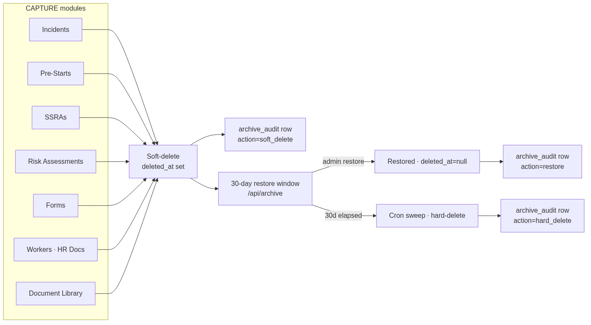

% Paneltec Group Platform Manual
% Paneltec Group — WHS + Compliance
% Generated 2026-09-14 20:53 UTC · Version `paneltec-v160.3.9.58.13.132gd`

\newpage

# 1. Executive Summary

Paneltec Group's operational platform is a single-source WHS + compliance system serving field operations for a civil-contracting business. Admins run day-to-day compliance from a React web app; field workers submit forms, sign in to sites, and complete daily pre-starts from an Expo mobile app. Every capture-side artefact (pre-start, hazard, incident, site diary, inspection, SWMS/SSRA) flows through a shared FastAPI + MongoDB backend that also brokers integrations with Simpro (workforce master), Navixy (fleet GPS), SmartFill (fuel), Microsoft 365 (email dispatch), and the Emergent LLM key (Claude/OpenAI assistance).

At this generation snapshot the codebase exposes **692** authenticated HTTP endpoints across **99** backend modules, tracks state in **131** MongoDB collections, and renders **64** distinct React pages on the web surface.

# 2. User Personas

Persona | Web access | Mobile access | Notes
-|-|-|-
`admin` | yes | mostly no | Runs the platform. Full read/write across every module. Gated behind email+password login PLUS a per-user 4-digit admin-console PIN for privileged actions (org settings, PIN-protected tiles, tile management, integrations).
`hseq_lead` | yes | mostly no | HSEQ manager. Reviews SWMS/SSRAs, closes incidents, signs off inspections. Read-write on capture modules; no delete on workforce records.
`contractor_rep` | yes | mostly no | External contractor representative. Submits contractor documents and workforce updates via a scoped portal.
`contractor_rep_submit_only` | yes | mostly no | Same as contractor_rep but view-only apart from the submission surface.
`supervisor` | yes | yes | Site supervisor. Assigns daily jobs, reviews pre-starts, signs off inspections. Mostly read; can create.
`worker` | no | yes | Field worker. Mobile-only. 4-digit mobile PIN login. Sees only their own daily jobs, forms, certifications.
`auditor` | yes | mostly no | Read-only auditor. Views records + exports; cannot edit.

# 3. Feature Modules

## Workers + HR Employees

*Module:* `backend/workers.py`

Workforce roster. Synced from Simpro; supports soft-delete + restore. HR document sub-registry.

| Method | Path |
|--------|------|
| `GET` | `/me/worker-profile` |
| `GET` | `/workers` |
| `POST` | `/workers` |
| `GET` | `/workers/directory` |
| `POST` | `/workers/sync-from-simpro` |
| `DELETE` | `/workers/{worker_id}` |
| `GET` | `/workers/{worker_id}` |
| `PATCH` | `/workers/{worker_id}` |
| `POST` | `/workers/{worker_id}/restore` |
| `GET` | `/workers/{worker_id}/smartfill-cards` |
| `POST` | `/workers/{worker_id}/smartfill-cards` |
| `DELETE` | `/workers/{worker_id}/smartfill-cards/{card_number}` |

…and **3** more endpoints (see appendix API reference).

## Inductions

*Module:* `backend/workers_inductions.py`

Worker inductions with certificates + expiry tracking.

| Method | Path |
|--------|------|
| `PUT` | `/workers/inductions/cell` |
| `GET` | `/workers/inductions/export.xlsx` |
| `POST` | `/workers/inductions/import-xlsx` |
| `POST` | `/workers/inductions/import-xlsx/commit` |
| `GET` | `/workers/inductions/matrix` |
| `POST` | `/workers/inductions/print` |
| `POST` | `/workers/{worker_id}/inductions` |
| `DELETE` | `/workers/{worker_id}/inductions/{induction_id}` |
| `GET` | `/workers/{worker_id}/inductions/{induction_id}` |
| `PATCH` | `/workers/{worker_id}/inductions/{induction_id}` |
| `POST` | `/workers/{worker_id}/inductions/{induction_id}/file` |

## Certifications

*Module:* `backend/worker_certifications.py`

Per-worker certifications with attachments + renewal chase.

| Method | Path |
|--------|------|
| `POST` | `/certifications/bulk-clear-pending-review` |
| `GET` | `/certifications/expiry-count` |
| `GET` | `/workers/certifications/all` |
| `POST` | `/workers/certifications/scan-reminders` |
| `GET` | `/workers/certifications/search` |
| `DELETE` | `/workers/certifications/{cert_id}` |
| `PATCH` | `/workers/certifications/{cert_id}` |
| `POST` | `/workers/certifications/{cert_id}/send-reminder` |
| `GET` | `/workers/{worker_id}/certifications` |
| `POST` | `/workers/{worker_id}/certifications` |
| `POST` | `/workers/{worker_id}/certifications/upload` |
| `POST` | `/workers/{worker_id}/certifications/{cert_id}/upload` |

## Incident Reports

*Module:* `backend/cs_incident.py`

Incident capture (mobile + web) with root-cause categorisation.

| Method | Path |
|--------|------|
| `GET` | `/cs-incident/` |
| `POST` | `/cs-incident/` |
| `GET` | `/cs-incident/columns` |
| `POST` | `/cs-incident/reimport` |
| `DELETE` | `/cs-incident/{uid}` |
| `GET` | `/cs-incident/{uid}` |
| `PATCH` | `/cs-incident/{uid}` |

## Pre-Starts + Daily Jobs

*Module:* `backend/prestart.py`

Daily equipment/plant pre-starts + assigned daily jobs.

## SWMS / SSRAs / Risk Assessments

*Module:* `backend/swms_phase45.py`

Safe-Work Method Statements + Site-Specific Risk Assessments authored via AI drafting.

| Method | Path |
|--------|------|
| `POST` | `/swms/bulk-delete` |
| `POST` | `/swms/from-paste` |
| `POST` | `/swms/from-scan` |
| `GET` | `/swms/recycle-bin` |
| `POST` | `/swms/{swms_id}/restore` |

## Master Risks

*Module:* `backend/master_risks.py`

Reference risk library — surfaced when authoring SSRAs.

| Method | Path |
|--------|------|
| `GET` | `/master-risks/` |
| `POST` | `/master-risks/` |
| `POST` | `/master-risks/reimport` |
| `DELETE` | `/master-risks/{risk_uid}` |
| `GET` | `/master-risks/{risk_uid}` |
| `PATCH` | `/master-risks/{risk_uid}` |

## Fuel Tracking (SmartFill)

*Module:* `backend/fleet_fuel.py`

Fuel transactions imported via SmartFill API + CSV backup path.

| Method | Path |
|--------|------|
| `GET` | `/fleet/fuel/anomalies` |
| `GET` | `/fleet/fuel/anomalies/matching-ids` |
| `POST` | `/fleet/fuel/anomalies/{txn_id}/dismiss` |
| `POST` | `/fleet/fuel/anomalies/{txn_id}/resolve` |
| `GET` | `/fleet/fuel/batches` |
| `DELETE` | `/fleet/fuel/batches/{batch_id}` |
| `GET` | `/fleet/fuel/batches/{batch_id}` |
| `POST` | `/fleet/fuel/import-csv` |
| `POST` | `/fleet/fuel/smartfill-auto-sync` |
| `GET` | `/fleet/fuel/smartfill-status` |
| `POST` | `/fleet/fuel/sync-smartfill` |
| `GET` | `/fleet/fuel/transactions` |

…and **18** more endpoints (see appendix API reference).

## Fleet Service Register

*Module:* `backend/fleet.py`

Vehicles + service schedules + Navixy live positions.

| Method | Path |
|--------|------|
| `GET` | `/fleet/assets/{asset_id}` |
| `GET` | `/fleet/assets/{asset_id}/next-service` |
| `GET` | `/fleet/assets/{asset_id}/service-sheet/{maintenance_id}/pdf` |
| `POST` | `/fleet/assets/{asset_id}/services` |
| `GET` | `/fleet/categories` |
| `GET` | `/fleet/register` |
| `GET` | `/fleet/search` |
| `GET` | `/fleet/service-schedule-presets` |
| `GET` | `/fleet/service-sheet-templates` |
| `GET` | `/fleet/service-status-rollup` |
| `GET` | `/fleet/technicians` |

## Apps Directory

*Module:* `backend/org_url_tiles.py`

In-app launcher tiles for external tools. Org-wide hide + per-tile PIN gates + drag-to-reorder.

| Method | Path |
|--------|------|
| `GET` | `/org/url-tiles` |
| `POST` | `/org/url-tiles` |
| `PATCH` | `/org/url-tiles/bulk-access` |
| `GET` | `/org/url-tiles/eligible-users` |
| `POST` | `/org/url-tiles/fetch-icon` |
| `PATCH` | `/org/url-tiles/reorder` |
| `POST` | `/org/url-tiles/reorder` |
| `GET` | `/org/url-tiles/user-approvals` |
| `PATCH` | `/org/url-tiles/user-approvals` |
| `DELETE` | `/org/url-tiles/{tile_id}` |
| `PATCH` | `/org/url-tiles/{tile_id}` |
| `POST` | `/org/url-tiles/{tile_id}/verify-pin` |

## Insurance Registry

*Module:* `backend/renewals.py`

Org insurance + supplier compliance renewals.

| Method | Path |
|--------|------|
| `GET` | `/public/renewals/{token}` |
| `GET` | `/renewals` |
| `POST` | `/renewals` |
| `POST` | `/renewals/bulk` |
| `POST` | `/renewals/bulk-delete` |
| `GET` | `/renewals/doc-types` |
| `POST` | `/renewals/doc-types` |
| `DELETE` | `/renewals/doc-types/{type_id}` |
| `PATCH` | `/renewals/doc-types/{type_id}` |
| `DELETE` | `/renewals/{rid}` |
| `PATCH` | `/renewals/{rid}` |
| `POST` | `/renewals/{rid}/revoke` |

…and **1** more endpoints (see appendix API reference).

## Document Library

*Module:* `backend/document_library.py`

Folder-scoped compliance documents with recursive search (filename + AI tags + uploader).

| Method | Path |
|--------|------|
| `DELETE` | `/document-library/files/{file_id}` |
| `GET` | `/document-library/files/{file_id}/download` |
| `GET` | `/document-library/folders` |
| `POST` | `/document-library/folders` |
| `DELETE` | `/document-library/folders/{folder_id}` |
| `PATCH` | `/document-library/folders/{folder_id}` |
| `GET` | `/document-library/folders/{folder_id}/files` |
| `POST` | `/document-library/folders/{folder_id}/files` |
| `GET` | `/document-library/folders/{folder_id}/subfolders` |
| `GET` | `/document-library/search` |
| `GET` | `/{supplier_id}/folders` |
| `POST` | `/{supplier_id}/folders` |

## Site QR Sign-On + Visitors

*Module:* `backend/sites.py`

Public visitor sign-in via per-site QR + admin dashboard.

## Forms

*Module:* `backend/forms.py`

Templated forms (structured payloads, photos, signatures) with routing rules + PDF export.

| Method | Path |
|--------|------|
| `GET` | `/forms/assets/lookup` |
| `GET` | `/forms/assets/picker` |
| `GET` | `/forms/cert-kinds` |
| `POST` | `/forms/fleet/vehicle-overrides` |
| `GET` | `/forms/fleet/vehicles` |
| `GET` | `/forms/templates` |
| `POST` | `/forms/templates` |
| `POST` | `/forms/templates/import` |
| `DELETE` | `/forms/templates/{template_id}` |
| `GET` | `/forms/templates/{template_id}` |
| `PATCH` | `/forms/templates/{template_id}` |
| `GET` | `/forms/templates/{template_id}/access-check` |

…and **11** more endpoints (see appendix API reference).

## Ask Intelligence

*Module:* `backend/ask.py`

AI-assisted deep-links across the org's own records.

| Method | Path |
|--------|------|
| `POST` | `/ask` |
| `GET` | `/ask/briefing` |
| `DELETE` | `/ask/history` |
| `GET` | `/ask/history` |
| `GET` | `/ask/suggestions` |
| `POST` | `/ask/suggestions` |
| `DELETE` | `/ask/suggestions/{suggestion_id}` |
| `PATCH` | `/ask/suggestions/{suggestion_id}` |

# 4. System Architecture

The stack is a classic FARM (FastAPI + React + MongoDB) with an
additional Expo mobile client. All three tiers are containerised behind
a Kubernetes ingress that maps `/api/*` to the FastAPI pod on `:8001`
and everything else to the React CRA dev server on `:3000`.

* **Backend:** FastAPI · Motor (async MongoDB) · uvicorn.
  Entry point: `backend/server.py`. Modules loaded via
  `api.include_router(...)` — 125 include-router calls at last snapshot.
* **Web:** React 19 · CRA scaffold · TailwindCSS · shadcn/ui.
  Entry: `frontend/src/App.js`. 64 pages under `frontend/src/pages/`.
* **Mobile:** Expo SDK · React Native (out of scope for this ship —
  documentation only, `/app/mobile/` is not modified).
* **Deployment:** pod-hosted preview URLs; supervisor manages both
  backend and frontend with hot reload enabled.

# 5. Data Layer

At this snapshot the code touches **131** distinct MongoDB collections. The top-touched collections (counted by number of backend modules that reference them) are listed below.

Collection | Modules that touch it
-|-
`users` | 40 — e.g. `admin_active_sessions`, `admin_console_pin`, `ask`, `asset_service`…
`workers` | 25 — e.g. `ask`, `asset_service`, `auth_invite`, `bulk_import_prestarts`…
`integration_configs` | 19 — e.g. `asset_meter_history`, `asset_navixy_dashboards`, `asset_navixy_sync`, `asset_trip_summary`…
`assets` | 15 — e.g. `asset_meter_history`, `asset_navixy_sync`, `asset_service`, `asset_trip_summary`…
`swms` | 13 — e.g. `ask`, `crud`, `dashboard`, `dashboards`…
`form_templates` | 12 — e.g. `asset_service`, `bulk_import_prestarts`, `crud`, `form_assignment_notifier`…
`form_submissions` | 11 — e.g. `ask`, `bulk_import_prestarts`, `category_counts`, `crud`…
`worker_certifications` | 11 — e.g. `dashboards`, `document_categories`, `forms`, `induction_columns`…
`orgs` | 10 — e.g. `auth`, `auth_invite`, `auth_mobile_pin`, `forms`…
`workspaces` | 9 — e.g. `asset_service`, `auth`, `dashboards`, `exports`…
`audit_logs` | 8 — e.g. `auth_invite`, `bulk_import_prestarts`, `induction_columns`, `mobile_modules`…
`simpro_sites` | 8 — e.g. `forms_pickers`, `integrations_simpro`, `mobile_home`, `mobile_sites`…
`contractors` | 7 — e.g. `ask`, `contractors`, `integrations_simpro`, `renewals`…
`org_settings` | 7 — e.g. `ask`, `comms_safe_mode`, `cron_smartfill_auto_sync`, `fleet_fuel`…
`user_permissions` | 7 — e.g. `bulk_permissions`, `comms_safe_mode`, `permission_presets`, `permission_v26_migrations`…
`doc_files` | 6 — e.g. `document_categories`, `document_library`, `file_pdf`, `simpro_zip_import`…
`hazards` | 6 — e.g. `ask`, `asset_service`, `category_counts`, `dashboard`…
`roles` | 6 — e.g. `auth`, `auth_mobile_pin`, `permission_presets`, `permissions`…
`sites` | 6 — e.g. `bulk_import_prestarts`, `dashboards`, `mobile_data`, `mobile_home`…
`app_state` | 5 — e.g. `backup_service`, `health_extras`, `migrate_form_pickers`, `migrate_strip_misplaced`…
`archive_audit` | 5 — e.g. `archive_audit_helpers`, `crud`, `org_archive_rules`, `visitor_signins`…
`asset_service_schedules` | 5 — e.g. `admin_purge_test_data`, `asset_navixy_sync`, `asset_service`, `cron_asset_service_generate`…
`incidents` | 5 — e.g. `ask`, `category_counts`, `dashboard`, `dashboards`…
`inspections` | 5 — e.g. `ask`, `category_counts`, `dashboard`, `dashboards`…
`pre_starts` | 5 — e.g. `ask`, `bulk_import_prestarts`, `category_counts`, `dashboard`…
`active_sessions` | 4 — e.g. `admin_active_sessions`, `auth`, `session_history`, `session_timeout`
`renewal_links` | 4 — e.g. `contractors`, `notifications`, `renewals`, `seed_phase3`
`site_diary_entries` | 4 — e.g. `ask`, `category_counts`, `dashboard`, `seed`
`site_signons` | 4 — e.g. `dashboards`, `mobile_home`, `sites_qr`, `sites_signon_v127`
`user_audit` | 4 — e.g. `admin_console_pin`, `mobile_onboarding_cards`, `simpro_import_users`, `users`

_Full list of collections in appendix A._

### Storage patterns

* **MongoDB documents** — primary state (all collections above).
* **GridFS** — large binary payloads: PDFs, form attachments, worker
  photos. Referenced by GridFS `file_id` in the owning row.
* **Ephemeral pod disk** — legacy upload paths still write to
  `/app/backend/uploads/...` for `document_library`, `contractor_docs`,
  `hazards`, `swms_scans`, `renewals`, and `form_attachments`. **This
  is parked for the `v58.14.x` object-storage migration** — pod-local
  files survive the preview but are inaccessible from a deployed
  container. 20 lint warnings pin the migration targets.
* **`sessionStorage` (frontend)** — retired in `.132g9`. The remaining
  session-scoped state is preview-only (drag-in-progress markers, form
  autosave scratch pads).

# 6. Integrations

Integration | Purpose | Credentials | Status | Backend module
-|-|-|-|-
Microsoft 365 | OAuth send-as-user via Graph. Delivery from the shared outbox. | MICROSOFT365_CLIENT_ID/SECRET (per-org, encrypted) | wired | `backend/email_outbox.py`
Navixy | GPS fleet tracking. Vehicle tags + last-position sync. | NAVIXY_API_KEY (per-org, encrypted) | wired | `backend/fleet_navixy_tags.py`
SmartFill | Fuel transactions + tank levels (JSON RPC to SmartFill). | SMARTFILL_USER + PASSWORD (per-org, encrypted) | wired | `backend/integrations_smartfill.py`
Simpro | Worker + customer + supplier import. Delta sync on cron. | SIMPRO_BUILD/COMPANY/CLIENT_ID/SECRET (per-org, encrypted) | wired | `backend/integrations_simpro.py`
OpenAI / Claude (Emergent LLM) | SWMS drafting, hazard vision, site-diary structuring. | EMERGENT_LLM_KEY (env) | wired | `backend/ai.py`

Integration secrets are encrypted at rest with Fernet (env-derived key
`INTEGRATIONS_ENC_KEY`) and never returned in plaintext by any GET —
`_mask()` in `backend/integrations.py` returns a masked-last-4 preview
for the UI (`v160.3.9.40 · SEC-003`).

Sentry crash reporting is **not** currently wired in this codebase
(none of the frontend/backend modules reference the Sentry SDK). Error
telemetry is captured to structured logs + the `archive_audit` /
`admin_actions` collections.

# 7. API Reference

At this snapshot **`/api/openapi.json`** exposes **768** endpoints across **117** tags. Every endpoint below is authenticated via a Bearer JWT unless it lives under a `/scan/` or `/public/` route.

### `admin-active-sessions` (5 endpoints)

| Method | Path | Summary | Responses |
|--------|------|---------|-----------|
| `GET` | `/api/admin/active-sessions` | List Active Sessions | 200 |
| `POST` | `/api/admin/active-sessions/bulk-revoke` | Bulk Revoke Sessions | 200, 422 |
| `POST` | `/api/admin/active-sessions/purge-inactive` | Purge Inactive Sessions | 200, 422 |
| `GET` | `/api/admin/active-sessions/purge-inactive/preview` | Preview Purge Inactive | 200, 422 |
| `DELETE` | `/api/admin/active-sessions/{jti}` | Revoke Session | 204, 422 |

### `admin-comms-safe-mode` (5 endpoints)

| Method | Path | Summary | Responses |
|--------|------|---------|-----------|
| `DELETE` | `/api/admin/comms-outbox-blocked` | Clear Blocked | 200, 422 |
| `GET` | `/api/admin/comms-outbox-blocked` | List Blocked | 200, 422 |
| `PATCH` | `/api/admin/comms-safe-mode` | Patch Safe Mode | 200, 422 |
| `GET` | `/api/admin/comms-safe-mode/status` | Get Safe Mode Status | 200 |
| `GET` | `/api/admin/comms-safe-mode/who-can-toggle` | Who Can Toggle | 200 |

### `admin-console-pin` (6 endpoints)

| Method | Path | Summary | Responses |
|--------|------|---------|-----------|
| `POST` | `/api/auth/admin-console/lock` | Lock | 200 |
| `POST` | `/api/auth/admin-console/set-pin` | Set Pin | 200, 422 |
| `POST` | `/api/auth/admin-console/status` | Status | 200 |
| `POST` | `/api/auth/admin-console/unlock` | Unlock | 200, 422 |
| `POST` | `/api/users/admin-console/backfill-provisional-prices` | Backfill Provisional Prices | 200 |
| `POST` | `/api/users/{target_user_id}/admin-console/clear-pin` | Clear Target User Pin | 200, 422 |

### `admin-purge` (1 endpoints)

| Method | Path | Summary | Responses |
|--------|------|---------|-----------|
| `POST` | `/api/admin/purge-test-data` | Purge Test Data | 200, 422 |

### `admin-roles` (13 endpoints)

| Method | Path | Summary | Responses |
|--------|------|---------|-----------|
| `GET` | `/api/admin/roles` | List Roles | 200 |
| `POST` | `/api/admin/roles` | Create Role | 201, 422 |
| `POST` | `/api/admin/roles/sync-from-simpro-positions` | Sync Roles From Simpro Positions | 200 |
| `DELETE` | `/api/admin/roles/{role_id}` | Delete Role | 200, 422 |
| `GET` | `/api/admin/roles/{role_id}` | Get Role | 200, 422 |
| `PATCH` | `/api/admin/roles/{role_id}` | Patch Role | 200, 422 |
| `GET` | `/api/admin/roles/{role_id}/assignees-count` | Get Role Assignees Count | 200, 422 |
| `GET` | `/api/admin/roles/{role_id}/audit` | Get Role Audit | 200, 422 |
| `GET` | `/api/admin/roles/{role_id}/forms` | List Role Forms | 200, 422 |
| `POST` | `/api/admin/roles/{role_id}/forms` | Assign Form To Role | 201, 422 |
| `GET` | `/api/admin/roles/{role_id}/forms/available` | List Available Forms For Role | 200, 422 |
| `DELETE` | `/api/admin/roles/{role_id}/forms/{form_id}` | Unassign Form From Role | 200, 422 |
| `PATCH` | `/api/admin/roles/{role_id}/forms/{form_id}` | Patch Role Form | 200, 422 |

### `admin-simpro-users` (4 endpoints)

| Method | Path | Summary | Responses |
|--------|------|---------|-----------|
| `GET` | `/api/admin/simpro/employees/available` | List Available Simpro Employees | 200, 422 |
| `POST` | `/api/admin/simpro/import-employees` | Import Employees | 200, 422 |
| `POST` | `/api/admin/simpro/import-employees/selective` | Import Employees Selective | 200, 422 |
| `POST` | `/api/admin/simpro/sync-linked` | Sync Linked Users | 200 |

### `admin-swms` (1 endpoints)

| Method | Path | Summary | Responses |
|--------|------|---------|-----------|
| `POST` | `/api/admin/swms/backfill-version-chain` | Backfill Version Chain | 200 |

### `admin-visitors` (8 endpoints)

| Method | Path | Summary | Responses |
|--------|------|---------|-----------|
| `GET` | `/api/admin/visitors` | Admin List Visitors | 200, 422 |
| `POST` | `/api/admin/visitors/archive` | Admin Bulk Archive Visitors | 200, 422 |
| `POST` | `/api/admin/visitors/bulk-delete` | Admin Bulk Delete Visitors | 200, 422 |
| `DELETE` | `/api/admin/visitors/{visitor_id}` | Admin Delete Visitor | 200, 422 |
| `GET` | `/api/admin/visitors/{visitor_id}` | Admin Get Visitor | 200, 422 |
| `POST` | `/api/admin/visitors/{visitor_id}/archive` | Admin Archive Visitor | 200, 422 |
| `POST` | `/api/admin/visitors/{visitor_id}/force-signout` | Admin Force Signout | 200, 422 |
| `POST` | `/api/admin/visitors/{visitor_id}/unarchive` | Admin Unarchive Visitor | 200, 422 |

### `ai` (3 endpoints)

| Method | Path | Summary | Responses |
|--------|------|---------|-----------|
| `POST` | `/api/ai/diary-structure` | Diary Structure | 200, 422 |
| `POST` | `/api/ai/hazard-vision` | Hazard Vision | 200, 422 |
| `POST` | `/api/ai/swms-draft` | Swms Draft | 200, 422 |

### `ask` (8 endpoints)

| Method | Path | Summary | Responses |
|--------|------|---------|-----------|
| `POST` | `/api/ask` | Ask | 200, 422 |
| `GET` | `/api/ask/briefing` | Briefing | 200, 422 |
| `DELETE` | `/api/ask/history` | Clear History | 200 |
| `GET` | `/api/ask/history` | History | 200, 422 |
| `GET` | `/api/ask/suggestions` | List Suggestions | 200 |
| `POST` | `/api/ask/suggestions` | Create Suggestion | 201, 422 |
| `DELETE` | `/api/ask/suggestions/{suggestion_id}` | Delete Suggestion | 204, 422 |
| `PATCH` | `/api/ask/suggestions/{suggestion_id}` | Update Suggestion | 200, 422 |

### `asset-meter-trends` (2 endpoints)

| Method | Path | Summary | Responses |
|--------|------|---------|-----------|
| `POST` | `/api/assets/{asset_id}/meter-history` | Add Manual Snapshot | 200, 422 |
| `GET` | `/api/assets/{asset_id}/meter-trends` | Meter Trends | 200, 422 |

### `asset-navixy-dashboards` (3 endpoints)

| Method | Path | Summary | Responses |
|--------|------|---------|-----------|
| `GET` | `/api/assets/navixy/dashboards/fleet-status` | Fleet Status | 200 |
| `GET` | `/api/assets/navixy/dashboards/technical` | Technical | 200 |
| `GET` | `/api/assets/navixy/dashboards/trips` | Trips | 200, 422 |

### `asset-navixy-sync` (2 endpoints)

| Method | Path | Summary | Responses |
|--------|------|---------|-----------|
| `POST` | `/api/assets/navixy/repair-lifetimes` | Http Repair Lifetimes | 200 |
| `POST` | `/api/assets/navixy/sync-counters` | Http Sync Now | 200 |

### `asset-scan-action` (2 endpoints)

| Method | Path | Summary | Responses |
|--------|------|---------|-----------|
| `POST` | `/api/scan/quick-action` | Scan Quick Action | 200, 422 |
| `GET` | `/api/scan/{scan_token}/forms` | Scan Forms | 200, 422 |

### `asset-service` (18 endpoints)

| Method | Path | Summary | Responses |
|--------|------|---------|-----------|
| `GET` | `/api/assets/service/inbox` | Service Inbox | 200, 422 |
| `POST` | `/api/assets/service/scan-reminders` | Scan Reminders | 200 |
| `GET` | `/api/assets/service/summary` | Service Summary | 200 |
| `POST` | `/api/assets/{asset_id}/meter` | Update Meter | 200, 422 |
| `POST` | `/api/assets/{asset_id}/meter/reset` | Meter Reset | 200, 422 |
| `GET` | `/api/assets/{asset_id}/records` | List Records | 200, 422 |
| `POST` | `/api/assets/{asset_id}/records` | Create Record | 201, 422 |
| `DELETE` | `/api/assets/{asset_id}/records/{rid}` | Delete Record | 204, 422 |
| `GET` | `/api/assets/{asset_id}/records/{rid}` | Get Record | 200, 422 |
| `PUT` | `/api/assets/{asset_id}/records/{rid}` | Update Record | 200, 422 |
| `GET` | `/api/assets/{asset_id}/schedules` | List Schedules | 200, 422 |
| `POST` | `/api/assets/{asset_id}/schedules` | Create Schedule | 201, 422 |
| `DELETE` | `/api/assets/{asset_id}/schedules/{sid}` | Delete Schedule | 204, 422 |
| `GET` | `/api/assets/{asset_id}/schedules/{sid}` | Get Schedule | 200, 422 |
| `PUT` | `/api/assets/{asset_id}/schedules/{sid}` | Update Schedule | 200, 422 |
| `POST` | `/api/assets/{asset_id}/schedules/{sid}/attachments` | Upload Schedule Attachments | 201, 422 |
| `DELETE` | `/api/assets/{asset_id}/schedules/{sid}/attachments/{stored_name}` | Delete Schedule Attachment | 204, 422 |
| `GET` | `/api/assets/{asset_id}/schedules/{sid}/attachments/{stored_name}` | Serve Schedule Attachment | 200, 422 |

### `asset-trip-summary` (1 endpoints)

| Method | Path | Summary | Responses |
|--------|------|---------|-----------|
| `GET` | `/api/assets/{asset_id}/trip-summary` | Trip Summary | 200, 422 |

### `assets` (16 endpoints)

| Method | Path | Summary | Responses |
|--------|------|---------|-----------|
| `GET` | `/api/assets` | List Assets | 200, 422 |
| `POST` | `/api/assets` | Create Asset | 201, 422 |
| `POST` | `/api/assets/labels/bulk` | Bulk Labels Pdf | 200, 422 |
| `GET` | `/api/assets/scan/{scan_token}` | Resolve Scan | 200, 422 |
| `DELETE` | `/api/assets/{asset_id}` | Archive Asset | 204, 422 |
| `GET` | `/api/assets/{asset_id}` | Get Asset | 200, 422 |
| `PUT` | `/api/assets/{asset_id}` | Update Asset | 200, 422 |
| `GET` | `/api/assets/{asset_id}/label.pdf` | Asset Label Pdf | 200, 422 |
| `DELETE` | `/api/assets/{asset_id}/nfc-pair` | Nfc Unpair | 200, 422 |
| `POST` | `/api/assets/{asset_id}/nfc-pair` | Nfc Pair | 200, 422 |
| `GET` | `/api/assets/{asset_id}/photo/{gridfs_id}` | Stream Asset Photo | 200, 422 |
| `POST` | `/api/assets/{asset_id}/photos` | Upload Asset Photo | 200, 422 |
| `DELETE` | `/api/assets/{asset_id}/photos/{photo_id}` | Delete Asset Photo | 200, 422 |
| `GET` | `/api/assets/{asset_id}/qr.png` | Asset Qr Png | 200, 422 |
| `PATCH` | `/api/assets/{asset_id}/tag` | Patch Asset Tag | 200, 422 |
| `POST` | `/api/assets/{asset_id}/uhf-pair` | Uhf Pair | 200, 422 |

### `audit-exports` (5 endpoints)

| Method | Path | Summary | Responses |
|--------|------|---------|-----------|
| `GET` | `/api/audit-exports` | List Exports | 200 |
| `POST` | `/api/audit-exports` | Create Export | 201, 422 |
| `DELETE` | `/api/audit-exports/{eid}` | Delete Export | 204, 422 |
| `GET` | `/api/audit-exports/{eid}` | Get Export | 200, 422 |
| `POST` | `/api/audit-exports/{eid}/render-pdf` | Render Pdf Sibling | 201, 422 |

### `auth` (9 endpoints)

| Method | Path | Summary | Responses |
|--------|------|---------|-----------|
| `POST` | `/api/auth/change-password` | Change Password | 200, 422 |
| `POST` | `/api/auth/download-token` | Issue Download Token | 200 |
| `POST` | `/api/auth/login` | Login | 200, 422 |
| `POST` | `/api/auth/login-with-simpro` | Login With Simpro | 200, 422 |
| `POST` | `/api/auth/logout` | Logout | 200 |
| `GET` | `/api/auth/me` | Me | 200 |
| `POST` | `/api/auth/refresh` | Refresh Token | 200 |
| `POST` | `/api/auth/signup` | Signup | 200, 422 |
| `POST` | `/api/auth/update-profile` | Update Profile | 200, 422 |

### `auth-invite` (11 endpoints)

| Method | Path | Summary | Responses |
|--------|------|---------|-----------|
| `POST` | `/api/auth/forgot-password` | Forgot Password | 200, 422 |
| `POST` | `/api/auth/invite/redeem` | Invite Redeem | 200, 422 |
| `POST` | `/api/auth/invite/validate` | Invite Validate | 200, 422 |
| `POST` | `/api/auth/pin/redeem` | Pin Redeem | 200, 422 |
| `POST` | `/api/auth/reset/redeem` | Reset Redeem | 200, 422 |
| `POST` | `/api/auth/reset/validate` | Reset Validate | 200, 422 |
| `GET` | `/api/users/{user_id}/access-status` | Access Status | 200, 422 |
| `POST` | `/api/users/{user_id}/invite` | Send Invite | 201, 422 |
| `POST` | `/api/users/{user_id}/pin` | Generate Pin | 200, 422 |
| `POST` | `/api/users/{user_id}/reset-password` | Send Reset | 200, 422 |
| `POST` | `/api/users/{user_id}/unlock` | Unlock User | 200, 422 |

### `backup` (26 endpoints)

| Method | Path | Summary | Responses |
|--------|------|---------|-----------|
| `POST` | `/api/backup/admin/migrate-destination-passwords` | Migrate Destination Passwords Route | 200 |
| `GET` | `/api/backup/agent-logs` | List Agent Logs | 200, 422 |
| `GET` | `/api/backup/agent/docker-compose.yml` | Agent Docker Compose | 200, 422 |
| `GET` | `/api/backup/agent/install.py` | Agent Install Script | 200, 422 |
| `GET` | `/api/backup/agent/pending` | Agent Pending | 200, 422 |
| `POST` | `/api/backup/agent/report` | Agent Report | 200, 422 |
| `GET` | `/api/backup/agents` | List Agents | 200 |
| `POST` | `/api/backup/agents/register` | Register Agent | 200, 422 |
| `DELETE` | `/api/backup/agents/{aid}` | Delete Agent | 200, 422 |
| `GET` | `/api/backup/destinations` | List Destinations | 200 |
| `POST` | `/api/backup/destinations` | Create Destination | 200, 422 |
| `DELETE` | `/api/backup/destinations/{did}` | Delete Destination | 200, 422 |
| `PUT` | `/api/backup/destinations/{did}` | Update Destination | 200, 422 |
| `GET` | `/api/backup/discovered-smb` | Discovered Smb | 200 |
| `GET` | `/api/backup/lan-status` | Lan Status | 200 |
| `POST` | `/api/backup/restore` | Restore From Zip | 200, 422 |
| `GET` | `/api/backup/retention` | Get Retention | 200 |
| `PUT` | `/api/backup/retention` | Set Retention | 200, 422 |
| `GET` | `/api/backup/retention/preview` | Retention Preview | 200 |
| `POST` | `/api/backup/retention/run` | Retention Run Now | 200 |
| `GET` | `/api/backup/schedule` | Get Schedule | 200 |
| `GET` | `/api/backup/snapshots` | List Snapshots | 200, 422 |
| `POST` | `/api/backup/snapshots` | Create Snapshot | 200 |
| `GET` | `/api/backup/snapshots/{snap_id}/data` | Download Snapshot | 200, 422 |
| `POST` | `/api/backup/snapshots/{snap_id}/verify` | Verify Snapshot | 200, 422 |
| `GET` | `/api/backup/summary` | Get Summary | 200 |

### `bulk-import` (6 endpoints)

| Method | Path | Summary | Responses |
|--------|------|---------|-----------|
| `POST` | `/api/pre-starts/bulk-import/init` | Init Job | 201, 422 |
| `GET` | `/api/pre-starts/bulk-import/last` | Last Resumable Job | 200, 422 |
| `POST` | `/api/pre-starts/bulk-import/{job_id}/approve` | Approve | 200, 422 |
| `GET` | `/api/pre-starts/bulk-import/{job_id}/report` | Report | 200, 422 |
| `POST` | `/api/pre-starts/bulk-import/{job_id}/start` | Start Job | 202, 422 |
| `GET` | `/api/pre-starts/bulk-import/{job_id}/status` | Status | 200, 422 |

### `category-counts` (7 endpoints)

| Method | Path | Summary | Responses |
|--------|------|---------|-----------|
| `GET` | `/api/admin/visitors/category-counts` | Admin Visitors Category Counts | 200, 422 |
| `GET` | `/api/hazards/category-counts` | Hazards Category Counts | 200, 422 |
| `GET` | `/api/incidents/category-counts` | Incidents Category Counts | 200, 422 |
| `GET` | `/api/inspections/category-counts` | Inspections Category Counts | 200, 422 |
| `GET` | `/api/pre-starts/category-counts` | Pre Starts Category Counts | 200, 422 |
| `GET` | `/api/risk-assessments/category-counts` | Risk Assessments Category Counts | 200, 422 |
| `GET` | `/api/site-diary/category-counts` | Site Diary Category Counts | 200, 422 |

### `certifications` (2 endpoints)

| Method | Path | Summary | Responses |
|--------|------|---------|-----------|
| `POST` | `/api/certifications/bulk-clear-pending-review` | Bulk Clear Pending Review | 200, 422 |
| `GET` | `/api/certifications/expiry-count` | Certifications Expiry Count | 200, 422 |

### `companies` (7 endpoints)

| Method | Path | Summary | Responses |
|--------|------|---------|-----------|
| `GET` | `/api/companies/` | List Rows | 200, 422 |
| `POST` | `/api/companies/` | Create Row | 200, 422 |
| `GET` | `/api/companies/columns` | Columns Metadata | 200 |
| `POST` | `/api/companies/reimport` | Reimport | 200, 422 |
| `DELETE` | `/api/companies/{uid}` | Delete Row | 200, 422 |
| `GET` | `/api/companies/{uid}` | Get Row | 200, 422 |
| `PATCH` | `/api/companies/{uid}` | Patch Row | 200, 422 |

### `completed-training` (7 endpoints)

| Method | Path | Summary | Responses |
|--------|------|---------|-----------|
| `GET` | `/api/completed-training/` | List Rows | 200, 422 |
| `POST` | `/api/completed-training/` | Create Row | 200, 422 |
| `GET` | `/api/completed-training/columns` | Columns Metadata | 200 |
| `POST` | `/api/completed-training/reimport` | Reimport | 200, 422 |
| `DELETE` | `/api/completed-training/{uid}` | Delete Row | 200, 422 |
| `GET` | `/api/completed-training/{uid}` | Get Row | 200, 422 |
| `PATCH` | `/api/completed-training/{uid}` | Patch Row | 200, 422 |

### `contractors` (8 endpoints)

| Method | Path | Summary | Responses |
|--------|------|---------|-----------|
| `GET` | `/api/contractors` | List Contractors | 200, 422 |
| `POST` | `/api/contractors` | Create Contractor | 201, 422 |
| `POST` | `/api/contractors/import-from-simpro` | Import From Simpro | 200, 422 |
| `DELETE` | `/api/contractors/{cid}` | Delete Contractor | 200, 422 |
| `GET` | `/api/contractors/{cid}` | Get Contractor | 200, 422 |
| `PATCH` | `/api/contractors/{cid}` | Patch Contractor | 200, 422 |
| `POST` | `/api/contractors/{cid}/documents` | Upload Document | 201, 422 |
| `DELETE` | `/api/contractors/{cid}/documents/{doc_id}` | Delete Document | 200, 422 |

### `contractors-qr` (1 endpoints)

| Method | Path | Summary | Responses |
|--------|------|---------|-----------|
| `GET` | `/api/contractors/{contractor_id}/scan-pdf` | Contractor Scan Pdf | 200, 422 |

### `cs-incident` (7 endpoints)

| Method | Path | Summary | Responses |
|--------|------|---------|-----------|
| `GET` | `/api/cs-incident/` | List Rows | 200, 422 |
| `POST` | `/api/cs-incident/` | Create Row | 200, 422 |
| `GET` | `/api/cs-incident/columns` | Columns Metadata | 200 |
| `POST` | `/api/cs-incident/reimport` | Reimport | 200, 422 |
| `DELETE` | `/api/cs-incident/{uid}` | Delete Row | 200, 422 |
| `GET` | `/api/cs-incident/{uid}` | Get Row | 200, 422 |
| `PATCH` | `/api/cs-incident/{uid}` | Patch Row | 200, 422 |

### `dashboard` (2 endpoints)

| Method | Path | Summary | Responses |
|--------|------|---------|-----------|
| `GET` | `/api/dashboard/metrics` | Metrics | 200, 422 |
| `GET` | `/api/dashboard/module-stats` | Module Stats | 200 |

### `dashboards` (1 endpoints)

| Method | Path | Summary | Responses |
|--------|------|---------|-----------|
| `GET` | `/api/dashboards/{module}` | Module Dashboard | 200, 422 |

### `docs` (1 endpoints)

| Method | Path | Summary | Responses |
|--------|------|---------|-----------|
| `GET` | `/api/docs/manual.docx` | Download the current Paneltec Group platform manual | 200, 401, 403, 404, 422, 429 |

### `document-categories` (5 endpoints)

| Method | Path | Summary | Responses |
|--------|------|---------|-----------|
| `GET` | `/api/document-categories` | List Categories | 200 |
| `POST` | `/api/document-categories` | Create Category | 201, 422 |
| `DELETE` | `/api/document-categories/{cat_id}` | Delete Category | 200, 422 |
| `PUT` | `/api/document-categories/{cat_id}` | Update Category | 200, 422 |
| `GET` | `/api/document-categories/{cat_id}/records` | Category Records | 200, 422 |

### `document-library` (10 endpoints)

| Method | Path | Summary | Responses |
|--------|------|---------|-----------|
| `DELETE` | `/api/document-library/files/{file_id}` | Delete File | 204, 422 |
| `GET` | `/api/document-library/files/{file_id}/download` | Download File | 200, 422 |
| `GET` | `/api/document-library/folders` | List Folders | 200 |
| `POST` | `/api/document-library/folders` | Create Folder | 201, 422 |
| `DELETE` | `/api/document-library/folders/{folder_id}` | Delete Folder | 204, 422 |
| `PATCH` | `/api/document-library/folders/{folder_id}` | Rename Folder | 200, 422 |
| `GET` | `/api/document-library/folders/{folder_id}/files` | List Files | 200, 422 |
| `POST` | `/api/document-library/folders/{folder_id}/files` | Upload Files | 201, 422 |
| `GET` | `/api/document-library/folders/{folder_id}/subfolders` | List Subfolders | 200, 422 |
| `GET` | `/api/document-library/search` | Search | 200, 422 |

### `email` (16 endpoints)

| Method | Path | Summary | Responses |
|--------|------|---------|-----------|
| `POST` | `/api/audit-exports/{record_id}/email` | Email-Audit-Export | 201, 422 |
| `POST` | `/api/contractors/{record_id}/email` | Email-Contractor | 201, 422 |
| `GET` | `/api/email/outbox` | List Outbox | 200, 422 |
| `POST` | `/api/email/outbox/bulk-delete` | Bulk Delete Outbox | 200, 422 |
| `DELETE` | `/api/email/outbox/{email_id}` | Delete Outbox | 200, 422 |
| `GET` | `/api/email/outbox/{email_id}` | Get Outbox | 200, 422 |
| `POST` | `/api/email/outbox/{email_id}/cancel` | Cancel Outbox | 200, 422 |
| `POST` | `/api/email/outbox/{email_id}/retry` | Retry Outbox | 200, 422 |
| `POST` | `/api/email/send` | Send Email | 201, 422 |
| `POST` | `/api/hazards/{record_id}/email` | Email-Hazard | 201, 422 |
| `POST` | `/api/incidents/{record_id}/email-summary` | Email-Incident | 201, 422 |
| `POST` | `/api/inspections/{record_id}/email` | Email-Inspection | 201, 422 |
| `POST` | `/api/pre-starts/{record_id}/email` | Email-Prestart | 201, 422 |
| `POST` | `/api/renewals/{record_id}/email-link` | Email-Renewal | 201, 422 |
| `POST` | `/api/site-diary/{record_id}/email-daily` | Email-Site-Diary | 201, 422 |
| `POST` | `/api/swms/{record_id}/email-for-review` | Email-Swms | 201, 422 |

### `files` (8 endpoints)

| Method | Path | Summary | Responses |
|--------|------|---------|-----------|
| `GET` | `/api/files/contractor_docs/{name}` | Serve Contractor Doc | 200, 422 |
| `GET` | `/api/files/document_library/{folder_id}/{name}` | Serve Document Library | 200, 422 |
| `GET` | `/api/files/exports/{name}` | Serve Export | 200, 422 |
| `GET` | `/api/files/form_photos/{submission_id}/{name}` | Serve Form Photo | 200, 422 |
| `GET` | `/api/files/hazards/{name}` | Serve Hazard | 200, 422 |
| `GET` | `/api/files/pdfs/{name}` | Serve Pdf | 200, 422 |
| `GET` | `/api/files/renewals/{token}/{name}` | Serve Renewal | 200, 422 |
| `GET` | `/api/files/swms_scans/{name}` | Serve Swms Scan | 200, 422 |

### `files-pdf` (10 endpoints)

| Method | Path | Summary | Responses |
|--------|------|---------|-----------|
| `GET` | `/api/admin/files/{file_id}/search-text` | Admin File Search Text | 200, 422 |
| `POST` | `/api/admin/install-libreoffice` | Install Libreoffice | 202, 422 |
| `GET` | `/api/admin/server-tools/health` | Server Tools Health | 200 |
| `GET` | `/api/admin/system-tools` | System Tools | 200 |
| `POST` | `/api/files/inline-pdf` | Stash Inline Endpoint | 200 |
| `GET` | `/api/files/inline/{stash_id}` | Serve Inline Pdf | 200, 422 |
| `POST` | `/api/files/pdf-bundle` | File Pdf Bundle | 200, 422 |
| `GET` | `/api/files/{file_id}/pdf` | File Pdf | 200, 422 |
| `GET` | `/api/files/{file_id}/pdf.pdf` | File Pdf Aliased | 200, 422 |
| `POST` | `/api/files/{file_id}/preview-token` | Mint File Preview Token | 200, 422 |

### `fleet` (11 endpoints)

| Method | Path | Summary | Responses |
|--------|------|---------|-----------|
| `GET` | `/api/fleet/assets/{asset_id}` | Get Asset Detail | 200, 422 |
| `GET` | `/api/fleet/assets/{asset_id}/next-service` | Get Next Service | 200, 422 |
| `GET` | `/api/fleet/assets/{asset_id}/service-sheet/{maintenance_id}/pdf` | Get Service Sheet Pdf | 200, 422 |
| `POST` | `/api/fleet/assets/{asset_id}/services` | Log Service | 200, 422 |
| `GET` | `/api/fleet/categories` | Get Categories | 200 |
| `GET` | `/api/fleet/register` | Get Register | 200, 422 |
| `GET` | `/api/fleet/search` | Fleet Search | 200, 422 |
| `GET` | `/api/fleet/service-schedule-presets` | List Service Schedule Presets | 200 |
| `GET` | `/api/fleet/service-sheet-templates` | List Sheet Templates | 200 |
| `GET` | `/api/fleet/service-status-rollup` | Get Service Status Rollup | 200, 422 |
| `GET` | `/api/fleet/technicians` | List Technicians | 200 |

### `fleet-fuel` (33 endpoints)

| Method | Path | Summary | Responses |
|--------|------|---------|-----------|
| `GET` | `/api/fleet/assets/{asset_id}/fuel` | Asset Fuel Feed | 200, 422 |
| `GET` | `/api/fleet/assets/{asset_id}/fuel-summary` | Asset Fuel Summary | 200, 422 |
| `GET` | `/api/fleet/fuel/anomalies` | List Anomalies | 200, 422 |
| `POST` | `/api/fleet/fuel/anomalies/bulk-attribute` | Bulk Attribute Anomalies | 200, 422 |
| `POST` | `/api/fleet/fuel/anomalies/bulk-dismiss` | Bulk Dismiss Anomalies | 200, 422 |
| `POST` | `/api/fleet/fuel/anomalies/bulk-reopen` | Bulk Reopen Anomalies | 200, 422 |
| `POST` | `/api/fleet/fuel/anomalies/bulk-resolve` | Bulk Resolve Anomalies | 200, 422 |
| `GET` | `/api/fleet/fuel/anomalies/matching-ids` | Anomalies Matching Ids | 200, 422 |
| `POST` | `/api/fleet/fuel/anomalies/{txn_id}/delete-dismissal` | Delete Anomaly Dismissal | 200, 422 |
| `POST` | `/api/fleet/fuel/anomalies/{txn_id}/dismiss` | Dismiss Anomaly | 200, 422 |
| `POST` | `/api/fleet/fuel/anomalies/{txn_id}/reopen` | Reopen Anomaly | 200, 422 |
| `POST` | `/api/fleet/fuel/anomalies/{txn_id}/resolve` | Resolve Anomaly | 200, 422 |
| `POST` | `/api/fleet/fuel/anomalies/{txn_id}/undelete-dismissal` | Undelete Anomaly Dismissal | 200, 422 |
| `GET` | `/api/fleet/fuel/batches` | List Batches | 200, 422 |
| `DELETE` | `/api/fleet/fuel/batches/{batch_id}` | Delete Batch | 200, 422 |
| `GET` | `/api/fleet/fuel/batches/{batch_id}` | Get Batch | 200, 422 |
| `GET` | `/api/fleet/fuel/cards` | List Fuel Cards | 200, 422 |
| `PATCH` | `/api/fleet/fuel/cards/{card_number}` | Update Fuel Card | 200, 422 |
| `POST` | `/api/fleet/fuel/cards/{card_number}/assign` | Card Assign | 200, 422 |
| `GET` | `/api/fleet/fuel/cards/{card_number}/summary` | Card Summary | 200, 422 |
| `GET` | `/api/fleet/fuel/cards/{card_number}/transactions` | Card Transactions | 200, 422 |
| `GET` | `/api/fleet/fuel/export` | Export Csv Ep | 200, 422 |
| `POST` | `/api/fleet/fuel/import-csv` | Import Csv Ep | 200, 422 |
| `GET` | `/api/fleet/fuel/reports` | Fuel Reports | 200, 422 |
| `POST` | `/api/fleet/fuel/reports/email` | Fuel Report Email | 200, 422 |
| `GET` | `/api/fleet/fuel/reports/export` | Fuel Report Export | 200, 422 |
| `POST` | `/api/fleet/fuel/smartfill-auto-sync` | Smartfill Auto Sync Toggle Ep | 200, 422 |
| `GET` | `/api/fleet/fuel/smartfill-status` | Smartfill Status Ep | 200 |
| `GET` | `/api/fleet/fuel/stats` | Fuel Stats | 200, 422 |
| `POST` | `/api/fleet/fuel/sync-smartfill` | Sync Smartfill Ep | 200, 422 |
| `GET` | `/api/fleet/fuel/transactions` | List Transactions | 200, 422 |
| `GET` | `/api/fleet/fuel/transactions/{txn_id}` | Get Transaction | 200, 422 |
| `POST` | `/api/fleet/fuel/transactions/{txn_id}/match` | Match Txn | 200, 422 |

### `fleet-navixy-tags` (1 endpoints)

| Method | Path | Summary | Responses |
|--------|------|---------|-----------|
| `GET` | `/api/fleet/navixy/tags` | Get Navixy Tags | 200 |

### `form-assignments` (5 endpoints)

| Method | Path | Summary | Responses |
|--------|------|---------|-----------|
| `GET` | `/api/form-templates/assignments` | List Assignments | 200 |
| `POST` | `/api/form-templates/assignments/bulk` | Bulk Save Assignments | 200, 422 |
| `PUT` | `/api/form-templates/{template_id}/applies-to` | Update Applies To | 200, 422 |
| `POST` | `/api/form-templates/{template_id}/notify-added-workers` | Notify Added Workers | 200, 422 |
| `POST` | `/api/form-templates/{template_id}/preview-recipients` | Preview Recipients | 200, 422 |

### `form-pickers` (4 endpoints)

| Method | Path | Summary | Responses |
|--------|------|---------|-----------|
| `GET` | `/api/forms/pickers/customers` | Customers | 200, 422 |
| `GET` | `/api/forms/pickers/jobs` | Jobs | 200, 422 |
| `GET` | `/api/forms/pickers/sites` | Sites | 200, 422 |
| `GET` | `/api/forms/pickers/workers` | Workers | 200, 422 |

### `forms` (23 endpoints)

| Method | Path | Summary | Responses |
|--------|------|---------|-----------|
| `GET` | `/api/forms/assets/lookup` | Asset Lookup | 200, 422 |
| `GET` | `/api/forms/assets/picker` | Asset Picker | 200, 422 |
| `GET` | `/api/forms/cert-kinds` | List Cert Kinds | 200 |
| `POST` | `/api/forms/fleet/vehicle-overrides` | Set Vehicle Override | 200, 422 |
| `GET` | `/api/forms/fleet/vehicles` | List Fleet For Forms | 200 |
| `POST` | `/api/forms/submissions/pdf-token` | Mint Form Pdf Token | 200, 422 |
| `DELETE` | `/api/forms/submissions/{submission_id}` | Delete Submission | 204, 422 |
| `GET` | `/api/forms/submissions/{submission_id}` | Get Submission | 200, 422 |
| `POST` | `/api/forms/submissions/{submission_id}/attachments` | Upload Submission Attachments | 201, 422 |
| `GET` | `/api/forms/submissions/{submission_id}/attachments/{stored_name}` | Serve Submission Attachment | 200, 422 |
| `GET` | `/api/forms/submissions/{submission_id}/pdf` | Render Submission Pdf | 200, 422 |
| `POST` | `/api/forms/submissions/{submission_id}/photos` | Upload Submission Photos | 201, 422 |
| `GET` | `/api/forms/submissions/{submission_id}/photos/{stored_name}` | Serve Submission Photo | 200, 422 |
| `GET` | `/api/forms/templates` | List Templates | 200, 422 |
| `POST` | `/api/forms/templates` | Create Template | 201, 422 |
| `POST` | `/api/forms/templates/ai-generate` | Ai Generate Template | 201, 422 |
| `POST` | `/api/forms/templates/import` | Import Templates | 200, 422 |
| `DELETE` | `/api/forms/templates/{template_id}` | Delete Template | 204, 422 |
| `GET` | `/api/forms/templates/{template_id}` | Get Template | 200, 422 |
| `PATCH` | `/api/forms/templates/{template_id}` | Update Template | 200, 422 |
| `GET` | `/api/forms/templates/{template_id}/access-check` | Template Access Check | 200, 422 |
| `GET` | `/api/forms/templates/{template_id}/submissions` | List Submissions | 200, 422 |
| `POST` | `/api/forms/templates/{template_id}/submissions` | Create Submission | 201, 422 |

### `fuel-price-settings` (3 endpoints)

| Method | Path | Summary | Responses |
|--------|------|---------|-----------|
| `GET` | `/api/fleet/fuel/price-history` | Get Price History | 200 |
| `GET` | `/api/fleet/fuel/price-settings` | Get Price Settings | 200 |
| `PUT` | `/api/fleet/fuel/price-settings` | Put Price Settings | 200, 422 |

### `hazards` (9 endpoints)

| Method | Path | Summary | Responses |
|--------|------|---------|-----------|
| `GET` | `/api/hazards` | List Items | 200, 422 |
| `POST` | `/api/hazards` | Create Item | 201, 422 |
| `POST` | `/api/hazards/archive` | Bulk Archive | 200, 422 |
| `POST` | `/api/hazards/unarchive-batch/{batch_id}` | Unarchive Batch | 200, 422 |
| `DELETE` | `/api/hazards/{item_id}` | Delete Item | 200, 422 |
| `GET` | `/api/hazards/{item_id}` | Get Item | 200, 422 |
| `PATCH` | `/api/hazards/{item_id}` | Update Item | 200, 422 |
| `POST` | `/api/hazards/{item_id}/archive` | Archive Item | 200, 422 |
| `POST` | `/api/hazards/{item_id}/unarchive` | Unarchive Item | 200, 422 |

### `health-extras` (4 endpoints)

| Method | Path | Summary | Responses |
|--------|------|---------|-----------|
| `GET` | `/api/health/backup` | Health Backup | 200 |
| `GET` | `/api/health/integrations` | Health Integrations | 200 |
| `GET` | `/api/me/suspicious-alerts` | Get Suspicious Alerts | 200 |
| `PATCH` | `/api/me/suspicious-alerts` | Set Suspicious Alerts | 200, 422 |

### `help` (4 endpoints)

| Method | Path | Summary | Responses |
|--------|------|---------|-----------|
| `GET` | `/api/help/manual.md` | Manual Markdown | 200 |
| `GET` | `/api/help/manual.pdf` | Manual Pdf | 200 |
| `GET` | `/api/help/schematics/{filename}` | Get Schematic | 200, 422 |
| `GET` | `/api/help/tiles/{filename}` | Get Tile | 200, 422 |

### `help-reference-images` (4 endpoints)

| Method | Path | Summary | Responses |
|--------|------|---------|-----------|
| `GET` | `/api/help/reference-images` | List Reference Images | 200 |
| `POST` | `/api/help/reference-images/upload` | Upload Reference Image | 200, 422 |
| `DELETE` | `/api/help/reference-images/{slot}` | Delete Reference Image | 200, 422 |
| `GET` | `/api/help/reference-images/{slot}` | Get Reference Image | 200, 422 |

### `hr-employees` (16 endpoints)

| Method | Path | Summary | Responses |
|--------|------|---------|-----------|
| `GET` | `/api/hr/employees/` | List Employees | 200, 422 |
| `GET` | `/api/hr/employees/audit` | List Audit | 200, 422 |
| `GET` | `/api/hr/employees/columns` | Columns | 200 |
| `GET` | `/api/hr/employees/link-candidates/bulk` | Link Candidates Bulk | 200 |
| `POST` | `/api/hr/employees/link-worker/bulk` | Link Worker Bulk | 200, 422 |
| `GET` | `/api/hr/employees/linked` | List Linked Employees | 200 |
| `POST` | `/api/hr/employees/refresh-from-source` | Refresh From Source | 200 |
| `POST` | `/api/hr/employees/reimport` | Reimport | 200, 422 |
| `POST` | `/api/hr/employees/unlink-worker/bulk` | Unlink Worker Bulk | 200, 422 |
| `GET` | `/api/hr/employees/{eid}/link-candidates` | Link Candidates | 200, 422 |
| `PATCH` | `/api/hr/employees/{eid}/link-worker` | Link Worker | 200, 422 |
| `PATCH` | `/api/hr/employees/{eid}/unlink-worker` | Unlink Worker | 200, 422 |
| `DELETE` | `/api/hr/employees/{uid}` | Delete Employee | 200, 422 |
| `GET` | `/api/hr/employees/{uid}` | Get Employee | 200, 422 |
| `PATCH` | `/api/hr/employees/{uid}` | Patch Employee | 200, 422 |
| `POST` | `/api/hr/employees/{uid}/archive` | Archive Employee | 200, 422 |

### `imports` (2 endpoints)

| Method | Path | Summary | Responses |
|--------|------|---------|-----------|
| `GET` | `/api/imports/history` | Import History | 200, 422 |
| `POST` | `/api/imports/pdf` | Import Pdf | 200, 422 |

### `incident-root-causes` (6 endpoints)

| Method | Path | Summary | Responses |
|--------|------|---------|-----------|
| `GET` | `/api/incident-root-causes/` | List Rows | 200, 422 |
| `POST` | `/api/incident-root-causes/` | Create Row | 200, 422 |
| `POST` | `/api/incident-root-causes/reimport` | Reimport Rows | 200, 422 |
| `DELETE` | `/api/incident-root-causes/{uid}` | Delete Row | 200, 422 |
| `GET` | `/api/incident-root-causes/{uid}` | Get Row | 200, 422 |
| `PATCH` | `/api/incident-root-causes/{uid}` | Patch Row | 200, 422 |

### `incidents` (9 endpoints)

| Method | Path | Summary | Responses |
|--------|------|---------|-----------|
| `GET` | `/api/incidents` | List Items | 200, 422 |
| `POST` | `/api/incidents` | Create Item | 201, 422 |
| `POST` | `/api/incidents/archive` | Bulk Archive | 200, 422 |
| `POST` | `/api/incidents/unarchive-batch/{batch_id}` | Unarchive Batch | 200, 422 |
| `DELETE` | `/api/incidents/{item_id}` | Delete Item | 200, 422 |
| `GET` | `/api/incidents/{item_id}` | Get Item | 200, 422 |
| `PATCH` | `/api/incidents/{item_id}` | Update Item | 200, 422 |
| `POST` | `/api/incidents/{item_id}/archive` | Archive Item | 200, 422 |
| `POST` | `/api/incidents/{item_id}/unarchive` | Unarchive Item | 200, 422 |

### `induction-columns` (4 endpoints)

| Method | Path | Summary | Responses |
|--------|------|---------|-----------|
| `GET` | `/api/induction-columns/cleanup-suggestions` | Cleanup Suggestions | 200 |
| `POST` | `/api/induction-columns/clear-column-key` | Clear Column Key | 200, 422 |
| `POST` | `/api/induction-columns/merge` | Merge Columns | 200, 422 |
| `POST` | `/api/induction-columns/move-to-certifications` | Move To Certifications | 200, 422 |

### `inspections` (9 endpoints)

| Method | Path | Summary | Responses |
|--------|------|---------|-----------|
| `GET` | `/api/inspections` | List Items | 200, 422 |
| `POST` | `/api/inspections` | Create Item | 201, 422 |
| `POST` | `/api/inspections/archive` | Bulk Archive | 200, 422 |
| `POST` | `/api/inspections/unarchive-batch/{batch_id}` | Unarchive Batch | 200, 422 |
| `DELETE` | `/api/inspections/{item_id}` | Delete Item | 200, 422 |
| `GET` | `/api/inspections/{item_id}` | Get Item | 200, 422 |
| `PATCH` | `/api/inspections/{item_id}` | Update Item | 200, 422 |
| `POST` | `/api/inspections/{item_id}/archive` | Archive Item | 200, 422 |
| `POST` | `/api/inspections/{item_id}/unarchive` | Unarchive Item | 200, 422 |

### `integrations` (8 endpoints)

| Method | Path | Summary | Responses |
|--------|------|---------|-----------|
| `GET` | `/api/integrations` | List Integrations | 200 |
| `POST` | `/api/integrations/admin/migrate-integration-secrets` | Migrate Integration Secrets | 200 |
| `POST` | `/api/integrations/navixy/get-hash` | Navixy Get Hash | 200 |
| `GET` | `/api/integrations/navixy/tags` | Navixy Tags | 200 |
| `POST` | `/api/integrations/navixy/test-connection` | Navixy Test | 200 |
| `GET` | `/api/integrations/navixy/vehicles` | Navixy Vehicles | 200, 422 |
| `GET` | `/api/integrations/{kind}` | Get Integration | 200, 422 |
| `PUT` | `/api/integrations/{kind}` | Put Integration | 200, 422 |

### `integrations-m365` (2 endpoints)

| Method | Path | Summary | Responses |
|--------|------|---------|-----------|
| `DELETE` | `/api/integrations/microsoft365` | M365 Disconnect | 200 |
| `POST` | `/api/integrations/microsoft365/test-connection` | M365 Test | 200 |

### `integrations-simpro` (15 endpoints)

| Method | Path | Summary | Responses |
|--------|------|---------|-----------|
| `GET` | `/api/integrations/simpro/companies` | Simpro Companies | 200 |
| `POST` | `/api/integrations/simpro/connect` | Simpro Connect | 200 |
| `GET` | `/api/integrations/simpro/customers` | Simpro Customers | 200, 422 |
| `GET` | `/api/integrations/simpro/customers/search` | Simpro Customers Search | 200, 422 |
| `GET` | `/api/integrations/simpro/employees` | Simpro Employees | 200, 422 |
| `GET` | `/api/integrations/simpro/last-synced` | Simpro Last Synced | 200 |
| `GET` | `/api/integrations/simpro/staff` | Simpro Staff | 200 |
| `GET` | `/api/integrations/simpro/suppliers` | Simpro Suppliers | 200 |
| `GET` | `/api/integrations/simpro/suppliers/cached` | Simpro Suppliers Cached | 200, 422 |
| `POST` | `/api/integrations/simpro/suppliers/sync` | Simpro Suppliers Sync | 200 |
| `POST` | `/api/integrations/simpro/sync-customers` | Simpro Sync Customers | 200 |
| `POST` | `/api/integrations/simpro/sync-jobs` | Simpro Sync Jobs | 200 |
| `POST` | `/api/integrations/simpro/sync-sites` | Simpro Sync Sites | 200, 422 |
| `POST` | `/api/integrations/simpro/sync-suppliers` | Simpro Sync Suppliers Now | 200 |
| `POST` | `/api/integrations/simpro/test-connection` | Simpro Test | 200 |

### `integrations-simpro-workers` (4 endpoints)

| Method | Path | Summary | Responses |
|--------|------|---------|-----------|
| `POST` | `/api/integrations/simpro/workers/refresh` | Refresh Workers | 200, 422 |
| `POST` | `/api/integrations/simpro/workers/rollback/{snapshot_id}` | Rollback Snapshot | 200, 422 |
| `GET` | `/api/integrations/simpro/workers/snapshots` | List Snapshots | 200, 422 |
| `GET` | `/api/integrations/simpro/workers/snapshots/{snapshot_id}` | Snapshot Detail | 200, 422 |

### `integrations-textmagic` (2 endpoints)

| Method | Path | Summary | Responses |
|--------|------|---------|-----------|
| `POST` | `/api/integrations/textmagic/send-sms` | Tm Send | 200, 422 |
| `POST` | `/api/integrations/textmagic/test-connection` | Tm Test | 200 |

### `list-forms` (6 endpoints)

| Method | Path | Summary | Responses |
|--------|------|---------|-----------|
| `GET` | `/api/list-forms/` | List List Forms | 200, 422 |
| `POST` | `/api/list-forms/` | Create List Form | 200, 422 |
| `POST` | `/api/list-forms/reimport` | Reimport List Forms | 200, 422 |
| `DELETE` | `/api/list-forms/{uid}` | Delete List Form | 200, 422 |
| `GET` | `/api/list-forms/{uid}` | Get List Form | 200, 422 |
| `PATCH` | `/api/list-forms/{uid}` | Patch List Form | 200, 422 |

### `list-roles` (6 endpoints)

| Method | Path | Summary | Responses |
|--------|------|---------|-----------|
| `GET` | `/api/list-roles/` | List Rows | 200, 422 |
| `POST` | `/api/list-roles/` | Create Row | 200, 422 |
| `POST` | `/api/list-roles/reimport` | Reimport | 200, 422 |
| `DELETE` | `/api/list-roles/{uid}` | Delete Row | 200, 422 |
| `GET` | `/api/list-roles/{uid}` | Get Row | 200, 422 |
| `PATCH` | `/api/list-roles/{uid}` | Patch Row | 200, 422 |

### `master-risks` (6 endpoints)

| Method | Path | Summary | Responses |
|--------|------|---------|-----------|
| `GET` | `/api/master-risks/` | List Master Risks | 200, 422 |
| `POST` | `/api/master-risks/` | Create Master Risk | 200, 422 |
| `POST` | `/api/master-risks/reimport` | Reimport Master Risks | 200, 422 |
| `DELETE` | `/api/master-risks/{risk_uid}` | Delete Master Risk | 200, 422 |
| `GET` | `/api/master-risks/{risk_uid}` | Get Master Risk | 200, 422 |
| `PATCH` | `/api/master-risks/{risk_uid}` | Patch Master Risk | 200, 422 |

### `me` (2 endpoints)

| Method | Path | Summary | Responses |
|--------|------|---------|-----------|
| `GET` | `/api/me/worker-profile` | Get My Worker Profile | 200 |
| `PATCH` | `/api/me/worker-profile` | Self Edit Worker Profile | 200, 422 |

### `metrics` (1 endpoints)

| Method | Path | Summary | Responses |
|--------|------|---------|-----------|
| `POST` | `/api/metrics/capture-density` | Capture Density Ping | 200, 422 |

### `mobile-auth` (9 endpoints)

| Method | Path | Summary | Responses |
|--------|------|---------|-----------|
| `GET` | `/api/auth/mobile/device-hint` | Device Hint | 200, 422 |
| `POST` | `/api/auth/mobile/pin-login` | Pin Login | 200, 422 |
| `POST` | `/api/mobile/auth/pin-set` | Pin Set | 200, 422 |
| `POST` | `/api/mobile/auth/pin-status` | Pin Status | 200, 422 |
| `POST` | `/api/mobile/auth/pin-verify` | Pin Verify | 200, 422 |
| `POST` | `/api/mobile/onboarding/issue-token` | Issue Onboarding Token | 200, 422 |
| `POST` | `/api/mobile/onboarding/redeem` | Redeem Onboarding Token | 200, 422 |
| `GET` | `/api/mobile/onboarding/validate/{token}` | Validate Onboarding Token | 200, 422 |
| `POST` | `/api/mobile/push/register` | Push Register | 200, 422 |

### `mobile-daily-jobs` (6 endpoints)

| Method | Path | Summary | Responses |
|--------|------|---------|-----------|
| `POST` | `/api/mobile/daily-jobs` | Create Daily Job | 201, 422 |
| `POST` | `/api/mobile/daily-jobs/parse-pdf` | Parse Pdf | 200, 422 |
| `GET` | `/api/mobile/daily-jobs/pdf/{pdf_id}` | Download Pdf | 200, 422 |
| `GET` | `/api/mobile/daily-jobs/today` | Get Today Daily Job | 200 |
| `POST` | `/api/mobile/daily-jobs/{assignment_id}/accept` | Accept Daily Job | 200, 422 |
| `POST` | `/api/mobile/daily-jobs/{assignment_id}/decline` | Decline Daily Job | 200, 422 |

### `mobile-daily-jobs-admin` (7 endpoints)

| Method | Path | Summary | Responses |
|--------|------|---------|-----------|
| `GET` | `/api/mobile/daily-jobs/admin/assignments` | Admin List Assignments | 200, 422 |
| `GET` | `/api/mobile/daily-jobs/admin/sites` | Admin List Sites | 200, 422 |
| `GET` | `/api/mobile/daily-jobs/admin/workers` | Admin List Workers | 200, 422 |
| `DELETE` | `/api/mobile/daily-jobs/admin/{assignment_id}/pdf` | Admin Soft Delete Assignment Pdf | 200, 422 |
| `POST` | `/api/mobile/daily-jobs/admin/{assignment_id}/pdf/undelete` | Admin Undelete Assignment Pdf | 200, 422 |
| `GET` | `/api/mobile/geocode` | Geocode | 200, 422 |
| `GET` | `/api/mobile/weather` | Weather | 200, 422 |

### `mobile-data` (6 endpoints)

| Method | Path | Summary | Responses |
|--------|------|---------|-----------|
| `POST` | `/api/mobile/ai/ask` | Ai Ask | 200, 422 |
| `GET` | `/api/mobile/ai/briefing` | Ai Briefing | 200 |
| `POST` | `/api/mobile/prestart/submit` | Prestart Submit | 201, 422 |
| `GET` | `/api/mobile/records/mine` | Records Mine | 200 |
| `POST` | `/api/mobile/sites/{site_id}/sign-off` | Mobile Site Sign Off | 200, 422 |
| `POST` | `/api/mobile/sites/{site_id}/sign-on` | Mobile Site Sign On | 201, 422 |

### `mobile-downloads` (2 endpoints)

| Method | Path | Summary | Responses |
|--------|------|---------|-----------|
| `GET` | `/api/mobile/downloads/android/latest.apk` | Android Latest Apk | 200 |
| `GET` | `/api/mobile/downloads/android/version` | Android Version | 200 |

### `mobile-home` (3 endpoints)

| Method | Path | Summary | Responses |
|--------|------|---------|-----------|
| `GET` | `/api/mobile/home` | Mobile Home | 200 |
| `GET` | `/api/mobile/notifications/count` | Notification Count | 200 |
| `POST` | `/api/mobile/user/active-company` | Set Active Company | 200, 422 |

### `mobile-modules` (5 endpoints)

| Method | Path | Summary | Responses |
|--------|------|---------|-----------|
| `GET` | `/api/me/mobile-modules` | Get My Mobile Modules | 200, 422 |
| `GET` | `/api/settings/mobile-modules` | Get Mobile Modules | 200 |
| `PUT` | `/api/settings/mobile-modules` | Put Mobile Modules | 200, 422 |
| `PATCH` | `/api/settings/mobile-modules/overrides` | Patch Mobile Modules Override | 200, 422 |
| `DELETE` | `/api/settings/mobile-modules/overrides/{role_id}` | Reset Role Overrides | 200, 422 |

### `mobile-onboarding-cards` (1 endpoints)

| Method | Path | Summary | Responses |
|--------|------|---------|-----------|
| `GET` | `/api/mobile/onboarding/cards.pdf` | Onboarding Cards Pdf | 200, 422 |

### `mobile-preview` (2 endpoints)

| Method | Path | Summary | Responses |
|--------|------|---------|-----------|
| `GET` | `/api/mobile/preview-user` | Mint a read-only preview JWT for the mobile-app iframe | 200, 422 |
| `GET` | `/api/mobile/preview-user/workers` | List workers eligible for the Live Preview worker dropdown | 200 |

### `notifications` (3 endpoints)

| Method | Path | Summary | Responses |
|--------|------|---------|-----------|
| `GET` | `/api/notifications` | List Notifications | 200 |
| `POST` | `/api/notifications/mark-all-read` | Mark All Read | 200 |
| `POST` | `/api/notifications/{notification_id}/read` | Mark Read | 200, 422 |

### `org` (22 endpoints)

| Method | Path | Summary | Responses |
|--------|------|---------|-----------|
| `GET` | `/api/org` | Get Org | 200 |
| `PATCH` | `/api/org` | Patch Org | 200, 422 |
| `GET` | `/api/org/companies` | List Org Companies | 200 |
| `PUT` | `/api/org/companies` | Replace Org Companies | 200, 422 |
| `POST` | `/api/org/insurance/email` | Dispatch Insurance Email | 200, 422 |
| `GET` | `/api/org/insurance/email/log` | List Insurance Email Log | 200, 422 |
| `POST` | `/api/org/insurance/email/log/clear-all` | Clear All Email Log | 200 |
| `DELETE` | `/api/org/insurance/email/log/{log_id}` | Soft Delete Email Log | 200, 422 |
| `POST` | `/api/org/insurance/email/log/{log_id}/undelete` | Undelete Email Log | 200, 422 |
| `GET` | `/api/org/insurance/{policy_type}/download` | Download Insurance Cert | 200, 422 |
| `GET` | `/api/org/insurance/{policy_type}/history` | List Insurance History | 200, 422 |
| `POST` | `/api/org/insurance/{policy_type}/history/clear-all` | Clear All Insurance History | 200, 422 |
| `POST` | `/api/org/insurance/{policy_type}/history/purge-all-deleted` | Purge All Deleted Insurance History | 200, 422 |
| `DELETE` | `/api/org/insurance/{policy_type}/history/{file_id}` | Soft Delete Insurance History | 200, 422 |
| `GET` | `/api/org/insurance/{policy_type}/history/{file_id}/download` | Download Insurance History Cert | 200, 422 |
| `POST` | `/api/org/insurance/{policy_type}/history/{file_id}/purge` | Purge Insurance History | 200, 422 |
| `POST` | `/api/org/insurance/{policy_type}/history/{file_id}/undelete` | Undelete Insurance History | 200, 422 |
| `POST` | `/api/org/insurance/{policy_type}/upload` | Upload Insurance Cert | 200, 422 |
| `POST` | `/api/org/logo/upload` | Upload Logo | 200, 422 |
| `GET` | `/api/org/logo/{gridfs_id}` | Get Logo | 200, 422 |
| `GET` | `/api/org/role-presets/{role}/forms` | Get Role Forms | 200, 422 |
| `PUT` | `/api/org/role-presets/{role}/forms` | Put Role Forms | 200, 422 |

### `org-archive-rules` (2 endpoints)

| Method | Path | Summary | Responses |
|--------|------|---------|-----------|
| `GET` | `/api/org/archive-rules` | List Rules | 200 |
| `PUT` | `/api/org/archive-rules/{module}` | Upsert Rule | 200, 422 |

### `org-url-tiles` (12 endpoints)

| Method | Path | Summary | Responses |
|--------|------|---------|-----------|
| `GET` | `/api/org/url-tiles` | List Tiles | 200, 422 |
| `POST` | `/api/org/url-tiles` | Create Tile | 200, 422 |
| `PATCH` | `/api/org/url-tiles/bulk-access` | Bulk Access | 200, 422 |
| `GET` | `/api/org/url-tiles/eligible-users` | List Eligible Users | 200 |
| `POST` | `/api/org/url-tiles/fetch-icon` | Fetch Icon | 200, 422 |
| `PATCH` | `/api/org/url-tiles/reorder` | Reorder Tiles By Ids | 200, 422 |
| `POST` | `/api/org/url-tiles/reorder` | Reorder Tiles | 200, 422 |
| `GET` | `/api/org/url-tiles/user-approvals` | Get User Approvals | 200, 422 |
| `PATCH` | `/api/org/url-tiles/user-approvals` | Patch User Approvals | 200, 422 |
| `DELETE` | `/api/org/url-tiles/{tile_id}` | Delete Tile | 200, 422 |
| `PATCH` | `/api/org/url-tiles/{tile_id}` | Update Tile | 200, 422 |
| `POST` | `/api/org/url-tiles/{tile_id}/verify-pin` | Verify Tile Pin | 200, 422 |

### `pdf` (8 endpoints)

| Method | Path | Summary | Responses |
|--------|------|---------|-----------|
| `GET` | `/api/cs-incidents/{record_id}/pdf` | Pdf-Cs Incidents | 200, 422 |
| `GET` | `/api/hazards/{record_id}/pdf` | Pdf-Hazards | 200, 422 |
| `GET` | `/api/incidents/{record_id}/pdf` | Pdf-Incidents | 200, 422 |
| `GET` | `/api/inspections/{record_id}/pdf` | Pdf-Inspections | 200, 422 |
| `POST` | `/api/pdf-token` | Mint Pdf Token | 200, 422 |
| `GET` | `/api/pre-starts/{record_id}/pdf` | Pdf-Pre Starts | 200, 422 |
| `GET` | `/api/site-diary/{record_id}/pdf` | Pdf-Site Diary | 200, 422 |
| `GET` | `/api/swms/{record_id}/pdf` | Pdf-Swms | 200, 422 |

### `permission-presets` (7 endpoints)

| Method | Path | Summary | Responses |
|--------|------|---------|-----------|
| `GET` | `/api/permission-presets` | List Presets | 200 |
| `POST` | `/api/permission-presets` | Create Preset | 201, 422 |
| `DELETE` | `/api/permission-presets/{preset_id}` | Delete Preset | 200, 422 |
| `PUT` | `/api/permission-presets/{preset_id}` | Update Preset | 200, 422 |
| `GET` | `/api/permission-presets/{preset_id}/assignees` | Preset Assignees | 200, 422 |
| `POST` | `/api/permission-presets/{preset_id}/duplicate` | Duplicate Preset | 201, 422 |
| `POST` | `/api/users/{user_id}/permissions/apply-preset` | Apply Preset | 200, 422 |

### `permissions` (1 endpoints)

| Method | Path | Summary | Responses |
|--------|------|---------|-----------|
| `POST` | `/api/permissions/bulk-restrict` | Bulk Restrict | 200, 422 |

### `plant-maintenance` (5 endpoints)

| Method | Path | Summary | Responses |
|--------|------|---------|-----------|
| `POST` | `/api/plant-maintenance/reimport` | Reimport | 200, 422 |
| `DELETE` | `/api/plant-maintenance/{uid}` | Delete Row | 200, 422 |
| `GET` | `/api/plant-maintenance/{uid}` | Get Row | 200, 422 |
| `PATCH` | `/api/plant-maintenance/{uid}` | Patch Row | 200, 422 |
| `GET` | `/api/plant/{plant_id}/maintenance` | Maintenance For Plant | 200, 422 |

### `pre-starts` (9 endpoints)

| Method | Path | Summary | Responses |
|--------|------|---------|-----------|
| `GET` | `/api/pre-starts` | List Items | 200, 422 |
| `POST` | `/api/pre-starts` | Create Item | 201, 422 |
| `POST` | `/api/pre-starts/archive` | Bulk Archive | 200, 422 |
| `POST` | `/api/pre-starts/unarchive-batch/{batch_id}` | Unarchive Batch | 200, 422 |
| `DELETE` | `/api/pre-starts/{item_id}` | Delete Item | 200, 422 |
| `GET` | `/api/pre-starts/{item_id}` | Get Item | 200, 422 |
| `PATCH` | `/api/pre-starts/{item_id}` | Update Item | 200, 422 |
| `POST` | `/api/pre-starts/{item_id}/archive` | Archive Item | 200, 422 |
| `POST` | `/api/pre-starts/{item_id}/unarchive` | Unarchive Item | 200, 422 |

### `program-schematic` (4 endpoints)

| Method | Path | Summary | Responses |
|--------|------|---------|-----------|
| `GET` | `/api/program-schematic/overlays` | List Overlays | 200 |
| `POST` | `/api/program-schematic/overlays/new` | Create New Custom Node | 201, 422 |
| `DELETE` | `/api/program-schematic/overlays/{cluster_key}/{node_key}` | Delete Overlay | 200, 422 |
| `PUT` | `/api/program-schematic/overlays/{cluster_key}/{node_key}` | Upsert Overlay | 200, 422 |

### `public-renewals` (2 endpoints)

| Method | Path | Summary | Responses |
|--------|------|---------|-----------|
| `GET` | `/api/public/renewals/{token}` | Public Get | 200, 422 |
| `POST` | `/api/public/renewals/{token}/submit` | Public Submit | 200, 422 |

### `public-visitor` (3 endpoints)

| Method | Path | Summary | Responses |
|--------|------|---------|-----------|
| `GET` | `/api/public/site/{scan_token}/form` | Public Visitor Form Info | 200, 422 |
| `POST` | `/api/public/visitor/site/{scan_token}/signin` | Public Visitor Signin | 200, 422 |
| `POST` | `/api/public/visitor/{visitor_id}/sign-out` | Public Visitor Signout | 200, 422 |

### `renewals` (11 endpoints)

| Method | Path | Summary | Responses |
|--------|------|---------|-----------|
| `GET` | `/api/renewals` | List Renewals | 200, 422 |
| `POST` | `/api/renewals` | Create Renewal | 201, 422 |
| `POST` | `/api/renewals/bulk` | Create Renewal Bulk | 201, 422 |
| `POST` | `/api/renewals/bulk-delete` | Bulk Delete Renewals | 200, 422 |
| `GET` | `/api/renewals/doc-types` | List Doc Types | 200 |
| `POST` | `/api/renewals/doc-types` | Create Doc Type | 201, 422 |
| `DELETE` | `/api/renewals/doc-types/{type_id}` | Delete Doc Type | 200, 422 |
| `PATCH` | `/api/renewals/doc-types/{type_id}` | Update Doc Type | 200, 422 |
| `DELETE` | `/api/renewals/{rid}` | Delete Renewal | 200, 422 |
| `PATCH` | `/api/renewals/{rid}` | Update Renewal | 200, 422 |
| `POST` | `/api/renewals/{rid}/revoke` | Revoke Renewal | 200, 422 |

### `risk-assessments` (9 endpoints)

| Method | Path | Summary | Responses |
|--------|------|---------|-----------|
| `GET` | `/api/risk-assessments` | List Items | 200, 422 |
| `POST` | `/api/risk-assessments` | Create Item | 201, 422 |
| `POST` | `/api/risk-assessments/archive` | Bulk Archive | 200, 422 |
| `POST` | `/api/risk-assessments/unarchive-batch/{batch_id}` | Unarchive Batch | 200, 422 |
| `DELETE` | `/api/risk-assessments/{item_id}` | Delete Item | 200, 422 |
| `GET` | `/api/risk-assessments/{item_id}` | Get Item | 200, 422 |
| `PATCH` | `/api/risk-assessments/{item_id}` | Update Item | 200, 422 |
| `POST` | `/api/risk-assessments/{item_id}/archive` | Archive Item | 200, 422 |
| `POST` | `/api/risk-assessments/{item_id}/unarchive` | Unarchive Item | 200, 422 |

### `session-history` (1 endpoints)

| Method | Path | Summary | Responses |
|--------|------|---------|-----------|
| `GET` | `/api/admin/users/{user_id}/session-history` | List Session History | 200, 422 |

### `session-timeout` (4 endpoints)

| Method | Path | Summary | Responses |
|--------|------|---------|-----------|
| `GET` | `/api/settings/force-refresh-signal` | Force Refresh Signal | 200 |
| `GET` | `/api/settings/login-options` | Login Options | 200 |
| `GET` | `/api/settings/session-timeout/me` | Session Timeout Me | 200 |
| `PATCH` | `/api/settings/session-timeout/me` | Patch Session Timeout Me | 200, 422 |

### `session-timeout-admin` (4 endpoints)

| Method | Path | Summary | Responses |
|--------|------|---------|-----------|
| `POST` | `/api/admin/settings/force-logout-all` | Force Logout All | 200 |
| `POST` | `/api/admin/settings/force-refresh-all` | Force Refresh All | 200 |
| `GET` | `/api/admin/settings/session-timeout` | Get Session Timeout | 200 |
| `PUT` | `/api/admin/settings/session-timeout` | Put Session Timeout | 200, 422 |

### `settings-nav` (2 endpoints)

| Method | Path | Summary | Responses |
|--------|------|---------|-----------|
| `GET` | `/api/settings/nav-layout` | Get Nav Layout | 200 |
| `PUT` | `/api/settings/nav-layout` | Put Nav Layout | 200, 422 |

### `simpro-zip-import` (13 endpoints)

| Method | Path | Summary | Responses |
|--------|------|---------|-----------|
| `GET` | `/api/workers/{worker_id}/certifications/{cert_id}/file` | Stream Cert File | 200, 422 |
| `GET` | `/api/workers/{worker_id}/hr-documents` | List Hr Documents | 200, 422 |
| `POST` | `/api/workers/{worker_id}/hr-documents` | Upload Hr Document | 201, 422 |
| `DELETE` | `/api/workers/{worker_id}/hr-documents/{doc_id}` | Delete Hr Document | 204, 422 |
| `PATCH` | `/api/workers/{worker_id}/hr-documents/{doc_id}` | Patch Hr Document | 200, 422 |
| `GET` | `/api/workers/{worker_id}/hr-documents/{doc_id}/file` | Stream Hr Document | 200, 422 |
| `GET` | `/api/workers/{worker_id}/photo/{gridfs_id}` | Stream Worker Photo | 200, 422 |
| `POST` | `/api/workers/{worker_id}/simpro-zip-import` | Worker Zip Import | 200, 422 |
| `GET` | `/api/workers/{worker_id}/unmatched-documents` | List Unmatched Documents | 200, 422 |
| `DELETE` | `/api/workers/{worker_id}/unmatched-documents/{doc_id}` | Delete Unmatched Document | 200, 422 |
| `GET` | `/api/workers/{worker_id}/unmatched-documents/{doc_id}/file` | Stream Unmatched Document | 200, 422 |
| `POST` | `/api/workers/{worker_id}/unmatched-documents/{doc_id}/move-to-hr` | Move Unmatched To Hr | 200, 422 |
| `POST` | `/api/workers/{worker_id}/unmatched-documents/{doc_id}/reclassify` | Reclassify Unmatched Document | 200, 422 |

### `simpro-zip-import-bulk` (8 endpoints)

| Method | Path | Summary | Responses |
|--------|------|---------|-----------|
| `POST` | `/api/integrations/simpro/workers/accept-suggestions` | Accept Taxonomy Suggestions | 200, 422 |
| `POST` | `/api/integrations/simpro/workers/bulk-zip-import` | Bulk Zip Import | 200, 422 |
| `GET` | `/api/integrations/simpro/workers/cert-kinds` | List Cert Kinds | 200 |
| `POST` | `/api/integrations/simpro/workers/identify-zip` | Identify Zip | 200, 422 |
| `POST` | `/api/integrations/simpro/workers/inductions/backfill-matrix-links` | Backfill Matrix Links | 200, 422 |
| `GET` | `/api/integrations/simpro/workers/last-sync` | Last Sync Marker | 200 |
| `GET` | `/api/integrations/simpro/workers/unmatched-summary` | Unmatched Summary | 200 |
| `GET` | `/api/integrations/simpro/workers/zip-status` | Workers Zip Status | 200 |

### `site-diary` (9 endpoints)

| Method | Path | Summary | Responses |
|--------|------|---------|-----------|
| `GET` | `/api/site-diary` | List Items | 200, 422 |
| `POST` | `/api/site-diary` | Create Item | 201, 422 |
| `POST` | `/api/site-diary/archive` | Bulk Archive | 200, 422 |
| `POST` | `/api/site-diary/unarchive-batch/{batch_id}` | Unarchive Batch | 200, 422 |
| `DELETE` | `/api/site-diary/{item_id}` | Delete Item | 200, 422 |
| `GET` | `/api/site-diary/{item_id}` | Get Item | 200, 422 |
| `PATCH` | `/api/site-diary/{item_id}` | Update Item | 200, 422 |
| `POST` | `/api/site-diary/{item_id}/archive` | Archive Item | 200, 422 |
| `POST` | `/api/site-diary/{item_id}/unarchive` | Unarchive Item | 200, 422 |

### `site-scan` (3 endpoints)

| Method | Path | Summary | Responses |
|--------|------|---------|-----------|
| `GET` | `/api/scan/site/{scan_token}` | Resolve Site Scan | 200, 422 |
| `POST` | `/api/scan/site/{scan_token}/sign-on` | Sign On To Site | 200, 422 |
| `POST` | `/api/scan/site/{scan_token}/sign-on-visitor` | Sign On Visitor | 200, 422 |

### `sites` (5 endpoints)

| Method | Path | Summary | Responses |
|--------|------|---------|-----------|
| `GET` | `/api/sites` | List Sites | 200 |
| `POST` | `/api/sites/dev/seed-one` | Dev Seed Site | 200 |
| `GET` | `/api/sites/{site_id}/active-signons` | List Active Signons | 200, 422 |
| `DELETE` | `/api/sites/{site_id}/active-signons/{signon_id}` | Manual Sign Off | 200, 422 |
| `GET` | `/api/sites/{site_id}/scan-pdf` | Site Scan Pdf | 200, 422 |

### `sites-admin` (4 endpoints)

| Method | Path | Summary | Responses |
|--------|------|---------|-----------|
| `GET` | `/api/sites/admin` | List Sites | 200 |
| `POST` | `/api/sites/admin` | Create Site | 200, 422 |
| `DELETE` | `/api/sites/admin/{sid}` | Delete Site | 200, 422 |
| `PATCH` | `/api/sites/admin/{sid}` | Update Site | 200, 422 |

### `sites-qr-v132dk` (1 endpoints)

| Method | Path | Summary | Responses |
|--------|------|---------|-----------|
| `GET` | `/api/sites/{site_id}/qr-signage.pdf` | Site Qr Signage Pdf | 200, 422 |

### `sites-qr-v132dk-public` (1 endpoints)

| Method | Path | Summary | Responses |
|--------|------|---------|-----------|
| `GET` | `/api/sign-on/{site_id}` | Resolve Persistent Signon | 200, 422 |

### `sites-v127` (10 endpoints)

| Method | Path | Summary | Responses |
|--------|------|---------|-----------|
| `POST` | `/api/me/signoff-active` | Signoff Active | 200 |
| `POST` | `/api/sites` | Create Manual Site | 200, 422 |
| `POST` | `/api/sites/bulk-delete` | Bulk Delete Sites | 200, 422 |
| `GET` | `/api/sites/recycle-bin` | List Recycle Bin | 200 |
| `PATCH` | `/api/sites/{site_id}` | Patch Site | 200, 422 |
| `POST` | `/api/sites/{site_id}/restore` | Restore Site | 200, 422 |
| `POST` | `/api/sites/{site_id}/signoff` | Signoff | 200, 422 |
| `GET` | `/api/sites/{site_id}/signon-log` | Signon Log | 200, 422 |
| `POST` | `/api/sites/{site_id}/signon-log/export` | Signon Log Export | 200, 422 |
| `POST` | `/api/sites/{site_id}/signon-v127` | Signon V127 | 200, 422 |

### `supplier-folders` (2 endpoints)

| Method | Path | Summary | Responses |
|--------|------|---------|-----------|
| `GET` | `/api/suppliers/{supplier_id}/folders` | Supplier List Folders | 200, 422 |
| `POST` | `/api/suppliers/{supplier_id}/folders` | Supplier Create Folder | 201, 422 |

### `supplier-panels` (13 endpoints)

| Method | Path | Summary | Responses |
|--------|------|---------|-----------|
| `DELETE` | `/api/suppliers/members/{member_id}` | Delete Member | 204, 422 |
| `PATCH` | `/api/suppliers/members/{member_id}` | Update Member | 200, 422 |
| `DELETE` | `/api/suppliers/notes/{note_id}` | Delete Note | 204, 422 |
| `PATCH` | `/api/suppliers/notes/{note_id}` | Update Note | 200, 422 |
| `GET` | `/api/suppliers/panel-counts` | Panel Counts | 200 |
| `DELETE` | `/api/suppliers/tasks/{task_id}` | Delete Task | 204, 422 |
| `PATCH` | `/api/suppliers/tasks/{task_id}` | Update Task | 200, 422 |
| `GET` | `/api/suppliers/{supplier_id}/members` | List Members | 200, 422 |
| `POST` | `/api/suppliers/{supplier_id}/members` | Create Member | 201, 422 |
| `GET` | `/api/suppliers/{supplier_id}/notes` | List Notes | 200, 422 |
| `POST` | `/api/suppliers/{supplier_id}/notes` | Create Note | 201, 422 |
| `GET` | `/api/suppliers/{supplier_id}/tasks` | List Tasks | 200, 422 |
| `POST` | `/api/suppliers/{supplier_id}/tasks` | Create Task | 201, 422 |

### `supplier-scan` (2 endpoints)

| Method | Path | Summary | Responses |
|--------|------|---------|-----------|
| `GET` | `/api/scan/supplier/{scan_token}` | Resolve Supplier Scan | 200, 422 |
| `POST` | `/api/scan/supplier/{scan_token}/complete-induction` | Complete Supplier Induction | 200, 422 |

### `suppliers` (5 endpoints)

| Method | Path | Summary | Responses |
|--------|------|---------|-----------|
| `GET` | `/api/suppliers/address-lookup` | Address Lookup | 200, 422 |
| `GET` | `/api/suppliers/meta` | List Meta | 200 |
| `GET` | `/api/suppliers/{simpro_supplier_id}/meta` | Get Meta | 200, 422 |
| `PATCH` | `/api/suppliers/{simpro_supplier_id}/meta` | Upsert Meta | 200, 422 |
| `POST` | `/api/suppliers/{simpro_supplier_id}/send-renewal` | Send Renewal | 201, 422 |

### `swms` (16 endpoints)

| Method | Path | Summary | Responses |
|--------|------|---------|-----------|
| `GET` | `/api/swms` | List Items | 200, 422 |
| `POST` | `/api/swms` | Create Item | 201, 422 |
| `POST` | `/api/swms/archive` | Bulk Archive | 200, 422 |
| `GET` | `/api/swms/assignments` | List Assignments | 200 |
| `PUT` | `/api/swms/assignments/bulk` | Put Assignment Bulk | 200, 422 |
| `PUT` | `/api/swms/assignments/{swms_id}` | Put Assignment | 200, 422 |
| `POST` | `/api/swms/import-docx` | Import Swms Docx | 200, 422 |
| `POST` | `/api/swms/unarchive-batch/{batch_id}` | Unarchive Batch | 200, 422 |
| `DELETE` | `/api/swms/{item_id}` | Delete Item | 200, 422 |
| `GET` | `/api/swms/{item_id}` | Get Item | 200, 422 |
| `PATCH` | `/api/swms/{item_id}` | Update Item | 200, 422 |
| `POST` | `/api/swms/{item_id}/archive` | Archive Item | 200, 422 |
| `POST` | `/api/swms/{item_id}/review` | Review Swms | 200, 422 |
| `POST` | `/api/swms/{item_id}/unarchive` | Unarchive Item | 200, 422 |
| `GET` | `/api/swms/{swms_id}/diff/{previous_id}` | Swms Diff | 200, 422 |
| `GET` | `/api/swms/{swms_id}/history` | Swms History | 200, 422 |

### `swms-phase45` (5 endpoints)

| Method | Path | Summary | Responses |
|--------|------|---------|-----------|
| `POST` | `/api/swms/bulk-delete` | Bulk Delete Swms | 200, 422 |
| `POST` | `/api/swms/from-paste` | Swms From Paste | 201, 422 |
| `POST` | `/api/swms/from-scan` | Swms From Scan | 201, 422 |
| `GET` | `/api/swms/recycle-bin` | List Recycle Bin | 200 |
| `POST` | `/api/swms/{swms_id}/restore` | Restore Swms | 200, 422 |

### `tile-credentials` (5 endpoints)

| Method | Path | Summary | Responses |
|--------|------|---------|-----------|
| `DELETE` | `/api/tile-credentials/{tile_id}` | Delete Credentials | 200, 422 |
| `GET` | `/api/tile-credentials/{tile_id}` | Get Credentials | 200, 422 |
| `PUT` | `/api/tile-credentials/{tile_id}` | Upsert Credentials | 200, 422 |
| `POST` | `/api/tile-credentials/{tile_id}/copy-field` | Copy Field | 200, 422 |
| `POST` | `/api/tile-credentials/{tile_id}/reveal` | Reveal Password | 200, 422 |

### `untagged` (5 endpoints)

| Method | Path | Summary | Responses |
|--------|------|---------|-----------|
| `GET` | `/api/` | Root | 200 |
| `GET` | `/api/gps-map` | Gps Map Proxy | 200, 422 |
| `GET` | `/api/health` | Health | 200 |
| `GET` | `/api/health/version` | Health Version | 200 |
| `GET` | `/api/whoami` | Whoami | 200 |

### `user-prefs` (6 endpoints)

| Method | Path | Summary | Responses |
|--------|------|---------|-----------|
| `DELETE` | `/api/user-prefs/section-order/{resource}` | Reset Section Order | 200, 422 |
| `GET` | `/api/user-prefs/section-order/{resource}` | Get Section Order | 200, 422 |
| `PUT` | `/api/user-prefs/section-order/{resource}` | Set Section Order | 200, 422 |
| `GET` | `/api/user-prefs/table-columns` | List All Prefs | 200 |
| `GET` | `/api/user-prefs/table-columns/{resource}` | Get Columns | 200, 422 |
| `PUT` | `/api/user-prefs/table-columns/{resource}` | Set Columns | 200, 422 |

### `users` (14 endpoints)

| Method | Path | Summary | Responses |
|--------|------|---------|-----------|
| `GET` | `/api/users` | List Users | 200, 422 |
| `POST` | `/api/users` | Invite User Deprecated | 410 |
| `POST` | `/api/users/bulk-assign-role` | Bulk Assign Role | 200, 422 |
| `POST` | `/api/users/bulk-delete` | Bulk Delete Users | 200, 422 |
| `POST` | `/api/users/import-from-simpro` | Import From Simpro | 201, 422 |
| `GET` | `/api/users/role-lock-drift` | Role Lock Drift Endpoint | 200 |
| `DELETE` | `/api/users/{user_id}` | Disable User | 200, 422 |
| `GET` | `/api/users/{user_id}` | Get User | 200, 422 |
| `PATCH` | `/api/users/{user_id}` | Update User | 200, 422 |
| `POST` | `/api/users/{user_id}/force-signout` | Force Signout | 200, 422 |
| `GET` | `/api/users/{user_id}/permissions` | Get Permissions | 200, 422 |
| `PUT` | `/api/users/{user_id}/permissions` | Put Permissions | 200, 422 |
| `POST` | `/api/users/{user_id}/permissions/reset` | Reset Permissions | 200, 422 |
| `POST` | `/api/users/{user_id}/set-password` | Admin Set Password | 200, 422 |

### `worker-certifications` (10 endpoints)

| Method | Path | Summary | Responses |
|--------|------|---------|-----------|
| `GET` | `/api/workers/certifications/all` | List All Certs | 200, 422 |
| `POST` | `/api/workers/certifications/scan-reminders` | Trigger Reminder Scan | 200 |
| `GET` | `/api/workers/certifications/search` | Search Certs | 200, 422 |
| `DELETE` | `/api/workers/certifications/{cert_id}` | Delete Cert | 204, 422 |
| `PATCH` | `/api/workers/certifications/{cert_id}` | Update Cert | 200, 422 |
| `POST` | `/api/workers/certifications/{cert_id}/send-reminder` | Manual Send Reminder | 200, 422 |
| `GET` | `/api/workers/{worker_id}/certifications` | List Certs | 200, 422 |
| `POST` | `/api/workers/{worker_id}/certifications` | Create Cert | 201, 422 |
| `POST` | `/api/workers/{worker_id}/certifications/upload` | Upload Cert File | 201, 422 |
| `POST` | `/api/workers/{worker_id}/certifications/{cert_id}/upload` | Attach Cert File | 200, 422 |

### `worker-qr` (4 endpoints)

| Method | Path | Summary | Responses |
|--------|------|---------|-----------|
| `GET` | `/api/workers/{worker_id}/id-card.pdf` | Worker Id Card Pdf | 200, 422 |
| `DELETE` | `/api/workers/{worker_id}/nfc-pair` | Nfc Unpair | 200, 422 |
| `POST` | `/api/workers/{worker_id}/nfc-pair` | Nfc Pair | 200, 422 |
| `GET` | `/api/workers/{worker_id}/qr.png` | Worker Qr Png | 200, 422 |

### `worker-scan` (2 endpoints)

| Method | Path | Summary | Responses |
|--------|------|---------|-----------|
| `GET` | `/api/scan/worker/{scan_token}` | Scan Worker | 200, 422 |
| `POST` | `/api/scan/worker/{scan_token}/site-signin` | Scan Worker Site Signin | 200, 422 |

### `workers` (13 endpoints)

| Method | Path | Summary | Responses |
|--------|------|---------|-----------|
| `GET` | `/api/workers` | List Workers | 200, 422 |
| `POST` | `/api/workers` | Create Worker Deprecated | 410 |
| `GET` | `/api/workers/directory` | Workers Directory | 200, 422 |
| `POST` | `/api/workers/sync-from-simpro` | Sync From Simpro | 200, 422 |
| `DELETE` | `/api/workers/{worker_id}` | Delete Worker | 204, 422 |
| `GET` | `/api/workers/{worker_id}` | Get Worker | 200, 422 |
| `PATCH` | `/api/workers/{worker_id}` | Update Worker | 200, 422 |
| `DELETE` | `/api/workers/{worker_id}/photo` | Delete Worker Photo | 200, 422 |
| `POST` | `/api/workers/{worker_id}/photo` | Upload Worker Photo | 200, 422 |
| `POST` | `/api/workers/{worker_id}/restore` | Restore Worker | 200, 422 |
| `GET` | `/api/workers/{worker_id}/smartfill-cards` | List Smartfill Cards | 200, 422 |
| `POST` | `/api/workers/{worker_id}/smartfill-cards` | Add Smartfill Card | 200, 422 |
| `DELETE` | `/api/workers/{worker_id}/smartfill-cards/{card_number}` | Remove Smartfill Card | 200, 422 |

### `workers-inductions` (6 endpoints)

| Method | Path | Summary | Responses |
|--------|------|---------|-----------|
| `PUT` | `/api/workers/inductions/cell` | Edit Cell | 200, 422 |
| `GET` | `/api/workers/inductions/export.xlsx` | Export Matrix | 200 |
| `POST` | `/api/workers/inductions/import-xlsx` | Import Xlsx Preview | 200, 422 |
| `POST` | `/api/workers/inductions/import-xlsx/commit` | Import Xlsx Commit | 200, 422 |
| `GET` | `/api/workers/inductions/matrix` | Induction Matrix | 200 |
| `POST` | `/api/workers/inductions/print` | Print Inductions | 200, 422 |

### `workers-inductions-card` (5 endpoints)

| Method | Path | Summary | Responses |
|--------|------|---------|-----------|
| `POST` | `/api/workers/{worker_id}/inductions` | Create Induction | 201, 422 |
| `DELETE` | `/api/workers/{worker_id}/inductions/{induction_id}` | Delete Induction | 204, 422 |
| `GET` | `/api/workers/{worker_id}/inductions/{induction_id}` | Get Induction | 200, 422 |
| `PATCH` | `/api/workers/{worker_id}/inductions/{induction_id}` | Patch Induction | 200, 422 |
| `POST` | `/api/workers/{worker_id}/inductions/{induction_id}/file` | Upload Induction File | 201, 422 |

### `workspaces` (5 endpoints)

| Method | Path | Summary | Responses |
|--------|------|---------|-----------|
| `GET` | `/api/workspaces` | List Workspaces | 200 |
| `POST` | `/api/workspaces` | Create Workspace | 200, 422 |
| `DELETE` | `/api/workspaces/{wid}` | Delete Workspace | 200, 422 |
| `PATCH` | `/api/workspaces/{wid}` | Update Workspace | 200, 422 |
| `POST` | `/api/workspaces/{wid}/unassign-all` | Unassign All From Workspace | 200, 422 |

# 8. Data Flow

### Archive lifecycle (soft-delete → 30-day window → restore/expire)

# 9. Security & Permissions Model

### Auth surfaces

* **Email + password login** — JWT, bcrypt password hash, rate-limited
  at the login endpoint. Used by every web login and by the mobile
  onboarding flow.
* **Mobile PIN (4-digit)** — separate bcrypt hash per worker. Backs the
  mobile sign-in and daily job pickup.
* **Admin-console PIN (4-digit)** — separate bcrypt hash per admin.
  Backs privileged actions (Apps Directory 3-dots menu, per-tile PIN
  gates, org settings). Rate-limited via `admin_console_pin_attempts`
  (3 / 30 s → 6 / 15 min lockout tiers).

### Per-tile access controls

Every `org_url_tiles` row has three orthogonal flags:

* `pin_protected` — clicking the tile prompts for the admin PIN.
* `hidden` — org-wide toggle. `GET /api/org/url-tiles` filters these
  out by default; admins can pass `?include_hidden=true` (after PIN
  gate) to reveal + restore individually.
* `allowed_user_ids` — private ACL list. Empty ⇒ public across the org.

### Credential Vault

`tile_credentials` (encrypted, per-user) stores per-admin logins for
external tools. AES-256-GCM at rest. Revealed via
`POST /api/tile-credentials/{tile_id}/reveal` which requires the admin
console PIN.

### Archive + audit

Every soft-delete (documents, certifications, insurance, forms) writes
a row to `archive_audit`. Every tile hide/restore also writes a row
(`.132ga` — with `pin_verified: true`).

# 10. Admin Structure

* Real-world admin count at the time of writing: **11** organisation
  admins (per Stephen's brief). All 11 see all org data — role scoping
  distinguishes contractor/worker/auditor from admin, not admin-from-
  admin.
* Session flow: login → JWT → optional admin-console PIN modal on
  first privileged action. Session timeout is configurable per-user
  (`PATCH /api/auth/me`) — default 24 h.
* Standing rule (documented in `memory/test_credentials.md`): the
  primary admin account (`stephen@paneltec.com.au`) is protected from
  Playwright wrong-PIN test paths because
  `admin_console_pin_attempts` is shared across the header lock and
  every tile 3-dots gate.

# 11. Version & Release Cadence

* Current running version: **`paneltec-v160.3.9.58.13.132gd`**.
* Every ship bumps three source-of-truth constants in lockstep:
  * `frontend/src/lib/version.js#RUNNING_VERSION`
  * `frontend/src/lib/version.js#EXPECTED_CACHE_VERSION`
  * `frontend/public/service-worker.js#CACHE_VERSION`
* Commit convention: `MOBILE_VERSION_SYNC_OPTIONAL=true git commit
  --no-verify` decouples the web ship from the Expo bundle version.
* Cadence: multiple ships per day is normal — 36 in the trailing 24 h
  at the time of this generation.

# 12. Known Constraints & Roadmap

* **Ephemeral upload storage** — 20 backend upload paths still write
  to pod-local disk. Parked for `v58.14.x` object-storage migration.
* **Mobile Android boot crash** — tracked separately; `/app/mobile/`
  is out of scope for the web-only rollups documented here.
* **Legacy branding cleanup** — largely closed after `.132fx`
  (on-dark PDF logo + wordmark sweep). Remaining scattered "Paneltec
  Civil" references are captured in `.132fk`.
* **Test-admin seeding** — `playwright-test-admin@paneltec.internal`
  still un-seeded. Verify scripts guard against Stephen's account per
  the `.132g7` standing rule.

# 13. Glossary

Term | Meaning
-|-
**WHS** | Work Health & Safety — Australian regulatory framework.
**SSRA** | Site-Specific Risk Assessment.
**SWMS** | Safe Work Method Statement.
**CAPTURE** | The set of field-capture modules: pre-starts, hazards, incidents, site diary, inspections, SWMS.
**HR Docs** | Human Resources document sub-registry attached to each worker's record.
**Simpro** | Third-party workforce/job-management SaaS. Source of truth for the `workers` collection.
**Navixy** | Third-party GPS fleet tracking service.
**SmartFill** | Fuel-tank monitoring SaaS.
**Emergent LLM key** | Universal key that unlocks Claude Sonnet, OpenAI GPT + image, Gemini Nano Banana, and Sora via the Emergent Integrations SDK.
**PIN gate** | Any admin-console-PIN prompt (tile 3-dots, tile launch, hide/restore visibility toggle, credential reveal).
**`archive_audit`** | Append-only audit trail for every soft-delete + tile visibility change.

# Appendix A · Complete MongoDB collection list

131 collections at this snapshot. First column is the collection name; second is the count of backend modules that touch it.

Collection | Module count
-|-
`active_sessions` | 4
`admin_actions` | 1
`admin_console_pin_attempts` | 2
`ai_usage` | 1
`app_state` | 5
`archive_audit` | 5
`ask_history` | 1
`ask_suggestions` | 1
`asset_meter_history` | 3
`asset_reminders_sent` | 2
`asset_service_generate_runs` | 1
`asset_service_records` | 3
`asset_service_schedules` | 5
`assets` | 15
`audit_exports` | 3
`audit_log` | 1
`audit_logs` | 8
`bk_agent_logs` | 1
`bk_agents` | 1
`bk_destinations` | 1
`bk_migrations` | 1
`bk_restore_log` | 1
`bk_snapshots` | 2
`bulk_import_dryrun` | 1
`bulk_import_jobs` | 1
`bulk_import_pdf_cache` | 1
`cert_kinds` | 2
`cert_reminders_sent` | 1
`certifications` | 1
`comms_outbox_blocked` | 1
`companies` | 2
`companies_audit` | 1
`completed_training` | 1
`completed_training_audit` | 1
`contractors` | 7
`cs_incident_issues` | 1
`cs_incident_issues_audit` | 1
`daily_job_assignments` | 3
`doc_files` | 6
`doc_files_pdf_cache` | 1
`doc_folders` | 2
`document_categories` | 1
`document_library_folders` | 1
`form_assignment_notifications` | 1
`form_routing_rules` | 1
`form_submissions` | 11
`form_templates` | 12
`fuel_cards` | 1
`fuel_import_batches` | 1
`fuel_price_history` | 1
`fuel_price_settings` | 2
`fuel_report_emails_sent` | 1
`fuel_transactions` | 3
`hazards` | 6
`help_reference_images` | 1
`hr_employees` | 2
`hr_employees_audit` | 1
`incident_root_causes` | 1
`incident_root_causes_audit` | 1
`incidents` | 5
`induction_columns` | 1
`inspections` | 5
`insurance_email_log` | 1
`integration_configs` | 19
`list_forms` | 2
`list_forms_audit` | 1
`list_roles` | 1
`list_roles_audit` | 1
`master_risks` | 1
`master_risks_audit` | 1
`migration_state` | 2
`mobile_onboarding_tokens` | 2
`notifications` | 3
`notifications_read` | 1
`org_archive_rules` | 1
`org_settings` | 7
`org_url_tiles` | 2
`organisations` | 1
`orgs` | 10
`outbound_emails` | 3
`outbound_sms` | 1
`pending_sms_dispatches` | 1
`permission_presets` | 2
`plant_maintenance` | 2
`plant_maintenance_audit` | 1
`pre_starts` | 5
`program_schematic_overlays` | 1
`renewal_doc_types` | 1
`renewal_links` | 4
`risk_assessments` | 1
`role_audit` | 1
`role_forms` | 1
`roles` | 6
`session_history` | 2
`session_timeout_settings` | 1
`settings_nav_layout` | 1
`simpro_import_audit` | 1
`simpro_jobs` | 3
`simpro_licence_mapping` | 2
`simpro_sites` | 8
`simpro_suppliers` | 2
`site_attendance` | 1
`site_diary_entries` | 4
`site_sign_ins` | 1
`site_signins` | 1
`site_signons` | 4
`site_visitors` | 3
`sites` | 6
`supplier_inductions` | 1
`supplier_members` | 1
`supplier_meta` | 1
`supplier_notes` | 1
`supplier_tasks` | 1
`swms` | 13
`tile_credential_audit` | 1
`user_audit` | 4
`user_permissions` | 7
`user_prefs` | 2
`user_tile_credentials` | 1
`users` | 40
`vehicle_categorisation_overrides` | 1
`worker_access` | 1
`worker_audit` | 1
`worker_certifications` | 11
`worker_change_log` | 1
`worker_hr_documents` | 2
`worker_import_snapshots` | 4
`worker_inductions` | 1
`worker_unmatched_documents` | 1
`workers` | 25
`workspaces` | 9

# Appendix B · React page inventory

64 `.jsx` files under `frontend/src/pages/`.

* `AdminAssignDailyJobs.jsx`
* `AdminVisitors.jsx`
* `AppsDirectory.jsx`
* `Ask.jsx`
* `AuditExports.jsx`
* `Certifications.jsx`
* `CommsSafeMode.jsx`
* `CompaniesTab.jsx`
* `CompletedTrainingTab.jsx`
* `Contractors.jsx`
* `Cover.jsx`
* `CsIncidentsList.jsx`
* `Dashboard.jsx`
* `DocumentLibrary.jsx`
* `FleetRegister.jsx`
* `FormAssignmentsAdmin.jsx`
* `FormSubmissions.jsx`
* `Forms.jsx`
* `FuelAnomalyInbox.jsx`
* `FuelCardsAdmin.jsx`
* `FuelReporting.jsx`
* `Hazards.jsx`
* `IncidentRootCausesTab.jsx`
* `Incidents.jsx`
* `Inspections.jsx`
* `Integrations.jsx`
* `ListFormsTab.jsx`
* `ListRolesTab.jsx`
* `Login.jsx`
* `MasterRisksTab.jsx`
* `Microsoft365Admin.jsx`
* `MyApps.jsx`
* `MyProfile.jsx`
* `NavixyAdmin.jsx`
* `Onboard.jsx`
* `OnboardMobileLanding.jsx`
* `OrgSettings.jsx`
* `Outbox.jsx`
* `PermissionPresetsAdmin.jsx`
* `PreStarts.jsx`
* `PublicRenewal.jsx`
* `QuickLinks.jsx`
* `Renewals.jsx`
* `RiskAssessments.jsx`
* `RolesAdmin.jsx`
* `ScanResolver.jsx`
* `ServiceInboxTab.jsx`
* `SimproAdmin.jsx`
* `SiteDiary.jsx`
* `SiteScanResolver.jsx`
* `SitesAdmin.jsx`
* `Stub.jsx`
* `SupplierScanResolver.jsx`
* `Suppliers.jsx`
* `Swms.jsx`
* `SwmsAssignmentsAdmin.jsx`
* `SystemSettings.jsx`
* `TextMagicAdmin.jsx`
* `UserManual.jsx`
* `UsersManagement.jsx`
* `Vehicles.jsx`
* `VisitorSignIn.jsx`
* `WorkerScanResolver.jsx`
* `Workers.jsx`

# Appendix C · Recent ship history

Most-recently-modified `v58_13_*_shipped*.md` memos in `memory/` (max 25):

* `v58_13_132gc_platform_manual_shipped.md`
* `v58_13_132gb_document_library_search_shipped.md`
* `v58_13_132ga_hide_restore_audit_trail_shipped.md`
* `v58_13_132g9_org_wide_hide_shipped.md`
* `v58_13_132g6_3dots_universal_pin_gate_shipped_finish_deferred.md`
* `v58_13_132g5_3dots_pin_gate_shipped_finish_deferred.md`
* `v58_13_132g4_drag_handle_and_copy_shipped_finish_deferred.md`
* `v58_13_132g3_launcher_modal_hotfix_shipped_finish_deferred.md`
* `v58_13_132g2_avatar_scale_range_shipped_finish_deferred.md`
* `v58_13_132g1_tiles_3dots_reorder_and_pin_shipped_finish_deferred.md`
* `v58_13_132g0_duplicate_detection_tightening_shipped_finish_deferred.md`
* `v58_13_132fz_legacy_template_matcher_additions_shipped_finish_deferred.md`
* `v58_13_132fy_show_inactive_workers_and_restore_shipped_finish_deferred.md`
* `v58_13_132fx_on_dark_logo_and_brand_sweep_shipped_finish_deferred.md`
* `v58_13_132fw_session_timeout_save_shipped_finish_deferred.md`
* `v58_13_132fv_incident_view_and_dates_shipped_finish_deferred.md`
* `v58_13_132fu_cover_logo_up_and_photos_signatures_shipped_finish_deferred.md`
* `v58_13_132ft_cover_logo_restyle_shipped_finish_deferred.md`
* `v58_13_132fs_slider_scale_and_matrix_pencil_shipped_finish_deferred.md`
* `v58_13_132fq_slider_and_missing_files_shipped_finish_deferred.md`
* `v58_13_132fp_edit_pencil_missing_hotfix_shipped_finish_deferred.md`
* `v58_13_132fn_worker_edit_permission_fix_shipped_finish_deferred.md`
* `v58_13_132fm_cover_wordmark_swap_shipped_finish_deferred.md`
* `v58_13_132fl_subfolder_slider_diagnostic_bulk_lock_shipped_finish_deferred.md`
* `v58_13_132fk_brand_sweep_shipped_finish_deferred.md`

# Appendix D · Frontend routes (`App.js`)

Path | Component
-|-
`/` | `Cover`
`/login` | `LoginRedirect`
`/onboard` | `Onboard`
`/m/onboard/:token` | `OnboardMobileLanding`
`/reset` | `ResetPasswordPage`
`/renew/:token` | `PublicRenewal`
`/scan/worker/:token` | `WorkerScanResolver`
`/scan/site/:token/visitor` | `VisitorSignIn`
`/scan/site/:token` | `SiteScanResolver`
`/scan/supplier/:token` | `SupplierScanResolver`
`/scan/:token` | `ScanResolver`
`/print/worker-id-card/:workerId` | `WorkerIdCardPrint`
`/apps-directory` | `AppsDirectory`
`/app` | `MustChangePasswordGuard`
`dashboard` | `Dashboard`
`ask` | `Ask`
`quick-links` | `Navigate`
`swms` | `SwmsList`
`swms/new` | `SwmsNew`
`swms/:id` | `SwmsDetail`
`pre-starts` | `PreStartsList`
`pre-starts/new` | `PreStartNew`
`pre-starts/bulk-import` | `BulkImportWizard`
`site-diary` | `SiteDiaryList`
`site-diary/new` | `SiteDiaryNew`
`hazards` | `HazardsList`
`hazards/new` | `HazardNew`
`incidents` | `IncidentsList`
`incidents/new` | `IncidentNew`
`inspections` | `InspectionsList`
`site-signin` | `Navigate`
`site-signin/*` | `Navigate`
`admin/visitors` | `AdminVisitors`
`risk-assessments` | `RiskAssessments`
`submissions` | `Navigate`
`submissions/cs-incidents` | `Navigate`
`inspections/new` | `InspectionNew`
`contractors` | `ContractorsList`
`contractors/new` | `ContractorNew`
`contractors/:id` | `ContractorDetail`
`suppliers` | `Suppliers`
`renewals` | `Renewals`
`audit-exports` | `AuditExports`
`vehicles-legacy` | `Vehicles`
`fleet` | `FleetRegister`
`fleet/fuel/anomalies` | `FuelAnomalyInbox`
`fleet/fuel/cards` | `FuelCardsAdmin`
`mobile/assign-daily-jobs` | `AdminAssignDailyJobs`
`fleet/fuel` | `FuelReporting`
`settings/imports` | `AdminImports`
`sites` | `SitesAdmin`
`sites/:id` | `SiteDetail`
`document-library` | `DocumentLibrary`
`document-library/:folderId` | `DocumentLibraryFolder`
`settings/org` | `OrgSettings`
`settings/workspaces` | `Navigate`
`settings/integrations` | `Integrations`
`settings/comms-safe-mode` | `CommsSafeMode`
`settings/integrations/navixy` | `NavixyAdmin`
`settings/integrations/simpro` | `SimproAdmin`
`settings/integrations/microsoft365` | `Microsoft365Admin`
`settings/integrations/textmagic` | `TextMagicAdmin`
`settings/users` | `UsersAndRolesShell`
`settings/help/simpro-import` | `SimproImportGuidePage`
`settings/schematic` | `ProgramSchematicPage`
`settings/program-schematic` | `Navigate`
`settings/my-apps` | `MyApps`
`settings/permission-presets` | `PermissionPresetsAdmin`
`settings/roles-admin` | `Navigate`
`settings/workers` | `Workers`
`settings/hr-employees` | `Navigate`
`settings/form-assignments` | `FormAssignmentsAdmin`
`settings/swms-assignments` | `SwmsAssignmentsAdmin`
`settings/system` | `SystemSettings`
`settings/certifications` | `Certifications`
`settings/backup` | `BackupTab`
`forms` | `Forms`
`forms/templates/:templateId/submissions` | `FormSubmissions`
`outbox` | `Outbox`
`profile` | `MyProfile`
`help` | `UserManual`
`*` | `Navigate`

# Appendix E · FastAPI included routers (`server.py`)

* `program_schematic_overlays_router`
* `mobile_data_router`
* `admin_console_pin_router`
* `docs_manual_router`
* `auth_mobile_pin_router`
* `admin_console_users_router`
* `auth_router`
* `imports_router`
* `ai_router`
* `dashboard_router`
* `files_router`
* `visitor_public_router`
* `visitor_public_flat_router`
* `category_counts_router`
* `visitor_admin_router`
* `mobile_auth_router`
* `mobile_home_router`
* `mobile_daily_jobs_router`
* `mobile_daily_jobs_admin_router`
* `mobile_onboarding_cards_router`
* `mobile_downloads_router`
* `mobile_preview_router`
* `auth_invite_router`
* `swms_extras_router`
* `swms_admin_router`
* `swms_phase45_router`
* `swms_router`
* `prestarts_router`
* `bulk_import_prestarts_router`
* `master_risks_router`
* `list_forms_router`
* `incident_root_causes_router`
* `cs_incident_router`
* `org_archive_rules_router`
* `org_url_tiles_router`
* `tile_credentials_router`
* `list_roles_router`
* `completed_training_router`
* `companies_router`
* `plant_maintenance_router`
* `plant_maintenance_scoped_router`
* `hr_employees_router`
* `diary_router`
* `hazards_router`
* `incidents_router`
* `inspections_router`
* `risk_assessments_router`
* `contractors_router`
* `renewals_router`
* `renewals_public_router`
* `exports_router`
* `integrations_router`
* `simpro_router`
* `simpro_workers_router`
* `simpro_zip_router`
* `simpro_zip_bulk_router`
* `m365_router`
* `textmagic_router`
* `ask_router`
* `users_router`
* `preset_router`
* `preset_apply_router`
* `bulk_permissions_router`
* `roles_catalogue_router`
* `simpro_import_users_router`
* `user_prefs_router`
* `user_prefs_section_order_router`
* `document_categories_router`
* `workspaces_router`
* `sites_admin_router`
* `email_router`
* `record_email_router`
* `comms_safe_mode_router`
* `pdf_router`
* `metrics_router`
* `document_library_router`
* `supplier_folders_router`
* `suppliers_router`
* `supplier_panels_router`
* `worker_certifications_router`
* `certs_bulk_router`
* `settings_nav_router`
* `workers_router`
* `workers_me_router`
* `workers_qr_router`
* `worker_scan_router`
* `forms_router`
* `assets_router`
* `fleet_router`
* `fleet_fuel_router`
* `fleet_fuel_asset_router`
* `fleet_fuel_reports_router`
* `fuel_price_settings_router`
* `asset_service_router`
* `asset_scan_router`
* `form_assignments_router`
* `asset_navixy_sync_router`
* `asset_meter_history_router`
* `asset_trip_summary_router`
* `swms_extras_router`
* `swms_admin_router`
* `help_reference_images_router`
* `file_pdf_router`
* `workers_inductions_router`
* `workers_inductions_card_router`
* `induction_columns_router`
* `session_timeout_router`
* `session_timeout_admin_router`
* `admin_active_sessions_router`
* `admin_purge_router`
* `session_history_router`
* `site_scan_router`
* `sites_router`
* `sites_qr_v132dk_router`
* `sign_on_public_router`
* `sites_v127_router`
* `me_v127_router`
* `supplier_scan_router`
* `contractors_qr_router`
* `asset_navixy_dashboards_router`
* `fleet_navixy_tags_router`
* `forms_pickers_router`
* `help_router`
* `notifications_router`
* `health_extras_router`
* `dashboards_router`

# Appendix F · Role × resource permission matrix

Sourced from `ROLE_DEFAULTS` in `backend/permissions.py`. Cell = comma-joined verbs the role has on that resource (from the eight-verb set: view / edit / delete / email / team_view / use / approve / open). `—` means no grant.

Resource | `admin` | `hseq_lead` | `contractor_rep` | `contractor_rep_submit_only` | `supervisor` | `worker` | `auditor`
- | - | - | - | - | - | - | -
`swms` | view, edit, delete, email, team_view, use, approve, reveal_pii, archive, reimport, audit_view | view, edit, email, team_view, use, reveal_pii, archive, reimport, audit_view | — | — | view, edit, email, team_view, use, reveal_pii, archive, reimport, audit_view | view | view, email, team_view
`pre_starts` | view, edit, delete, email, team_view, use, approve, reveal_pii, archive, reimport, audit_view | view, edit, email, team_view, use, reveal_pii, archive, reimport, audit_view | — | — | view, edit, email, team_view, use, reveal_pii, archive, reimport, audit_view | view, edit | view, email, team_view
`site_diary` | view, edit, delete, email, team_view, use, approve, reveal_pii, archive, reimport, audit_view | view, edit, email, team_view, use, reveal_pii, archive, reimport, audit_view | — | — | view, edit, email, team_view, use, reveal_pii, archive, reimport, audit_view | view, edit | view, email, team_view
`hazards` | view, edit, delete, email, team_view, use, approve, reveal_pii, archive, reimport, audit_view | view, edit, email, team_view, use, reveal_pii, archive, reimport, audit_view | — | — | view, edit, email, team_view, use, reveal_pii, archive, reimport, audit_view | view, edit | view, email, team_view
`incidents` | view, edit, delete, email, team_view, use, approve, reveal_pii, archive, reimport, audit_view | view, edit, email, team_view, use, reveal_pii, archive, reimport, audit_view | — | — | view, edit, email, team_view, use, reveal_pii, archive, reimport, audit_view | view, edit | view, email, team_view
`inspections` | view, edit, delete, email, team_view, use, approve, reveal_pii, archive, reimport, audit_view | view, edit, email, team_view, use, reveal_pii, archive, reimport, audit_view | — | — | view, edit, email, team_view, use, reveal_pii, archive, reimport, audit_view | view | view, email, team_view
`risk_assessments` | view, edit, delete, email, team_view, use, approve, reveal_pii, archive, reimport, audit_view | view, edit, email, team_view, use, reveal_pii, archive, reimport, audit_view | — | — | view, edit, email, team_view, use, reveal_pii, archive, reimport, audit_view | view | view, email
`contractors` | view, edit, delete, email, team_view, use, approve, reveal_pii, archive, reimport, audit_view | view, edit, email, team_view, use, reveal_pii, archive, reimport, audit_view | view, edit, email | view | view, edit, email, team_view, use, reveal_pii, archive, reimport, audit_view | — | view, email
`renewals` | view, edit, delete, email, team_view, use, approve, reveal_pii, archive, reimport, audit_view | view, edit, email, team_view, use, reveal_pii, archive, reimport, audit_view | — | — | view, edit, email, team_view, use, reveal_pii, archive, reimport, audit_view | — | view, email
`audit_exports` | view, edit, delete, email, team_view, use, approve, reveal_pii, archive, reimport, audit_view | view, edit, email, team_view, use, reveal_pii, archive, reimport, audit_view | — | — | view, email | — | view, email
`vehicles` | view, edit, delete, team_view, use, approve, reveal_pii, archive, reimport, audit_view | view, edit, team_view, use, reveal_pii, archive, reimport, audit_view | — | — | view | — | view
`assets` | view, edit, delete, team_view, use, approve, reveal_pii, archive, reimport, audit_view | view, edit, team_view, use, reveal_pii, archive, reimport, audit_view | — | — | view | — | view
`integrations` | view, edit, delete, team_view, use, approve, reveal_pii, archive, reimport, audit_view | view, edit, team_view, use, reveal_pii, archive, reimport, audit_view | — | — | — | — | view
`users` | view, edit, delete, team_view, use, approve, reveal_pii, archive, reimport, audit_view | view, edit, team_view, use, reveal_pii, archive, reimport, audit_view | — | — | — | — | —
`workers` | view, edit, delete, team_view, use, approve, reveal_pii, archive, reimport, audit_view | view, edit, team_view, use, reveal_pii, archive, reimport, audit_view | view, edit | — | view, team_view | view | view, team_view
`inductions` | view, edit, delete, email, team_view, use, approve, reveal_pii, archive, reimport, audit_view | view, edit, email, team_view, use, reveal_pii, archive, reimport, audit_view | view, edit, email | — | view, edit, team_view | view | view, email, team_view
`certifications` | view, edit, delete, email, team_view, use, approve, reveal_pii, archive, reimport, audit_view | view, edit, email, team_view, use, reveal_pii, archive, reimport, audit_view | view, edit, email | view, edit | view | view | view, email
`documents` | view, edit, delete, team_view, use, approve, reveal_pii, archive, reimport, audit_view | view, edit, team_view, use, reveal_pii, archive, reimport, audit_view | view, edit | view, edit | view | — | view
`forms` | view, edit, delete, team_view, use, approve, reveal_pii, archive, reimport, audit_view | view, edit, team_view, use, reveal_pii, archive, reimport, audit_view | — | view, edit | view, edit, team_view | view, edit | view
`suppliers` | view, edit, delete, team_view, use, approve, reveal_pii, archive, reimport, audit_view | view, edit, team_view, use, reveal_pii, archive, reimport, audit_view | — | — | view | — | view
`ai` | view, edit, delete, team_view, use, approve, reveal_pii, archive, reimport, audit_view | — | — | — | view, edit, use | — | view
`reference_library` | view, edit, delete, team_view, use, approve, reveal_pii, archive, reimport, audit_view | view, edit, team_view, use, reveal_pii, archive, reimport, audit_view | — | — | — | — | view
`notifications` | view, edit, delete, team_view, use, approve, reveal_pii, archive, reimport, audit_view | — | — | — | — | — | view
`help` | view, edit, delete, team_view, use, approve, reveal_pii, archive, reimport, audit_view | — | — | — | — | — | view
`sites` | view, edit, delete, team_view, use, approve, reveal_pii, archive, reimport, audit_view | view, edit, team_view, use, reveal_pii, archive, reimport, audit_view | — | — | — | — | view
`hr_employees` | view, edit, delete, team_view, use, approve, reveal_pii, archive, reimport, audit_view | view | — | — | — | — | view, audit_view
`comms_safe_mode` | — | — | — | — | — | — | —
`sites_visitors` | view, edit, delete | — | — | — | — | — | —
