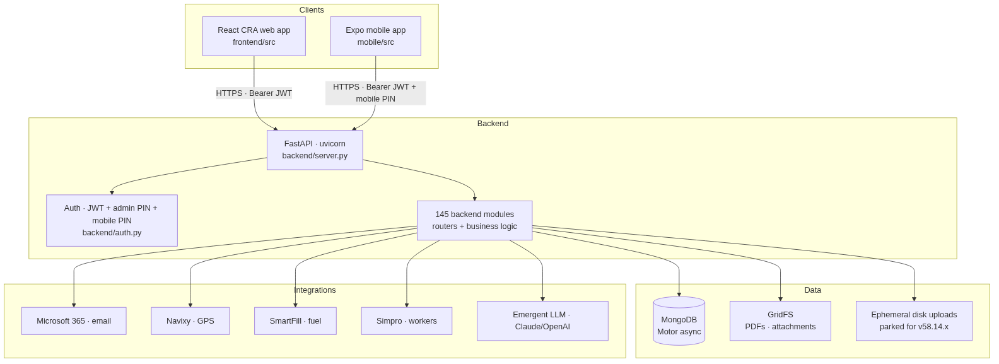
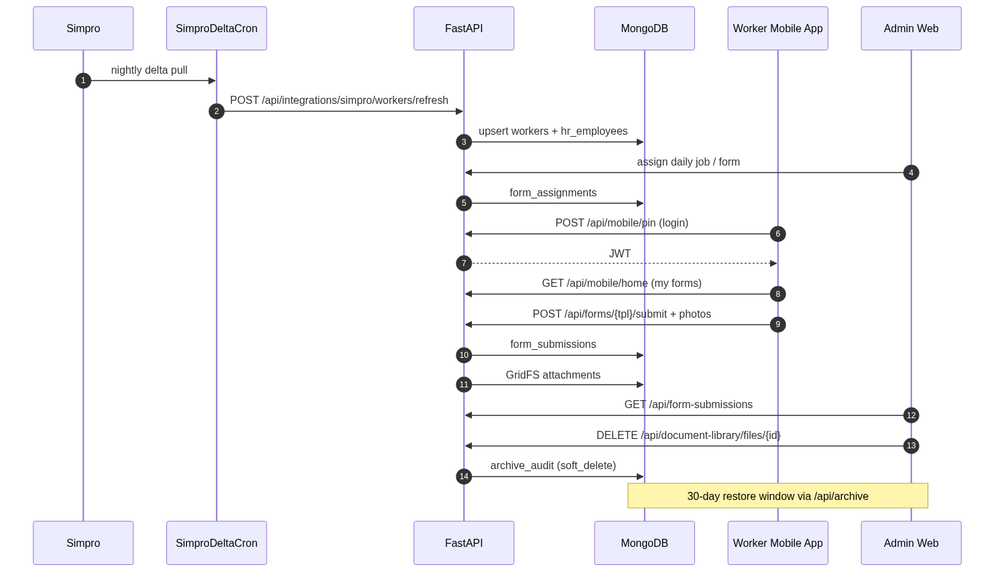
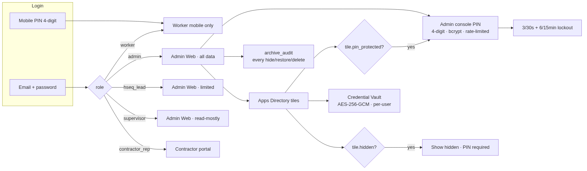

% Paneltec Group Platform Manual
% Paneltec Group — WHS + Compliance
% Generated 2026-09-14 20:41 UTC · Version `paneltec-v160.3.9.58.13.132gc`

\newpage

# 1. Executive Summary

Paneltec Group's operational platform is a single-source WHS + compliance system serving field operations for a civil-contracting business. Admins run day-to-day compliance from a React web app; field workers submit forms, sign in to sites, and complete daily pre-starts from an Expo mobile app. Every capture-side artefact (pre-start, hazard, incident, site diary, inspection, SWMS/SSRA) flows through a shared FastAPI + MongoDB backend that also brokers integrations with Simpro (workforce master), Navixy (fleet GPS), SmartFill (fuel), Microsoft 365 (email dispatch), and the Emergent LLM key (Claude/OpenAI assistance).

At this generation snapshot the codebase exposes **691** authenticated HTTP endpoints across **98** backend modules, tracks state in **131** MongoDB collections, and renders **64** distinct React pages on the web surface.

# 2. User Personas

Persona | Web access | Mobile access | Notes
-|-|-|-
`admin` | yes | mostly no | Runs the platform. Full read/write across every module. Gated behind email+password login PLUS a per-user 4-digit admin-console PIN for privileged actions (org settings, PIN-protected tiles, tile management, integrations).
`hseq_lead` | yes | mostly no | HSEQ manager. Reviews SWMS/SSRAs, closes incidents, signs off inspections. Read-write on capture modules; no delete on workforce records.
`contractor_rep` | yes | mostly no | External contractor representative. Submits contractor documents and workforce updates via a scoped portal.
`contractor_rep_submit_only` | yes | mostly no | Same as contractor_rep but view-only apart from the submission surface.
`supervisor` | yes | yes | Site supervisor. Assigns daily jobs, reviews pre-starts, signs off inspections. Mostly read; can create.
`worker` | no | yes | Field worker. Mobile-only. 4-digit mobile PIN login. Sees only their own daily jobs, forms, certifications.
`auditor` | yes | mostly no | Read-only auditor. Views records + exports; cannot edit.

# 3. Feature Modules

## Workers + HR Employees

*Module:* `backend/workers.py`

Workforce roster. Synced from Simpro; supports soft-delete + restore. HR document sub-registry.

| Method | Path |
|--------|------|
| `GET` | `/me/worker-profile` |
| `GET` | `/workers` |
| `POST` | `/workers` |
| `GET` | `/workers/directory` |
| `POST` | `/workers/sync-from-simpro` |
| `DELETE` | `/workers/{worker_id}` |
| `GET` | `/workers/{worker_id}` |
| `PATCH` | `/workers/{worker_id}` |
| `POST` | `/workers/{worker_id}/restore` |
| `GET` | `/workers/{worker_id}/smartfill-cards` |
| `POST` | `/workers/{worker_id}/smartfill-cards` |
| `DELETE` | `/workers/{worker_id}/smartfill-cards/{card_number}` |

…and **3** more endpoints (see appendix API reference).

## Inductions

*Module:* `backend/workers_inductions.py`

Worker inductions with certificates + expiry tracking.

| Method | Path |
|--------|------|
| `PUT` | `/workers/inductions/cell` |
| `GET` | `/workers/inductions/export.xlsx` |
| `POST` | `/workers/inductions/import-xlsx` |
| `POST` | `/workers/inductions/import-xlsx/commit` |
| `GET` | `/workers/inductions/matrix` |
| `POST` | `/workers/inductions/print` |
| `POST` | `/workers/{worker_id}/inductions` |
| `DELETE` | `/workers/{worker_id}/inductions/{induction_id}` |
| `GET` | `/workers/{worker_id}/inductions/{induction_id}` |
| `PATCH` | `/workers/{worker_id}/inductions/{induction_id}` |
| `POST` | `/workers/{worker_id}/inductions/{induction_id}/file` |

## Certifications

*Module:* `backend/worker_certifications.py`

Per-worker certifications with attachments + renewal chase.

| Method | Path |
|--------|------|
| `POST` | `/certifications/bulk-clear-pending-review` |
| `GET` | `/certifications/expiry-count` |
| `GET` | `/workers/certifications/all` |
| `POST` | `/workers/certifications/scan-reminders` |
| `GET` | `/workers/certifications/search` |
| `DELETE` | `/workers/certifications/{cert_id}` |
| `PATCH` | `/workers/certifications/{cert_id}` |
| `POST` | `/workers/certifications/{cert_id}/send-reminder` |
| `GET` | `/workers/{worker_id}/certifications` |
| `POST` | `/workers/{worker_id}/certifications` |
| `POST` | `/workers/{worker_id}/certifications/upload` |
| `POST` | `/workers/{worker_id}/certifications/{cert_id}/upload` |

## Incident Reports

*Module:* `backend/cs_incident.py`

Incident capture (mobile + web) with root-cause categorisation.

| Method | Path |
|--------|------|
| `GET` | `/cs-incident/` |
| `POST` | `/cs-incident/` |
| `GET` | `/cs-incident/columns` |
| `POST` | `/cs-incident/reimport` |
| `DELETE` | `/cs-incident/{uid}` |
| `GET` | `/cs-incident/{uid}` |
| `PATCH` | `/cs-incident/{uid}` |

## Pre-Starts + Daily Jobs

*Module:* `backend/prestart.py`

Daily equipment/plant pre-starts + assigned daily jobs.

## SWMS / SSRAs / Risk Assessments

*Module:* `backend/swms_phase45.py`

Safe-Work Method Statements + Site-Specific Risk Assessments authored via AI drafting.

| Method | Path |
|--------|------|
| `POST` | `/swms/bulk-delete` |
| `POST` | `/swms/from-paste` |
| `POST` | `/swms/from-scan` |
| `GET` | `/swms/recycle-bin` |
| `POST` | `/swms/{swms_id}/restore` |

## Master Risks

*Module:* `backend/master_risks.py`

Reference risk library — surfaced when authoring SSRAs.

| Method | Path |
|--------|------|
| `GET` | `/master-risks/` |
| `POST` | `/master-risks/` |
| `POST` | `/master-risks/reimport` |
| `DELETE` | `/master-risks/{risk_uid}` |
| `GET` | `/master-risks/{risk_uid}` |
| `PATCH` | `/master-risks/{risk_uid}` |

## Fuel Tracking (SmartFill)

*Module:* `backend/fleet_fuel.py`

Fuel transactions imported via SmartFill API + CSV backup path.

| Method | Path |
|--------|------|
| `GET` | `/fleet/fuel/anomalies` |
| `GET` | `/fleet/fuel/anomalies/matching-ids` |
| `POST` | `/fleet/fuel/anomalies/{txn_id}/dismiss` |
| `POST` | `/fleet/fuel/anomalies/{txn_id}/resolve` |
| `GET` | `/fleet/fuel/batches` |
| `DELETE` | `/fleet/fuel/batches/{batch_id}` |
| `GET` | `/fleet/fuel/batches/{batch_id}` |
| `POST` | `/fleet/fuel/import-csv` |
| `POST` | `/fleet/fuel/smartfill-auto-sync` |
| `GET` | `/fleet/fuel/smartfill-status` |
| `POST` | `/fleet/fuel/sync-smartfill` |
| `GET` | `/fleet/fuel/transactions` |

…and **18** more endpoints (see appendix API reference).

## Fleet Service Register

*Module:* `backend/fleet.py`

Vehicles + service schedules + Navixy live positions.

| Method | Path |
|--------|------|
| `GET` | `/fleet/assets/{asset_id}` |
| `GET` | `/fleet/assets/{asset_id}/next-service` |
| `GET` | `/fleet/assets/{asset_id}/service-sheet/{maintenance_id}/pdf` |
| `POST` | `/fleet/assets/{asset_id}/services` |
| `GET` | `/fleet/categories` |
| `GET` | `/fleet/register` |
| `GET` | `/fleet/search` |
| `GET` | `/fleet/service-schedule-presets` |
| `GET` | `/fleet/service-sheet-templates` |
| `GET` | `/fleet/service-status-rollup` |
| `GET` | `/fleet/technicians` |

## Apps Directory

*Module:* `backend/org_url_tiles.py`

In-app launcher tiles for external tools. Org-wide hide + per-tile PIN gates + drag-to-reorder.

| Method | Path |
|--------|------|
| `GET` | `/org/url-tiles` |
| `POST` | `/org/url-tiles` |
| `PATCH` | `/org/url-tiles/bulk-access` |
| `GET` | `/org/url-tiles/eligible-users` |
| `POST` | `/org/url-tiles/fetch-icon` |
| `PATCH` | `/org/url-tiles/reorder` |
| `POST` | `/org/url-tiles/reorder` |
| `GET` | `/org/url-tiles/user-approvals` |
| `PATCH` | `/org/url-tiles/user-approvals` |
| `DELETE` | `/org/url-tiles/{tile_id}` |
| `PATCH` | `/org/url-tiles/{tile_id}` |
| `POST` | `/org/url-tiles/{tile_id}/verify-pin` |

## Insurance Registry

*Module:* `backend/renewals.py`

Org insurance + supplier compliance renewals.

| Method | Path |
|--------|------|
| `GET` | `/public/renewals/{token}` |
| `GET` | `/renewals` |
| `POST` | `/renewals` |
| `POST` | `/renewals/bulk` |
| `POST` | `/renewals/bulk-delete` |
| `GET` | `/renewals/doc-types` |
| `POST` | `/renewals/doc-types` |
| `DELETE` | `/renewals/doc-types/{type_id}` |
| `PATCH` | `/renewals/doc-types/{type_id}` |
| `DELETE` | `/renewals/{rid}` |
| `PATCH` | `/renewals/{rid}` |
| `POST` | `/renewals/{rid}/revoke` |

…and **1** more endpoints (see appendix API reference).

## Document Library

*Module:* `backend/document_library.py`

Folder-scoped compliance documents with recursive search (filename + AI tags + uploader).

| Method | Path |
|--------|------|
| `DELETE` | `/document-library/files/{file_id}` |
| `GET` | `/document-library/files/{file_id}/download` |
| `GET` | `/document-library/folders` |
| `POST` | `/document-library/folders` |
| `DELETE` | `/document-library/folders/{folder_id}` |
| `PATCH` | `/document-library/folders/{folder_id}` |
| `GET` | `/document-library/folders/{folder_id}/files` |
| `POST` | `/document-library/folders/{folder_id}/files` |
| `GET` | `/document-library/folders/{folder_id}/subfolders` |
| `GET` | `/document-library/search` |
| `GET` | `/{supplier_id}/folders` |
| `POST` | `/{supplier_id}/folders` |

## Site QR Sign-On + Visitors

*Module:* `backend/sites.py`

Public visitor sign-in via per-site QR + admin dashboard.

## Forms

*Module:* `backend/forms.py`

Templated forms (structured payloads, photos, signatures) with routing rules + PDF export.

| Method | Path |
|--------|------|
| `GET` | `/forms/assets/lookup` |
| `GET` | `/forms/assets/picker` |
| `GET` | `/forms/cert-kinds` |
| `POST` | `/forms/fleet/vehicle-overrides` |
| `GET` | `/forms/fleet/vehicles` |
| `GET` | `/forms/templates` |
| `POST` | `/forms/templates` |
| `POST` | `/forms/templates/import` |
| `DELETE` | `/forms/templates/{template_id}` |
| `GET` | `/forms/templates/{template_id}` |
| `PATCH` | `/forms/templates/{template_id}` |
| `GET` | `/forms/templates/{template_id}/access-check` |

…and **11** more endpoints (see appendix API reference).

## Ask Intelligence

*Module:* `backend/ask.py`

AI-assisted deep-links across the org's own records.

| Method | Path |
|--------|------|
| `POST` | `/ask` |
| `GET` | `/ask/briefing` |
| `DELETE` | `/ask/history` |
| `GET` | `/ask/history` |
| `GET` | `/ask/suggestions` |
| `POST` | `/ask/suggestions` |
| `DELETE` | `/ask/suggestions/{suggestion_id}` |
| `PATCH` | `/ask/suggestions/{suggestion_id}` |

# 4. System Architecture

The stack is a classic FARM (FastAPI + React + MongoDB) with an
additional Expo mobile client. All three tiers are containerised behind
a Kubernetes ingress that maps `/api/*` to the FastAPI pod on `:8001`
and everything else to the React CRA dev server on `:3000`.

* **Backend:** FastAPI · Motor (async MongoDB) · uvicorn.
  Entry point: `backend/server.py`. Modules loaded via
  `api.include_router(...)` — 125 include-router calls at last snapshot.
* **Web:** React 19 · CRA scaffold · TailwindCSS · shadcn/ui.
  Entry: `frontend/src/App.js`. 64 pages under `frontend/src/pages/`.
* **Mobile:** Expo SDK · React Native (out of scope for this ship —
  documentation only, `/app/mobile/` is not modified).
* **Deployment:** pod-hosted preview URLs; supervisor manages both
  backend and frontend with hot reload enabled.

# 5. Data Layer

At this snapshot the code touches **131** distinct MongoDB collections. The top-touched collections (counted by number of backend modules that reference them) are listed below.

Collection | Modules that touch it
-|-
`users` | 39 — e.g. `admin_active_sessions`, `admin_console_pin`, `ask`, `asset_service`…
`workers` | 25 — e.g. `ask`, `asset_service`, `auth_invite`, `bulk_import_prestarts`…
`integration_configs` | 19 — e.g. `asset_meter_history`, `asset_navixy_dashboards`, `asset_navixy_sync`, `asset_trip_summary`…
`assets` | 15 — e.g. `asset_meter_history`, `asset_navixy_sync`, `asset_service`, `asset_trip_summary`…
`swms` | 13 — e.g. `ask`, `crud`, `dashboard`, `dashboards`…
`form_templates` | 12 — e.g. `asset_service`, `bulk_import_prestarts`, `crud`, `form_assignment_notifier`…
`form_submissions` | 11 — e.g. `ask`, `bulk_import_prestarts`, `category_counts`, `crud`…
`worker_certifications` | 11 — e.g. `dashboards`, `document_categories`, `forms`, `induction_columns`…
`orgs` | 10 — e.g. `auth`, `auth_invite`, `auth_mobile_pin`, `forms`…
`workspaces` | 9 — e.g. `asset_service`, `auth`, `dashboards`, `exports`…
`audit_logs` | 8 — e.g. `auth_invite`, `bulk_import_prestarts`, `induction_columns`, `mobile_modules`…
`simpro_sites` | 8 — e.g. `forms_pickers`, `integrations_simpro`, `mobile_home`, `mobile_sites`…
`contractors` | 7 — e.g. `ask`, `contractors`, `integrations_simpro`, `renewals`…
`org_settings` | 7 — e.g. `ask`, `comms_safe_mode`, `cron_smartfill_auto_sync`, `fleet_fuel`…
`user_permissions` | 7 — e.g. `bulk_permissions`, `comms_safe_mode`, `permission_presets`, `permission_v26_migrations`…
`doc_files` | 6 — e.g. `document_categories`, `document_library`, `file_pdf`, `simpro_zip_import`…
`hazards` | 6 — e.g. `ask`, `asset_service`, `category_counts`, `dashboard`…
`roles` | 6 — e.g. `auth`, `auth_mobile_pin`, `permission_presets`, `permissions`…
`sites` | 6 — e.g. `bulk_import_prestarts`, `dashboards`, `mobile_data`, `mobile_home`…
`app_state` | 5 — e.g. `backup_service`, `health_extras`, `migrate_form_pickers`, `migrate_strip_misplaced`…
`archive_audit` | 5 — e.g. `archive_audit_helpers`, `crud`, `org_archive_rules`, `visitor_signins`…
`asset_service_schedules` | 5 — e.g. `admin_purge_test_data`, `asset_navixy_sync`, `asset_service`, `cron_asset_service_generate`…
`incidents` | 5 — e.g. `ask`, `category_counts`, `dashboard`, `dashboards`…
`inspections` | 5 — e.g. `ask`, `category_counts`, `dashboard`, `dashboards`…
`pre_starts` | 5 — e.g. `ask`, `bulk_import_prestarts`, `category_counts`, `dashboard`…
`active_sessions` | 4 — e.g. `admin_active_sessions`, `auth`, `session_history`, `session_timeout`
`renewal_links` | 4 — e.g. `contractors`, `notifications`, `renewals`, `seed_phase3`
`site_diary_entries` | 4 — e.g. `ask`, `category_counts`, `dashboard`, `seed`
`site_signons` | 4 — e.g. `dashboards`, `mobile_home`, `sites_qr`, `sites_signon_v127`
`user_audit` | 4 — e.g. `admin_console_pin`, `mobile_onboarding_cards`, `simpro_import_users`, `users`

_Full list of collections in appendix A._

### Storage patterns

* **MongoDB documents** — primary state (all collections above).
* **GridFS** — large binary payloads: PDFs, form attachments, worker
  photos. Referenced by GridFS `file_id` in the owning row.
* **Ephemeral pod disk** — legacy upload paths still write to
  `/app/backend/uploads/...` for `document_library`, `contractor_docs`,
  `hazards`, `swms_scans`, `renewals`, and `form_attachments`. **This
  is parked for the `v58.14.x` object-storage migration** — pod-local
  files survive the preview but are inaccessible from a deployed
  container. 20 lint warnings pin the migration targets.
* **`sessionStorage` (frontend)** — retired in `.132g9`. The remaining
  session-scoped state is preview-only (drag-in-progress markers, form
  autosave scratch pads).

# 6. Integrations

Integration | Purpose | Credentials | Status | Backend module
-|-|-|-|-
Microsoft 365 | OAuth send-as-user via Graph. Delivery from the shared outbox. | MICROSOFT365_CLIENT_ID/SECRET (per-org, encrypted) | wired | `backend/email_outbox.py`
Navixy | GPS fleet tracking. Vehicle tags + last-position sync. | NAVIXY_API_KEY (per-org, encrypted) | wired | `backend/fleet_navixy_tags.py`
SmartFill | Fuel transactions + tank levels (JSON RPC to SmartFill). | SMARTFILL_USER + PASSWORD (per-org, encrypted) | wired | `backend/integrations_smartfill.py`
Simpro | Worker + customer + supplier import. Delta sync on cron. | SIMPRO_BUILD/COMPANY/CLIENT_ID/SECRET (per-org, encrypted) | wired | `backend/integrations_simpro.py`
OpenAI / Claude (Emergent LLM) | SWMS drafting, hazard vision, site-diary structuring. | EMERGENT_LLM_KEY (env) | wired | `backend/ai.py`

Integration secrets are encrypted at rest with Fernet (env-derived key
`INTEGRATIONS_ENC_KEY`) and never returned in plaintext by any GET —
`_mask()` in `backend/integrations.py` returns a masked-last-4 preview
for the UI (`v160.3.9.40 · SEC-003`).

Sentry crash reporting is **not** currently wired in this codebase
(none of the frontend/backend modules reference the Sentry SDK). Error
telemetry is captured to structured logs + the `archive_audit` /
`admin_actions` collections.

# 7. API Reference

At this snapshot the code exposes **691** HTTP endpoints across **98** modules.
Every endpoint below is authenticated via a Bearer JWT unless it lives under a `/scan/` or `/public/` route.

### `admin_active_sessions` (5 endpoints)

| Method | Path |
|--------|------|
| `GET` | `/admin/active-sessions` |
| `POST` | `/admin/active-sessions/bulk-revoke` |
| `POST` | `/admin/active-sessions/purge-inactive` |
| `GET` | `/admin/active-sessions/purge-inactive/preview` |
| `DELETE` | `/admin/active-sessions/{jti}` |

### `admin_console_pin` (6 endpoints)

| Method | Path |
|--------|------|
| `POST` | `/auth/admin-console/lock` |
| `POST` | `/auth/admin-console/set-pin` |
| `POST` | `/auth/admin-console/status` |
| `POST` | `/auth/admin-console/unlock` |
| `POST` | `/users/admin-console/backfill-provisional-prices` |
| `POST` | `/users/{target_user_id}/admin-console/clear-pin` |

### `admin_purge_test_data` (1 endpoints)

| Method | Path |
|--------|------|
| `POST` | `/admin/purge-test-data` |

### `admin_safe_wrapper` (1 endpoints)

| Method | Path |
|--------|------|
| `PATCH` | `/some-thing` |

### `ai` (3 endpoints)

| Method | Path |
|--------|------|
| `POST` | `/ai/diary-structure` |
| `POST` | `/ai/hazard-vision` |
| `POST` | `/ai/swms-draft` |

### `ask` (8 endpoints)

| Method | Path |
|--------|------|
| `POST` | `/ask` |
| `GET` | `/ask/briefing` |
| `DELETE` | `/ask/history` |
| `GET` | `/ask/history` |
| `GET` | `/ask/suggestions` |
| `POST` | `/ask/suggestions` |
| `DELETE` | `/ask/suggestions/{suggestion_id}` |
| `PATCH` | `/ask/suggestions/{suggestion_id}` |

### `asset_meter_history` (2 endpoints)

| Method | Path |
|--------|------|
| `POST` | `/assets/{asset_id}/meter-history` |
| `GET` | `/assets/{asset_id}/meter-trends` |

### `asset_navixy_dashboards` (3 endpoints)

| Method | Path |
|--------|------|
| `GET` | `/assets/navixy/dashboards/fleet-status` |
| `GET` | `/assets/navixy/dashboards/technical` |
| `GET` | `/assets/navixy/dashboards/trips` |

### `asset_navixy_sync` (2 endpoints)

| Method | Path |
|--------|------|
| `POST` | `/assets/navixy/repair-lifetimes` |
| `POST` | `/assets/navixy/sync-counters` |

### `asset_service` (25 endpoints)

| Method | Path |
|--------|------|
| `GET` | `/assets/service/inbox` |
| `POST` | `/assets/service/scan-reminders` |
| `GET` | `/assets/service/summary` |
| `POST` | `/assets/{asset_id}/meter` |
| `POST` | `/assets/{asset_id}/meter/reset` |
| `GET` | `/assets/{asset_id}/records` |
| `POST` | `/assets/{asset_id}/records` |
| `DELETE` | `/assets/{asset_id}/records/{rid}` |
| `GET` | `/assets/{asset_id}/records/{rid}` |
| `PUT` | `/assets/{asset_id}/records/{rid}` |
| `GET` | `/assets/{asset_id}/schedules` |
| `POST` | `/assets/{asset_id}/schedules` |
| `DELETE` | `/assets/{asset_id}/schedules/{sid}` |
| `GET` | `/assets/{asset_id}/schedules/{sid}` |
| `PUT` | `/assets/{asset_id}/schedules/{sid}` |
| `POST` | `/assets/{asset_id}/schedules/{sid}/attachments` |
| `DELETE` | `/assets/{asset_id}/schedules/{sid}/attachments/{stored_name}` |
| `GET` | `/assets/{asset_id}/schedules/{sid}/attachments/{stored_name}` |
| `GET` | `/form-templates/assignments` |
| `POST` | `/form-templates/assignments/bulk` |
| `PUT` | `/form-templates/{template_id}/applies-to` |
| `POST` | `/form-templates/{template_id}/notify-added-workers` |
| `POST` | `/form-templates/{template_id}/preview-recipients` |
| `POST` | `/scan/quick-action` |
| `GET` | `/scan/{scan_token}/forms` |

### `asset_trip_summary` (1 endpoints)

| Method | Path |
|--------|------|
| `GET` | `/assets/{asset_id}/trip-summary` |

### `assets` (16 endpoints)

| Method | Path |
|--------|------|
| `GET` | `/assets` |
| `POST` | `/assets` |
| `POST` | `/assets/labels/bulk` |
| `GET` | `/assets/scan/{scan_token}` |
| `DELETE` | `/assets/{asset_id}` |
| `GET` | `/assets/{asset_id}` |
| `PUT` | `/assets/{asset_id}` |
| `GET` | `/assets/{asset_id}/label.pdf` |
| `DELETE` | `/assets/{asset_id}/nfc-pair` |
| `POST` | `/assets/{asset_id}/nfc-pair` |
| `GET` | `/assets/{asset_id}/photo/{gridfs_id}` |
| `POST` | `/assets/{asset_id}/photos` |
| `DELETE` | `/assets/{asset_id}/photos/{photo_id}` |
| `GET` | `/assets/{asset_id}/qr.png` |
| `PATCH` | `/assets/{asset_id}/tag` |
| `POST` | `/assets/{asset_id}/uhf-pair` |

### `auth` (9 endpoints)

| Method | Path |
|--------|------|
| `POST` | `/auth/change-password` |
| `POST` | `/auth/download-token` |
| `POST` | `/auth/login` |
| `POST` | `/auth/login-with-simpro` |
| `POST` | `/auth/logout` |
| `GET` | `/auth/me` |
| `POST` | `/auth/refresh` |
| `POST` | `/auth/signup` |
| `POST` | `/auth/update-profile` |

### `auth_invite` (11 endpoints)

| Method | Path |
|--------|------|
| `POST` | `/auth/forgot-password` |
| `POST` | `/auth/invite/redeem` |
| `POST` | `/auth/invite/validate` |
| `POST` | `/auth/pin/redeem` |
| `POST` | `/auth/reset/redeem` |
| `POST` | `/auth/reset/validate` |
| `GET` | `/users/{user_id}/access-status` |
| `POST` | `/users/{user_id}/invite` |
| `POST` | `/users/{user_id}/pin` |
| `POST` | `/users/{user_id}/reset-password` |
| `POST` | `/users/{user_id}/unlock` |

### `auth_mobile_pin` (2 endpoints)

| Method | Path |
|--------|------|
| `GET` | `/auth/mobile/device-hint` |
| `POST` | `/auth/mobile/pin-login` |

### `backup_service` (26 endpoints)

| Method | Path |
|--------|------|
| `POST` | `/api/backup/admin/migrate-destination-passwords` |
| `GET` | `/api/backup/agent-logs` |
| `GET` | `/api/backup/agent/docker-compose.yml` |
| `GET` | `/api/backup/agent/install.py` |
| `GET` | `/api/backup/agent/pending` |
| `POST` | `/api/backup/agent/report` |
| `GET` | `/api/backup/agents` |
| `POST` | `/api/backup/agents/register` |
| `DELETE` | `/api/backup/agents/{aid}` |
| `GET` | `/api/backup/destinations` |
| `POST` | `/api/backup/destinations` |
| `DELETE` | `/api/backup/destinations/{did}` |
| `PUT` | `/api/backup/destinations/{did}` |
| `GET` | `/api/backup/discovered-smb` |
| `GET` | `/api/backup/lan-status` |
| `POST` | `/api/backup/restore` |
| `GET` | `/api/backup/retention` |
| `PUT` | `/api/backup/retention` |
| `GET` | `/api/backup/retention/preview` |
| `POST` | `/api/backup/retention/run` |
| `GET` | `/api/backup/schedule` |
| `GET` | `/api/backup/snapshots` |
| `POST` | `/api/backup/snapshots` |
| `GET` | `/api/backup/snapshots/{snap_id}/data` |
| `POST` | `/api/backup/snapshots/{snap_id}/verify` |
| `GET` | `/api/backup/summary` |

### `bulk_import_prestarts` (7 endpoints)

| Method | Path |
|--------|------|
| `POST` | `/pre-starts/bulk-import/init` |
| `GET` | `/pre-starts/bulk-import/last` |
| `GET` | `/pre-starts/bulk-import/pdf/{gridfs_id}` |
| `POST` | `/pre-starts/bulk-import/{job_id}/approve` |
| `GET` | `/pre-starts/bulk-import/{job_id}/report` |
| `POST` | `/pre-starts/bulk-import/{job_id}/start` |
| `GET` | `/pre-starts/bulk-import/{job_id}/status` |

### `bulk_permissions` (1 endpoints)

| Method | Path |
|--------|------|
| `POST` | `/permissions/bulk-restrict` |

### `category_counts` (7 endpoints)

| Method | Path |
|--------|------|
| `GET` | `/admin/visitors/category-counts` |
| `GET` | `/hazards/category-counts` |
| `GET` | `/incidents/category-counts` |
| `GET` | `/inspections/category-counts` |
| `GET` | `/pre-starts/category-counts` |
| `GET` | `/risk-assessments/category-counts` |
| `GET` | `/site-diary/category-counts` |

### `comms_safe_mode` (5 endpoints)

| Method | Path |
|--------|------|
| `DELETE` | `/admin/comms-outbox-blocked` |
| `GET` | `/admin/comms-outbox-blocked` |
| `PATCH` | `/admin/comms-safe-mode` |
| `GET` | `/admin/comms-safe-mode/status` |
| `GET` | `/admin/comms-safe-mode/who-can-toggle` |

### `companies` (7 endpoints)

| Method | Path |
|--------|------|
| `GET` | `/companies/` |
| `POST` | `/companies/` |
| `GET` | `/companies/columns` |
| `POST` | `/companies/reimport` |
| `DELETE` | `/companies/{uid}` |
| `GET` | `/companies/{uid}` |
| `PATCH` | `/companies/{uid}` |

### `completed_training` (7 endpoints)

| Method | Path |
|--------|------|
| `GET` | `/completed-training/` |
| `POST` | `/completed-training/` |
| `GET` | `/completed-training/columns` |
| `POST` | `/completed-training/reimport` |
| `DELETE` | `/completed-training/{uid}` |
| `GET` | `/completed-training/{uid}` |
| `PATCH` | `/completed-training/{uid}` |

### `contractors` (8 endpoints)

| Method | Path |
|--------|------|
| `GET` | `/contractors` |
| `POST` | `/contractors` |
| `POST` | `/contractors/import-from-simpro` |
| `DELETE` | `/contractors/{cid}` |
| `GET` | `/contractors/{cid}` |
| `PATCH` | `/contractors/{cid}` |
| `POST` | `/contractors/{cid}/documents` |
| `DELETE` | `/contractors/{cid}/documents/{doc_id}` |

### `crud` (1 endpoints)

| Method | Path |
|--------|------|
| `POST` | `/{item_id}/review` |

### `cs_incident` (7 endpoints)

| Method | Path |
|--------|------|
| `GET` | `/cs-incident/` |
| `POST` | `/cs-incident/` |
| `GET` | `/cs-incident/columns` |
| `POST` | `/cs-incident/reimport` |
| `DELETE` | `/cs-incident/{uid}` |
| `GET` | `/cs-incident/{uid}` |
| `PATCH` | `/cs-incident/{uid}` |

### `dashboard` (10 endpoints)

| Method | Path |
|--------|------|
| `GET` | `/dashboard/metrics` |
| `GET` | `/dashboard/module-stats` |
| `GET` | `/files/contractor_docs/{name}` |
| `GET` | `/files/document_library/{folder_id}/{name}` |
| `GET` | `/files/exports/{name}` |
| `GET` | `/files/form_photos/{submission_id}/{name}` |
| `GET` | `/files/hazards/{name}` |
| `GET` | `/files/pdfs/{name}` |
| `GET` | `/files/renewals/{token}/{name}` |
| `GET` | `/files/swms_scans/{name}` |

### `dashboards` (1 endpoints)

| Method | Path |
|--------|------|
| `GET` | `/dashboards/{module}` |

### `document_categories` (5 endpoints)

| Method | Path |
|--------|------|
| `GET` | `/document-categories` |
| `POST` | `/document-categories` |
| `DELETE` | `/document-categories/{cat_id}` |
| `PUT` | `/document-categories/{cat_id}` |
| `GET` | `/document-categories/{cat_id}/records` |

### `document_library` (12 endpoints)

| Method | Path |
|--------|------|
| `DELETE` | `/document-library/files/{file_id}` |
| `GET` | `/document-library/files/{file_id}/download` |
| `GET` | `/document-library/folders` |
| `POST` | `/document-library/folders` |
| `DELETE` | `/document-library/folders/{folder_id}` |
| `PATCH` | `/document-library/folders/{folder_id}` |
| `GET` | `/document-library/folders/{folder_id}/files` |
| `POST` | `/document-library/folders/{folder_id}/files` |
| `GET` | `/document-library/folders/{folder_id}/subfolders` |
| `GET` | `/document-library/search` |
| `GET` | `/{supplier_id}/folders` |
| `POST` | `/{supplier_id}/folders` |

### `email_outbox` (7 endpoints)

| Method | Path |
|--------|------|
| `GET` | `/email/outbox` |
| `POST` | `/email/outbox/bulk-delete` |
| `DELETE` | `/email/outbox/{email_id}` |
| `GET` | `/email/outbox/{email_id}` |
| `POST` | `/email/outbox/{email_id}/cancel` |
| `POST` | `/email/outbox/{email_id}/retry` |
| `POST` | `/email/send` |

### `exports` (5 endpoints)

| Method | Path |
|--------|------|
| `GET` | `/audit-exports` |
| `POST` | `/audit-exports` |
| `DELETE` | `/audit-exports/{eid}` |
| `GET` | `/audit-exports/{eid}` |
| `POST` | `/audit-exports/{eid}/render-pdf` |

### `file_pdf` (10 endpoints)

| Method | Path |
|--------|------|
| `GET` | `/admin/files/{file_id}/search-text` |
| `POST` | `/admin/install-libreoffice` |
| `GET` | `/admin/server-tools/health` |
| `GET` | `/admin/system-tools` |
| `POST` | `/files/inline-pdf` |
| `GET` | `/files/inline/{stash_id}` |
| `POST` | `/files/pdf-bundle` |
| `GET` | `/files/{file_id}/pdf` |
| `GET` | `/files/{file_id}/pdf.pdf` |
| `POST` | `/files/{file_id}/preview-token` |

### `fleet` (11 endpoints)

| Method | Path |
|--------|------|
| `GET` | `/fleet/assets/{asset_id}` |
| `GET` | `/fleet/assets/{asset_id}/next-service` |
| `GET` | `/fleet/assets/{asset_id}/service-sheet/{maintenance_id}/pdf` |
| `POST` | `/fleet/assets/{asset_id}/services` |
| `GET` | `/fleet/categories` |
| `GET` | `/fleet/register` |
| `GET` | `/fleet/search` |
| `GET` | `/fleet/service-schedule-presets` |
| `GET` | `/fleet/service-sheet-templates` |
| `GET` | `/fleet/service-status-rollup` |
| `GET` | `/fleet/technicians` |

### `fleet_fuel` (30 endpoints)

| Method | Path |
|--------|------|
| `GET` | `/fleet/assets/{asset_id}/fuel` |
| `GET` | `/fleet/assets/{asset_id}/fuel-summary` |
| `GET` | `/fleet/fuel/anomalies` |
| `POST` | `/fleet/fuel/anomalies/bulk-attribute` |
| `POST` | `/fleet/fuel/anomalies/bulk-dismiss` |
| `POST` | `/fleet/fuel/anomalies/bulk-reopen` |
| `POST` | `/fleet/fuel/anomalies/bulk-resolve` |
| `GET` | `/fleet/fuel/anomalies/matching-ids` |
| `POST` | `/fleet/fuel/anomalies/{txn_id}/delete-dismissal` |
| `POST` | `/fleet/fuel/anomalies/{txn_id}/dismiss` |
| `POST` | `/fleet/fuel/anomalies/{txn_id}/reopen` |
| `POST` | `/fleet/fuel/anomalies/{txn_id}/resolve` |
| `POST` | `/fleet/fuel/anomalies/{txn_id}/undelete-dismissal` |
| `GET` | `/fleet/fuel/batches` |
| `DELETE` | `/fleet/fuel/batches/{batch_id}` |
| `GET` | `/fleet/fuel/batches/{batch_id}` |
| `GET` | `/fleet/fuel/cards` |
| `PATCH` | `/fleet/fuel/cards/{card_number}` |
| `POST` | `/fleet/fuel/cards/{card_number}/assign` |
| `GET` | `/fleet/fuel/cards/{card_number}/summary` |
| `GET` | `/fleet/fuel/cards/{card_number}/transactions` |
| `GET` | `/fleet/fuel/export` |
| `POST` | `/fleet/fuel/import-csv` |
| `POST` | `/fleet/fuel/smartfill-auto-sync` |
| `GET` | `/fleet/fuel/smartfill-status` |
| `GET` | `/fleet/fuel/stats` |
| `POST` | `/fleet/fuel/sync-smartfill` |
| `GET` | `/fleet/fuel/transactions` |
| `GET` | `/fleet/fuel/transactions/{txn_id}` |
| `POST` | `/fleet/fuel/transactions/{txn_id}/match` |

### `fleet_fuel_reports` (3 endpoints)

| Method | Path |
|--------|------|
| `GET` | `/fleet/fuel/reports` |
| `POST` | `/fleet/fuel/reports/email` |
| `GET` | `/fleet/fuel/reports/export` |

### `fleet_navixy_tags` (1 endpoints)

| Method | Path |
|--------|------|
| `GET` | `/fleet/navixy/tags` |

### `forms` (23 endpoints)

| Method | Path |
|--------|------|
| `GET` | `/forms/assets/lookup` |
| `GET` | `/forms/assets/picker` |
| `GET` | `/forms/cert-kinds` |
| `POST` | `/forms/fleet/vehicle-overrides` |
| `GET` | `/forms/fleet/vehicles` |
| `POST` | `/forms/submissions/pdf-token` |
| `DELETE` | `/forms/submissions/{submission_id}` |
| `GET` | `/forms/submissions/{submission_id}` |
| `POST` | `/forms/submissions/{submission_id}/attachments` |
| `GET` | `/forms/submissions/{submission_id}/attachments/{stored_name}` |
| `GET` | `/forms/submissions/{submission_id}/pdf` |
| `POST` | `/forms/submissions/{submission_id}/photos` |
| `GET` | `/forms/submissions/{submission_id}/photos/{stored_name}` |
| `GET` | `/forms/templates` |
| `POST` | `/forms/templates` |
| `POST` | `/forms/templates/ai-generate` |
| `POST` | `/forms/templates/import` |
| `DELETE` | `/forms/templates/{template_id}` |
| `GET` | `/forms/templates/{template_id}` |
| `PATCH` | `/forms/templates/{template_id}` |
| `GET` | `/forms/templates/{template_id}/access-check` |
| `GET` | `/forms/templates/{template_id}/submissions` |
| `POST` | `/forms/templates/{template_id}/submissions` |

### `forms_pickers` (4 endpoints)

| Method | Path |
|--------|------|
| `GET` | `/forms/pickers/customers` |
| `GET` | `/forms/pickers/jobs` |
| `GET` | `/forms/pickers/sites` |
| `GET` | `/forms/pickers/workers` |

### `fuel_price_settings` (3 endpoints)

| Method | Path |
|--------|------|
| `GET` | `/fleet/fuel/price-history` |
| `GET` | `/fleet/fuel/price-settings` |
| `PUT` | `/fleet/fuel/price-settings` |

### `health_extras` (4 endpoints)

| Method | Path |
|--------|------|
| `GET` | `/health/backup` |
| `GET` | `/health/integrations` |
| `GET` | `/me/suspicious-alerts` |
| `PATCH` | `/me/suspicious-alerts` |

### `help_reference_images` (4 endpoints)

| Method | Path |
|--------|------|
| `GET` | `/help/reference-images` |
| `POST` | `/help/reference-images/upload` |
| `DELETE` | `/help/reference-images/{slot}` |
| `GET` | `/help/reference-images/{slot}` |

### `help_routes` (4 endpoints)

| Method | Path |
|--------|------|
| `GET` | `/help/manual.md` |
| `GET` | `/help/manual.pdf` |
| `GET` | `/help/schematics/{filename}` |
| `GET` | `/help/tiles/{filename}` |

### `hr_employees` (16 endpoints)

| Method | Path |
|--------|------|
| `GET` | `/hr/employees/` |
| `GET` | `/hr/employees/audit` |
| `GET` | `/hr/employees/columns` |
| `GET` | `/hr/employees/link-candidates/bulk` |
| `POST` | `/hr/employees/link-worker/bulk` |
| `GET` | `/hr/employees/linked` |
| `POST` | `/hr/employees/refresh-from-source` |
| `POST` | `/hr/employees/reimport` |
| `POST` | `/hr/employees/unlink-worker/bulk` |
| `GET` | `/hr/employees/{eid}/link-candidates` |
| `PATCH` | `/hr/employees/{eid}/link-worker` |
| `PATCH` | `/hr/employees/{eid}/unlink-worker` |
| `DELETE` | `/hr/employees/{uid}` |
| `GET` | `/hr/employees/{uid}` |
| `PATCH` | `/hr/employees/{uid}` |
| `POST` | `/hr/employees/{uid}/archive` |

### `imports` (2 endpoints)

| Method | Path |
|--------|------|
| `GET` | `/imports/history` |
| `POST` | `/imports/pdf` |

### `incident_root_causes` (6 endpoints)

| Method | Path |
|--------|------|
| `GET` | `/incident-root-causes/` |
| `POST` | `/incident-root-causes/` |
| `POST` | `/incident-root-causes/reimport` |
| `DELETE` | `/incident-root-causes/{uid}` |
| `GET` | `/incident-root-causes/{uid}` |
| `PATCH` | `/incident-root-causes/{uid}` |

### `induction_columns` (4 endpoints)

| Method | Path |
|--------|------|
| `GET` | `/induction-columns/cleanup-suggestions` |
| `POST` | `/induction-columns/clear-column-key` |
| `POST` | `/induction-columns/merge` |
| `POST` | `/induction-columns/move-to-certifications` |

### `integrations` (8 endpoints)

| Method | Path |
|--------|------|
| `GET` | `/integrations` |
| `POST` | `/integrations/admin/migrate-integration-secrets` |
| `POST` | `/integrations/navixy/get-hash` |
| `GET` | `/integrations/navixy/tags` |
| `POST` | `/integrations/navixy/test-connection` |
| `GET` | `/integrations/navixy/vehicles` |
| `GET` | `/integrations/{kind}` |
| `PUT` | `/integrations/{kind}` |

### `integrations_m365` (2 endpoints)

| Method | Path |
|--------|------|
| `DELETE` | `/integrations/microsoft365` |
| `POST` | `/integrations/microsoft365/test-connection` |

### `integrations_simpro` (15 endpoints)

| Method | Path |
|--------|------|
| `GET` | `/integrations/simpro/companies` |
| `POST` | `/integrations/simpro/connect` |
| `GET` | `/integrations/simpro/customers` |
| `GET` | `/integrations/simpro/customers/search` |
| `GET` | `/integrations/simpro/employees` |
| `GET` | `/integrations/simpro/last-synced` |
| `GET` | `/integrations/simpro/staff` |
| `GET` | `/integrations/simpro/suppliers` |
| `GET` | `/integrations/simpro/suppliers/cached` |
| `POST` | `/integrations/simpro/suppliers/sync` |
| `POST` | `/integrations/simpro/sync-customers` |
| `POST` | `/integrations/simpro/sync-jobs` |
| `POST` | `/integrations/simpro/sync-sites` |
| `POST` | `/integrations/simpro/sync-suppliers` |
| `POST` | `/integrations/simpro/test-connection` |

### `integrations_simpro_workers` (4 endpoints)

| Method | Path |
|--------|------|
| `POST` | `/integrations/simpro/workers/refresh` |
| `POST` | `/integrations/simpro/workers/rollback/{snapshot_id}` |
| `GET` | `/integrations/simpro/workers/snapshots` |
| `GET` | `/integrations/simpro/workers/snapshots/{snapshot_id}` |

### `integrations_textmagic` (2 endpoints)

| Method | Path |
|--------|------|
| `POST` | `/integrations/textmagic/send-sms` |
| `POST` | `/integrations/textmagic/test-connection` |

### `list_forms` (6 endpoints)

| Method | Path |
|--------|------|
| `GET` | `/list-forms/` |
| `POST` | `/list-forms/` |
| `POST` | `/list-forms/reimport` |
| `DELETE` | `/list-forms/{uid}` |
| `GET` | `/list-forms/{uid}` |
| `PATCH` | `/list-forms/{uid}` |

### `list_roles` (6 endpoints)

| Method | Path |
|--------|------|
| `GET` | `/list-roles/` |
| `POST` | `/list-roles/` |
| `POST` | `/list-roles/reimport` |
| `DELETE` | `/list-roles/{uid}` |
| `GET` | `/list-roles/{uid}` |
| `PATCH` | `/list-roles/{uid}` |

### `master_risks` (6 endpoints)

| Method | Path |
|--------|------|
| `GET` | `/master-risks/` |
| `POST` | `/master-risks/` |
| `POST` | `/master-risks/reimport` |
| `DELETE` | `/master-risks/{risk_uid}` |
| `GET` | `/master-risks/{risk_uid}` |
| `PATCH` | `/master-risks/{risk_uid}` |

### `metrics_routes` (1 endpoints)

| Method | Path |
|--------|------|
| `POST` | `/metrics/capture-density` |

### `mobile_auth` (7 endpoints)

| Method | Path |
|--------|------|
| `POST` | `/mobile/auth/pin-set` |
| `POST` | `/mobile/auth/pin-status` |
| `POST` | `/mobile/auth/pin-verify` |
| `POST` | `/mobile/onboarding/issue-token` |
| `POST` | `/mobile/onboarding/redeem` |
| `GET` | `/mobile/onboarding/validate/{token}` |
| `POST` | `/mobile/push/register` |

### `mobile_daily_jobs` (6 endpoints)

| Method | Path |
|--------|------|
| `POST` | `/mobile/daily-jobs` |
| `POST` | `/mobile/daily-jobs/parse-pdf` |
| `GET` | `/mobile/daily-jobs/pdf/{pdf_id}` |
| `GET` | `/mobile/daily-jobs/today` |
| `POST` | `/mobile/daily-jobs/{assignment_id}/accept` |
| `POST` | `/mobile/daily-jobs/{assignment_id}/decline` |

### `mobile_daily_jobs_admin` (7 endpoints)

| Method | Path |
|--------|------|
| `GET` | `/mobile/daily-jobs/admin/assignments` |
| `GET` | `/mobile/daily-jobs/admin/sites` |
| `GET` | `/mobile/daily-jobs/admin/workers` |
| `DELETE` | `/mobile/daily-jobs/admin/{assignment_id}/pdf` |
| `POST` | `/mobile/daily-jobs/admin/{assignment_id}/pdf/undelete` |
| `GET` | `/mobile/geocode` |
| `GET` | `/mobile/weather` |

### `mobile_data` (6 endpoints)

| Method | Path |
|--------|------|
| `POST` | `/mobile/ai/ask` |
| `GET` | `/mobile/ai/briefing` |
| `POST` | `/mobile/prestart/submit` |
| `GET` | `/mobile/records/mine` |
| `POST` | `/mobile/sites/{site_id}/sign-off` |
| `POST` | `/mobile/sites/{site_id}/sign-on` |

### `mobile_downloads` (2 endpoints)

| Method | Path |
|--------|------|
| `GET` | `/mobile/downloads/android/latest.apk` |
| `GET` | `/mobile/downloads/android/version` |

### `mobile_home` (3 endpoints)

| Method | Path |
|--------|------|
| `GET` | `/mobile/home` |
| `GET` | `/mobile/notifications/count` |
| `POST` | `/mobile/user/active-company` |

### `mobile_modules` (5 endpoints)

| Method | Path |
|--------|------|
| `GET` | `/api/me/mobile-modules` |
| `GET` | `/api/settings/mobile-modules` |
| `PUT` | `/api/settings/mobile-modules` |
| `PATCH` | `/api/settings/mobile-modules/overrides` |
| `DELETE` | `/api/settings/mobile-modules/overrides/{role_id}` |

### `mobile_onboarding_cards` (1 endpoints)

| Method | Path |
|--------|------|
| `GET` | `/mobile/onboarding/cards.pdf` |

### `mobile_preview` (2 endpoints)

| Method | Path |
|--------|------|
| `GET` | `/mobile/preview-user` |
| `GET` | `/mobile/preview-user/workers` |

### `mobile_sites` (7 endpoints)

| Method | Path |
|--------|------|
| `POST` | `/mobile/gps/heartbeat` |
| `GET` | `/mobile/sites` |
| `GET` | `/mobile/sites/{site_id}/current-occupancy` |
| `POST` | `/mobile/sites/{site_id}/sign-in` |
| `POST` | `/mobile/sites/{site_id}/sign-out` |
| `POST` | `/mobile/sites/{site_id}/visitor-sign-in` |
| `POST` | `/mobile/sites/{site_id}/visitor-sign-out` |

### `notifications` (3 endpoints)

| Method | Path |
|--------|------|
| `GET` | `/notifications` |
| `POST` | `/notifications/mark-all-read` |
| `POST` | `/notifications/{notification_id}/read` |

### `org_archive_rules` (2 endpoints)

| Method | Path |
|--------|------|
| `GET` | `/org/archive-rules` |
| `PUT` | `/org/archive-rules/{module}` |

### `org_settings` (22 endpoints)

| Method | Path |
|--------|------|
| `GET` | `/api/org` |
| `PATCH` | `/api/org` |
| `GET` | `/api/org/companies` |
| `PUT` | `/api/org/companies` |
| `POST` | `/api/org/insurance/email` |
| `GET` | `/api/org/insurance/email/log` |
| `POST` | `/api/org/insurance/email/log/clear-all` |
| `DELETE` | `/api/org/insurance/email/log/{log_id}` |
| `POST` | `/api/org/insurance/email/log/{log_id}/undelete` |
| `GET` | `/api/org/insurance/{policy_type}/download` |
| `GET` | `/api/org/insurance/{policy_type}/history` |
| `POST` | `/api/org/insurance/{policy_type}/history/clear-all` |
| `POST` | `/api/org/insurance/{policy_type}/history/purge-all-deleted` |
| `DELETE` | `/api/org/insurance/{policy_type}/history/{file_id}` |
| `GET` | `/api/org/insurance/{policy_type}/history/{file_id}/download` |
| `POST` | `/api/org/insurance/{policy_type}/history/{file_id}/purge` |
| `POST` | `/api/org/insurance/{policy_type}/history/{file_id}/undelete` |
| `POST` | `/api/org/insurance/{policy_type}/upload` |
| `POST` | `/api/org/logo/upload` |
| `GET` | `/api/org/logo/{gridfs_id}` |
| `GET` | `/api/org/role-presets/{role}/forms` |
| `PUT` | `/api/org/role-presets/{role}/forms` |

### `org_url_tiles` (12 endpoints)

| Method | Path |
|--------|------|
| `GET` | `/org/url-tiles` |
| `POST` | `/org/url-tiles` |
| `PATCH` | `/org/url-tiles/bulk-access` |
| `GET` | `/org/url-tiles/eligible-users` |
| `POST` | `/org/url-tiles/fetch-icon` |
| `PATCH` | `/org/url-tiles/reorder` |
| `POST` | `/org/url-tiles/reorder` |
| `GET` | `/org/url-tiles/user-approvals` |
| `PATCH` | `/org/url-tiles/user-approvals` |
| `DELETE` | `/org/url-tiles/{tile_id}` |
| `PATCH` | `/org/url-tiles/{tile_id}` |
| `POST` | `/org/url-tiles/{tile_id}/verify-pin` |

### `pdf_routes` (1 endpoints)

| Method | Path |
|--------|------|
| `POST` | `/pdf-token` |

### `permission_presets` (7 endpoints)

| Method | Path |
|--------|------|
| `GET` | `/permission-presets` |
| `POST` | `/permission-presets` |
| `DELETE` | `/permission-presets/{preset_id}` |
| `PUT` | `/permission-presets/{preset_id}` |
| `GET` | `/permission-presets/{preset_id}/assignees` |
| `POST` | `/permission-presets/{preset_id}/duplicate` |
| `POST` | `/users/{user_id}/permissions/apply-preset` |

### `plant_maintenance` (5 endpoints)

| Method | Path |
|--------|------|
| `POST` | `/plant-maintenance/reimport` |
| `DELETE` | `/plant-maintenance/{uid}` |
| `GET` | `/plant-maintenance/{uid}` |
| `PATCH` | `/plant-maintenance/{uid}` |
| `GET` | `/plant/{plant_id}/maintenance` |

### `program_schematic_overlays` (4 endpoints)

| Method | Path |
|--------|------|
| `GET` | `/overlays` |
| `POST` | `/overlays/new` |
| `DELETE` | `/overlays/{cluster_key}/{node_key}` |
| `PUT` | `/overlays/{cluster_key}/{node_key}` |

### `renewals` (13 endpoints)

| Method | Path |
|--------|------|
| `GET` | `/public/renewals/{token}` |
| `POST` | `/public/renewals/{token}/submit` |
| `GET` | `/renewals` |
| `POST` | `/renewals` |
| `POST` | `/renewals/bulk` |
| `POST` | `/renewals/bulk-delete` |
| `GET` | `/renewals/doc-types` |
| `POST` | `/renewals/doc-types` |
| `DELETE` | `/renewals/doc-types/{type_id}` |
| `PATCH` | `/renewals/doc-types/{type_id}` |
| `DELETE` | `/renewals/{rid}` |
| `PATCH` | `/renewals/{rid}` |
| `POST` | `/renewals/{rid}/revoke` |

### `roles_catalogue` (13 endpoints)

| Method | Path |
|--------|------|
| `GET` | `/admin/roles` |
| `POST` | `/admin/roles` |
| `POST` | `/admin/roles/sync-from-simpro-positions` |
| `DELETE` | `/admin/roles/{role_id}` |
| `GET` | `/admin/roles/{role_id}` |
| `PATCH` | `/admin/roles/{role_id}` |
| `GET` | `/admin/roles/{role_id}/assignees-count` |
| `GET` | `/admin/roles/{role_id}/audit` |
| `GET` | `/admin/roles/{role_id}/forms` |
| `POST` | `/admin/roles/{role_id}/forms` |
| `GET` | `/admin/roles/{role_id}/forms/available` |
| `DELETE` | `/admin/roles/{role_id}/forms/{form_id}` |
| `PATCH` | `/admin/roles/{role_id}/forms/{form_id}` |

### `session_history` (1 endpoints)

| Method | Path |
|--------|------|
| `GET` | `/admin/users/{user_id}/session-history` |

### `session_timeout` (8 endpoints)

| Method | Path |
|--------|------|
| `POST` | `/admin/settings/force-logout-all` |
| `POST` | `/admin/settings/force-refresh-all` |
| `GET` | `/admin/settings/session-timeout` |
| `PUT` | `/admin/settings/session-timeout` |
| `GET` | `/settings/force-refresh-signal` |
| `GET` | `/settings/login-options` |
| `GET` | `/settings/session-timeout/me` |
| `PATCH` | `/settings/session-timeout/me` |

### `settings_nav` (2 endpoints)

| Method | Path |
|--------|------|
| `GET` | `/settings/nav-layout` |
| `PUT` | `/settings/nav-layout` |

### `simpro_import_users` (4 endpoints)

| Method | Path |
|--------|------|
| `GET` | `/admin/simpro/employees/available` |
| `POST` | `/admin/simpro/import-employees` |
| `POST` | `/admin/simpro/import-employees/selective` |
| `POST` | `/admin/simpro/sync-linked` |

### `simpro_zip_import` (21 endpoints)

| Method | Path |
|--------|------|
| `POST` | `/integrations/simpro/workers/accept-suggestions` |
| `POST` | `/integrations/simpro/workers/bulk-zip-import` |
| `GET` | `/integrations/simpro/workers/cert-kinds` |
| `POST` | `/integrations/simpro/workers/identify-zip` |
| `POST` | `/integrations/simpro/workers/inductions/backfill-matrix-links` |
| `GET` | `/integrations/simpro/workers/last-sync` |
| `GET` | `/integrations/simpro/workers/unmatched-summary` |
| `GET` | `/integrations/simpro/workers/zip-status` |
| `GET` | `/workers/{worker_id}/certifications/{cert_id}/file` |
| `GET` | `/workers/{worker_id}/hr-documents` |
| `POST` | `/workers/{worker_id}/hr-documents` |
| `DELETE` | `/workers/{worker_id}/hr-documents/{doc_id}` |
| `PATCH` | `/workers/{worker_id}/hr-documents/{doc_id}` |
| `GET` | `/workers/{worker_id}/hr-documents/{doc_id}/file` |
| `GET` | `/workers/{worker_id}/photo/{gridfs_id}` |
| `POST` | `/workers/{worker_id}/simpro-zip-import` |
| `GET` | `/workers/{worker_id}/unmatched-documents` |
| `DELETE` | `/workers/{worker_id}/unmatched-documents/{doc_id}` |
| `GET` | `/workers/{worker_id}/unmatched-documents/{doc_id}/file` |
| `POST` | `/workers/{worker_id}/unmatched-documents/{doc_id}/move-to-hr` |
| `POST` | `/workers/{worker_id}/unmatched-documents/{doc_id}/reclassify` |

### `sites_admin` (4 endpoints)

| Method | Path |
|--------|------|
| `GET` | `/sites/admin` |
| `POST` | `/sites/admin` |
| `DELETE` | `/sites/admin/{sid}` |
| `PATCH` | `/sites/admin/{sid}` |

### `sites_qr` (8 endpoints)

| Method | Path |
|--------|------|
| `GET` | `/scan/site/{scan_token}` |
| `POST` | `/scan/site/{scan_token}/sign-on` |
| `POST` | `/scan/site/{scan_token}/sign-on-visitor` |
| `GET` | `/sites` |
| `POST` | `/sites/dev/seed-one` |
| `GET` | `/sites/{site_id}/active-signons` |
| `DELETE` | `/sites/{site_id}/active-signons/{signon_id}` |
| `GET` | `/sites/{site_id}/scan-pdf` |

### `sites_qr_v132dk` (2 endpoints)

| Method | Path |
|--------|------|
| `GET` | `/sign-on/{site_id}` |
| `GET` | `/sites/{site_id}/qr-signage.pdf` |

### `sites_signon_v127` (10 endpoints)

| Method | Path |
|--------|------|
| `POST` | `/me/signoff-active` |
| `POST` | `/sites` |
| `POST` | `/sites/bulk-delete` |
| `GET` | `/sites/recycle-bin` |
| `PATCH` | `/sites/{site_id}` |
| `POST` | `/sites/{site_id}/restore` |
| `POST` | `/sites/{site_id}/signoff` |
| `GET` | `/sites/{site_id}/signon-log` |
| `POST` | `/sites/{site_id}/signon-log/export` |
| `POST` | `/sites/{site_id}/signon-v127` |

### `supplier_panels` (13 endpoints)

| Method | Path |
|--------|------|
| `DELETE` | `/suppliers/members/{member_id}` |
| `PATCH` | `/suppliers/members/{member_id}` |
| `DELETE` | `/suppliers/notes/{note_id}` |
| `PATCH` | `/suppliers/notes/{note_id}` |
| `GET` | `/suppliers/panel-counts` |
| `DELETE` | `/suppliers/tasks/{task_id}` |
| `PATCH` | `/suppliers/tasks/{task_id}` |
| `GET` | `/suppliers/{supplier_id}/members` |
| `POST` | `/suppliers/{supplier_id}/members` |
| `GET` | `/suppliers/{supplier_id}/notes` |
| `POST` | `/suppliers/{supplier_id}/notes` |
| `GET` | `/suppliers/{supplier_id}/tasks` |
| `POST` | `/suppliers/{supplier_id}/tasks` |

### `suppliers` (5 endpoints)

| Method | Path |
|--------|------|
| `GET` | `/suppliers/address-lookup` |
| `GET` | `/suppliers/meta` |
| `GET` | `/suppliers/{simpro_supplier_id}/meta` |
| `PATCH` | `/suppliers/{simpro_supplier_id}/meta` |
| `POST` | `/suppliers/{simpro_supplier_id}/send-renewal` |

### `suppliers_qr` (3 endpoints)

| Method | Path |
|--------|------|
| `GET` | `/contractors/{contractor_id}/scan-pdf` |
| `GET` | `/scan/supplier/{scan_token}` |
| `POST` | `/scan/supplier/{scan_token}/complete-induction` |

### `swms_extras` (7 endpoints)

| Method | Path |
|--------|------|
| `POST` | `/admin/swms/backfill-version-chain` |
| `GET` | `/swms/assignments` |
| `PUT` | `/swms/assignments/bulk` |
| `PUT` | `/swms/assignments/{swms_id}` |
| `POST` | `/swms/import-docx` |
| `GET` | `/swms/{swms_id}/diff/{previous_id}` |
| `GET` | `/swms/{swms_id}/history` |

### `swms_phase45` (5 endpoints)

| Method | Path |
|--------|------|
| `POST` | `/swms/bulk-delete` |
| `POST` | `/swms/from-paste` |
| `POST` | `/swms/from-scan` |
| `GET` | `/swms/recycle-bin` |
| `POST` | `/swms/{swms_id}/restore` |

### `tile_credentials` (5 endpoints)

| Method | Path |
|--------|------|
| `DELETE` | `/tile-credentials/{tile_id}` |
| `GET` | `/tile-credentials/{tile_id}` |
| `PUT` | `/tile-credentials/{tile_id}` |
| `POST` | `/tile-credentials/{tile_id}/copy-field` |
| `POST` | `/tile-credentials/{tile_id}/reveal` |

### `user_prefs` (6 endpoints)

| Method | Path |
|--------|------|
| `DELETE` | `/user-prefs/section-order/{resource}` |
| `GET` | `/user-prefs/section-order/{resource}` |
| `PUT` | `/user-prefs/section-order/{resource}` |
| `GET` | `/user-prefs/table-columns` |
| `GET` | `/user-prefs/table-columns/{resource}` |
| `PUT` | `/user-prefs/table-columns/{resource}` |

### `users` (15 endpoints)

| Method | Path |
|--------|------|
| `GET` | `/users` |
| `POST` | `/users` |
| `GET` | `/users/_workspaces` |
| `POST` | `/users/bulk-assign-role` |
| `POST` | `/users/bulk-delete` |
| `POST` | `/users/import-from-simpro` |
| `GET` | `/users/role-lock-drift` |
| `DELETE` | `/users/{user_id}` |
| `GET` | `/users/{user_id}` |
| `PATCH` | `/users/{user_id}` |
| `POST` | `/users/{user_id}/force-signout` |
| `GET` | `/users/{user_id}/permissions` |
| `PUT` | `/users/{user_id}/permissions` |
| `POST` | `/users/{user_id}/permissions/reset` |
| `POST` | `/users/{user_id}/set-password` |

### `visitor_signins` (9 endpoints)

| Method | Path |
|--------|------|
| `GET` | `/admin/visitors` |
| `POST` | `/admin/visitors/archive` |
| `POST` | `/admin/visitors/bulk-delete` |
| `DELETE` | `/admin/visitors/{visitor_id}` |
| `GET` | `/admin/visitors/{visitor_id}` |
| `POST` | `/admin/visitors/{visitor_id}/archive` |
| `POST` | `/admin/visitors/{visitor_id}/force-signout` |
| `POST` | `/admin/visitors/{visitor_id}/unarchive` |
| `GET` | `/public/site/{scan_token}/form` |

### `worker_certifications` (12 endpoints)

| Method | Path |
|--------|------|
| `POST` | `/certifications/bulk-clear-pending-review` |
| `GET` | `/certifications/expiry-count` |
| `GET` | `/workers/certifications/all` |
| `POST` | `/workers/certifications/scan-reminders` |
| `GET` | `/workers/certifications/search` |
| `DELETE` | `/workers/certifications/{cert_id}` |
| `PATCH` | `/workers/certifications/{cert_id}` |
| `POST` | `/workers/certifications/{cert_id}/send-reminder` |
| `GET` | `/workers/{worker_id}/certifications` |
| `POST` | `/workers/{worker_id}/certifications` |
| `POST` | `/workers/{worker_id}/certifications/upload` |
| `POST` | `/workers/{worker_id}/certifications/{cert_id}/upload` |

### `workers` (15 endpoints)

| Method | Path |
|--------|------|
| `GET` | `/me/worker-profile` |
| `PATCH` | `/me/worker-profile` |
| `GET` | `/workers` |
| `POST` | `/workers` |
| `GET` | `/workers/directory` |
| `POST` | `/workers/sync-from-simpro` |
| `DELETE` | `/workers/{worker_id}` |
| `GET` | `/workers/{worker_id}` |
| `PATCH` | `/workers/{worker_id}` |
| `DELETE` | `/workers/{worker_id}/photo` |
| `POST` | `/workers/{worker_id}/photo` |
| `POST` | `/workers/{worker_id}/restore` |
| `GET` | `/workers/{worker_id}/smartfill-cards` |
| `POST` | `/workers/{worker_id}/smartfill-cards` |
| `DELETE` | `/workers/{worker_id}/smartfill-cards/{card_number}` |

### `workers_inductions` (11 endpoints)

| Method | Path |
|--------|------|
| `PUT` | `/workers/inductions/cell` |
| `GET` | `/workers/inductions/export.xlsx` |
| `POST` | `/workers/inductions/import-xlsx` |
| `POST` | `/workers/inductions/import-xlsx/commit` |
| `GET` | `/workers/inductions/matrix` |
| `POST` | `/workers/inductions/print` |
| `POST` | `/workers/{worker_id}/inductions` |
| `DELETE` | `/workers/{worker_id}/inductions/{induction_id}` |
| `GET` | `/workers/{worker_id}/inductions/{induction_id}` |
| `PATCH` | `/workers/{worker_id}/inductions/{induction_id}` |
| `POST` | `/workers/{worker_id}/inductions/{induction_id}/file` |

### `workers_qr` (6 endpoints)

| Method | Path |
|--------|------|
| `GET` | `/scan/worker/{scan_token}` |
| `POST` | `/scan/worker/{scan_token}/site-signin` |
| `GET` | `/workers/{worker_id}/id-card.pdf` |
| `DELETE` | `/workers/{worker_id}/nfc-pair` |
| `POST` | `/workers/{worker_id}/nfc-pair` |
| `GET` | `/workers/{worker_id}/qr.png` |

### `workspaces` (5 endpoints)

| Method | Path |
|--------|------|
| `GET` | `/workspaces` |
| `POST` | `/workspaces` |
| `DELETE` | `/workspaces/{wid}` |
| `PATCH` | `/workspaces/{wid}` |
| `POST` | `/workspaces/{wid}/unassign-all` |

# 8. Data Flow

# 9. Security & Permissions Model

### Auth surfaces

* **Email + password login** — JWT, bcrypt password hash, rate-limited
  at the login endpoint. Used by every web login and by the mobile
  onboarding flow.
* **Mobile PIN (4-digit)** — separate bcrypt hash per worker. Backs the
  mobile sign-in and daily job pickup.
* **Admin-console PIN (4-digit)** — separate bcrypt hash per admin.
  Backs privileged actions (Apps Directory 3-dots menu, per-tile PIN
  gates, org settings). Rate-limited via `admin_console_pin_attempts`
  (3 / 30 s → 6 / 15 min lockout tiers).

### Per-tile access controls

Every `org_url_tiles` row has three orthogonal flags:

* `pin_protected` — clicking the tile prompts for the admin PIN.
* `hidden` — org-wide toggle. `GET /api/org/url-tiles` filters these
  out by default; admins can pass `?include_hidden=true` (after PIN
  gate) to reveal + restore individually.
* `allowed_user_ids` — private ACL list. Empty ⇒ public across the org.

### Credential Vault

`tile_credentials` (encrypted, per-user) stores per-admin logins for
external tools. AES-256-GCM at rest. Revealed via
`POST /api/tile-credentials/{tile_id}/reveal` which requires the admin
console PIN.

### Archive + audit

Every soft-delete (documents, certifications, insurance, forms) writes
a row to `archive_audit`. Every tile hide/restore also writes a row
(`.132ga` — with `pin_verified: true`).

# 10. Admin Structure

* Real-world admin count at the time of writing: **11** organisation
  admins (per Stephen's brief). All 11 see all org data — role scoping
  distinguishes contractor/worker/auditor from admin, not admin-from-
  admin.
* Session flow: login → JWT → optional admin-console PIN modal on
  first privileged action. Session timeout is configurable per-user
  (`PATCH /api/auth/me`) — default 24 h.
* Standing rule (documented in `memory/test_credentials.md`): the
  primary admin account (`stephen@paneltec.com.au`) is protected from
  Playwright wrong-PIN test paths because
  `admin_console_pin_attempts` is shared across the header lock and
  every tile 3-dots gate.

# 11. Version & Release Cadence

* Current running version: **`paneltec-v160.3.9.58.13.132gc`**.
* Every ship bumps three source-of-truth constants in lockstep:
  * `frontend/src/lib/version.js#RUNNING_VERSION`
  * `frontend/src/lib/version.js#EXPECTED_CACHE_VERSION`
  * `frontend/public/service-worker.js#CACHE_VERSION`
* Commit convention: `MOBILE_VERSION_SYNC_OPTIONAL=true git commit
  --no-verify` decouples the web ship from the Expo bundle version.
* Cadence: multiple ships per day is normal — 36 in the trailing 24 h
  at the time of this generation.

# 12. Known Constraints & Roadmap

* **Ephemeral upload storage** — 20 backend upload paths still write
  to pod-local disk. Parked for `v58.14.x` object-storage migration.
* **Mobile Android boot crash** — tracked separately; `/app/mobile/`
  is out of scope for the web-only rollups documented here.
* **Legacy branding cleanup** — largely closed after `.132fx`
  (on-dark PDF logo + wordmark sweep). Remaining scattered "Paneltec
  Civil" references are captured in `.132fk`.
* **Test-admin seeding** — `playwright-test-admin@paneltec.internal`
  still un-seeded. Verify scripts guard against Stephen's account per
  the `.132g7` standing rule.

# 13. Glossary

Term | Meaning
-|-
**WHS** | Work Health & Safety — Australian regulatory framework.
**SSRA** | Site-Specific Risk Assessment.
**SWMS** | Safe Work Method Statement.
**CAPTURE** | The set of field-capture modules: pre-starts, hazards, incidents, site diary, inspections, SWMS.
**HR Docs** | Human Resources document sub-registry attached to each worker's record.
**Simpro** | Third-party workforce/job-management SaaS. Source of truth for the `workers` collection.
**Navixy** | Third-party GPS fleet tracking service.
**SmartFill** | Fuel-tank monitoring SaaS.
**Emergent LLM key** | Universal key that unlocks Claude Sonnet, OpenAI GPT + image, Gemini Nano Banana, and Sora via the Emergent Integrations SDK.
**PIN gate** | Any admin-console-PIN prompt (tile 3-dots, tile launch, hide/restore visibility toggle, credential reveal).
**`archive_audit`** | Append-only audit trail for every soft-delete + tile visibility change.

# Appendix A · Complete MongoDB collection list

131 collections at this snapshot. First column is the collection name; second is the count of backend modules that touch it.

Collection | Module count
-|-
`active_sessions` | 4
`admin_actions` | 1
`admin_console_pin_attempts` | 2
`ai_usage` | 1
`app_state` | 5
`archive_audit` | 5
`ask_history` | 1
`ask_suggestions` | 1
`asset_meter_history` | 3
`asset_reminders_sent` | 2
`asset_service_generate_runs` | 1
`asset_service_records` | 3
`asset_service_schedules` | 5
`assets` | 15
`audit_exports` | 3
`audit_log` | 1
`audit_logs` | 8
`bk_agent_logs` | 1
`bk_agents` | 1
`bk_destinations` | 1
`bk_migrations` | 1
`bk_restore_log` | 1
`bk_snapshots` | 2
`bulk_import_dryrun` | 1
`bulk_import_jobs` | 1
`bulk_import_pdf_cache` | 1
`cert_kinds` | 2
`cert_reminders_sent` | 1
`certifications` | 1
`comms_outbox_blocked` | 1
`companies` | 2
`companies_audit` | 1
`completed_training` | 1
`completed_training_audit` | 1
`contractors` | 7
`cs_incident_issues` | 1
`cs_incident_issues_audit` | 1
`daily_job_assignments` | 3
`doc_files` | 6
`doc_files_pdf_cache` | 1
`doc_folders` | 2
`document_categories` | 1
`document_library_folders` | 1
`form_assignment_notifications` | 1
`form_routing_rules` | 1
`form_submissions` | 11
`form_templates` | 12
`fuel_cards` | 1
`fuel_import_batches` | 1
`fuel_price_history` | 1
`fuel_price_settings` | 2
`fuel_report_emails_sent` | 1
`fuel_transactions` | 3
`hazards` | 6
`help_reference_images` | 1
`hr_employees` | 2
`hr_employees_audit` | 1
`incident_root_causes` | 1
`incident_root_causes_audit` | 1
`incidents` | 5
`induction_columns` | 1
`inspections` | 5
`insurance_email_log` | 1
`integration_configs` | 19
`list_forms` | 2
`list_forms_audit` | 1
`list_roles` | 1
`list_roles_audit` | 1
`master_risks` | 1
`master_risks_audit` | 1
`migration_state` | 2
`mobile_onboarding_tokens` | 2
`notifications` | 3
`notifications_read` | 1
`org_archive_rules` | 1
`org_settings` | 7
`org_url_tiles` | 2
`organisations` | 1
`orgs` | 10
`outbound_emails` | 3
`outbound_sms` | 1
`pending_sms_dispatches` | 1
`permission_presets` | 2
`plant_maintenance` | 2
`plant_maintenance_audit` | 1
`pre_starts` | 5
`program_schematic_overlays` | 1
`renewal_doc_types` | 1
`renewal_links` | 4
`risk_assessments` | 1
`role_audit` | 1
`role_forms` | 1
`roles` | 6
`session_history` | 2
`session_timeout_settings` | 1
`settings_nav_layout` | 1
`simpro_import_audit` | 1
`simpro_jobs` | 3
`simpro_licence_mapping` | 2
`simpro_sites` | 8
`simpro_suppliers` | 2
`site_attendance` | 1
`site_diary_entries` | 4
`site_sign_ins` | 1
`site_signins` | 1
`site_signons` | 4
`site_visitors` | 3
`sites` | 6
`supplier_inductions` | 1
`supplier_members` | 1
`supplier_meta` | 1
`supplier_notes` | 1
`supplier_tasks` | 1
`swms` | 13
`tile_credential_audit` | 1
`user_audit` | 4
`user_permissions` | 7
`user_prefs` | 2
`user_tile_credentials` | 1
`users` | 39
`vehicle_categorisation_overrides` | 1
`worker_access` | 1
`worker_audit` | 1
`worker_certifications` | 11
`worker_change_log` | 1
`worker_hr_documents` | 2
`worker_import_snapshots` | 4
`worker_inductions` | 1
`worker_unmatched_documents` | 1
`workers` | 25
`workspaces` | 9

# Appendix B · React page inventory

64 `.jsx` files under `frontend/src/pages/`.

* `AdminAssignDailyJobs.jsx`
* `AdminVisitors.jsx`
* `AppsDirectory.jsx`
* `Ask.jsx`
* `AuditExports.jsx`
* `Certifications.jsx`
* `CommsSafeMode.jsx`
* `CompaniesTab.jsx`
* `CompletedTrainingTab.jsx`
* `Contractors.jsx`
* `Cover.jsx`
* `CsIncidentsList.jsx`
* `Dashboard.jsx`
* `DocumentLibrary.jsx`
* `FleetRegister.jsx`
* `FormAssignmentsAdmin.jsx`
* `FormSubmissions.jsx`
* `Forms.jsx`
* `FuelAnomalyInbox.jsx`
* `FuelCardsAdmin.jsx`
* `FuelReporting.jsx`
* `Hazards.jsx`
* `IncidentRootCausesTab.jsx`
* `Incidents.jsx`
* `Inspections.jsx`
* `Integrations.jsx`
* `ListFormsTab.jsx`
* `ListRolesTab.jsx`
* `Login.jsx`
* `MasterRisksTab.jsx`
* `Microsoft365Admin.jsx`
* `MyApps.jsx`
* `MyProfile.jsx`
* `NavixyAdmin.jsx`
* `Onboard.jsx`
* `OnboardMobileLanding.jsx`
* `OrgSettings.jsx`
* `Outbox.jsx`
* `PermissionPresetsAdmin.jsx`
* `PreStarts.jsx`
* `PublicRenewal.jsx`
* `QuickLinks.jsx`
* `Renewals.jsx`
* `RiskAssessments.jsx`
* `RolesAdmin.jsx`
* `ScanResolver.jsx`
* `ServiceInboxTab.jsx`
* `SimproAdmin.jsx`
* `SiteDiary.jsx`
* `SiteScanResolver.jsx`
* `SitesAdmin.jsx`
* `Stub.jsx`
* `SupplierScanResolver.jsx`
* `Suppliers.jsx`
* `Swms.jsx`
* `SwmsAssignmentsAdmin.jsx`
* `SystemSettings.jsx`
* `TextMagicAdmin.jsx`
* `UserManual.jsx`
* `UsersManagement.jsx`
* `Vehicles.jsx`
* `VisitorSignIn.jsx`
* `WorkerScanResolver.jsx`
* `Workers.jsx`

# Appendix C · Recent ship history

Most-recently-modified `v58_13_*_shipped*.md` memos in `memory/` (max 25):

* `v58_13_132gb_document_library_search_shipped.md`
* `v58_13_132ga_hide_restore_audit_trail_shipped.md`
* `v58_13_132g9_org_wide_hide_shipped.md`
* `v58_13_132g6_3dots_universal_pin_gate_shipped_finish_deferred.md`
* `v58_13_132g5_3dots_pin_gate_shipped_finish_deferred.md`
* `v58_13_132g4_drag_handle_and_copy_shipped_finish_deferred.md`
* `v58_13_132g3_launcher_modal_hotfix_shipped_finish_deferred.md`
* `v58_13_132g2_avatar_scale_range_shipped_finish_deferred.md`
* `v58_13_132g1_tiles_3dots_reorder_and_pin_shipped_finish_deferred.md`
* `v58_13_132g0_duplicate_detection_tightening_shipped_finish_deferred.md`
* `v58_13_132fz_legacy_template_matcher_additions_shipped_finish_deferred.md`
* `v58_13_132fy_show_inactive_workers_and_restore_shipped_finish_deferred.md`
* `v58_13_132fx_on_dark_logo_and_brand_sweep_shipped_finish_deferred.md`
* `v58_13_132fw_session_timeout_save_shipped_finish_deferred.md`
* `v58_13_132fv_incident_view_and_dates_shipped_finish_deferred.md`
* `v58_13_132fu_cover_logo_up_and_photos_signatures_shipped_finish_deferred.md`
* `v58_13_132ft_cover_logo_restyle_shipped_finish_deferred.md`
* `v58_13_132fs_slider_scale_and_matrix_pencil_shipped_finish_deferred.md`
* `v58_13_132fq_slider_and_missing_files_shipped_finish_deferred.md`
* `v58_13_132fp_edit_pencil_missing_hotfix_shipped_finish_deferred.md`
* `v58_13_132fn_worker_edit_permission_fix_shipped_finish_deferred.md`
* `v58_13_132fm_cover_wordmark_swap_shipped_finish_deferred.md`
* `v58_13_132fl_subfolder_slider_diagnostic_bulk_lock_shipped_finish_deferred.md`
* `v58_13_132fk_brand_sweep_shipped_finish_deferred.md`
* `v58_13_132fj_delete_button_audit_shipped_finish_deferred.md`

# Appendix D · Frontend routes (`App.js`)

Path | Component
-|-
`/` | `Cover`
`/login` | `LoginRedirect`
`/onboard` | `Onboard`
`/m/onboard/:token` | `OnboardMobileLanding`
`/reset` | `ResetPasswordPage`
`/renew/:token` | `PublicRenewal`
`/scan/worker/:token` | `WorkerScanResolver`
`/scan/site/:token/visitor` | `VisitorSignIn`
`/scan/site/:token` | `SiteScanResolver`
`/scan/supplier/:token` | `SupplierScanResolver`
`/scan/:token` | `ScanResolver`
`/print/worker-id-card/:workerId` | `WorkerIdCardPrint`
`/apps-directory` | `AppsDirectory`
`/app` | `MustChangePasswordGuard`
`dashboard` | `Dashboard`
`ask` | `Ask`
`quick-links` | `Navigate`
`swms` | `SwmsList`
`swms/new` | `SwmsNew`
`swms/:id` | `SwmsDetail`
`pre-starts` | `PreStartsList`
`pre-starts/new` | `PreStartNew`
`pre-starts/bulk-import` | `BulkImportWizard`
`site-diary` | `SiteDiaryList`
`site-diary/new` | `SiteDiaryNew`
`hazards` | `HazardsList`
`hazards/new` | `HazardNew`
`incidents` | `IncidentsList`
`incidents/new` | `IncidentNew`
`inspections` | `InspectionsList`
`site-signin` | `Navigate`
`site-signin/*` | `Navigate`
`admin/visitors` | `AdminVisitors`
`risk-assessments` | `RiskAssessments`
`submissions` | `Navigate`
`submissions/cs-incidents` | `Navigate`
`inspections/new` | `InspectionNew`
`contractors` | `ContractorsList`
`contractors/new` | `ContractorNew`
`contractors/:id` | `ContractorDetail`
`suppliers` | `Suppliers`
`renewals` | `Renewals`
`audit-exports` | `AuditExports`
`vehicles-legacy` | `Vehicles`
`fleet` | `FleetRegister`
`fleet/fuel/anomalies` | `FuelAnomalyInbox`
`fleet/fuel/cards` | `FuelCardsAdmin`
`mobile/assign-daily-jobs` | `AdminAssignDailyJobs`
`fleet/fuel` | `FuelReporting`
`settings/imports` | `AdminImports`
`sites` | `SitesAdmin`
`sites/:id` | `SiteDetail`
`document-library` | `DocumentLibrary`
`document-library/:folderId` | `DocumentLibraryFolder`
`settings/org` | `OrgSettings`
`settings/workspaces` | `Navigate`
`settings/integrations` | `Integrations`
`settings/comms-safe-mode` | `CommsSafeMode`
`settings/integrations/navixy` | `NavixyAdmin`
`settings/integrations/simpro` | `SimproAdmin`
`settings/integrations/microsoft365` | `Microsoft365Admin`
`settings/integrations/textmagic` | `TextMagicAdmin`
`settings/users` | `UsersAndRolesShell`
`settings/help/simpro-import` | `SimproImportGuidePage`
`settings/schematic` | `ProgramSchematicPage`
`settings/program-schematic` | `Navigate`
`settings/my-apps` | `MyApps`
`settings/permission-presets` | `PermissionPresetsAdmin`
`settings/roles-admin` | `Navigate`
`settings/workers` | `Workers`
`settings/hr-employees` | `Navigate`
`settings/form-assignments` | `FormAssignmentsAdmin`
`settings/swms-assignments` | `SwmsAssignmentsAdmin`
`settings/system` | `SystemSettings`
`settings/certifications` | `Certifications`
`settings/backup` | `BackupTab`
`forms` | `Forms`
`forms/templates/:templateId/submissions` | `FormSubmissions`
`outbox` | `Outbox`
`profile` | `MyProfile`
`help` | `UserManual`
`*` | `Navigate`

# Appendix E · FastAPI included routers (`server.py`)

* `program_schematic_overlays_router`
* `mobile_data_router`
* `admin_console_pin_router`
* `auth_mobile_pin_router`
* `admin_console_users_router`
* `auth_router`
* `imports_router`
* `ai_router`
* `dashboard_router`
* `files_router`
* `visitor_public_router`
* `visitor_public_flat_router`
* `category_counts_router`
* `visitor_admin_router`
* `mobile_auth_router`
* `mobile_home_router`
* `mobile_daily_jobs_router`
* `mobile_daily_jobs_admin_router`
* `mobile_onboarding_cards_router`
* `mobile_downloads_router`
* `mobile_preview_router`
* `auth_invite_router`
* `swms_extras_router`
* `swms_admin_router`
* `swms_phase45_router`
* `swms_router`
* `prestarts_router`
* `bulk_import_prestarts_router`
* `master_risks_router`
* `list_forms_router`
* `incident_root_causes_router`
* `cs_incident_router`
* `org_archive_rules_router`
* `org_url_tiles_router`
* `tile_credentials_router`
* `list_roles_router`
* `completed_training_router`
* `companies_router`
* `plant_maintenance_router`
* `plant_maintenance_scoped_router`
* `hr_employees_router`
* `diary_router`
* `hazards_router`
* `incidents_router`
* `inspections_router`
* `risk_assessments_router`
* `contractors_router`
* `renewals_router`
* `renewals_public_router`
* `exports_router`
* `integrations_router`
* `simpro_router`
* `simpro_workers_router`
* `simpro_zip_router`
* `simpro_zip_bulk_router`
* `m365_router`
* `textmagic_router`
* `ask_router`
* `users_router`
* `preset_router`
* `preset_apply_router`
* `bulk_permissions_router`
* `roles_catalogue_router`
* `simpro_import_users_router`
* `user_prefs_router`
* `user_prefs_section_order_router`
* `document_categories_router`
* `workspaces_router`
* `sites_admin_router`
* `email_router`
* `record_email_router`
* `comms_safe_mode_router`
* `pdf_router`
* `metrics_router`
* `document_library_router`
* `supplier_folders_router`
* `suppliers_router`
* `supplier_panels_router`
* `worker_certifications_router`
* `certs_bulk_router`
* `settings_nav_router`
* `workers_router`
* `workers_me_router`
* `workers_qr_router`
* `worker_scan_router`
* `forms_router`
* `assets_router`
* `fleet_router`
* `fleet_fuel_router`
* `fleet_fuel_asset_router`
* `fleet_fuel_reports_router`
* `fuel_price_settings_router`
* `asset_service_router`
* `asset_scan_router`
* `form_assignments_router`
* `asset_navixy_sync_router`
* `asset_meter_history_router`
* `asset_trip_summary_router`
* `swms_extras_router`
* `swms_admin_router`
* `help_reference_images_router`
* `file_pdf_router`
* `workers_inductions_router`
* `workers_inductions_card_router`
* `induction_columns_router`
* `session_timeout_router`
* `session_timeout_admin_router`
* `admin_active_sessions_router`
* `admin_purge_router`
* `session_history_router`
* `site_scan_router`
* `sites_router`
* `sites_qr_v132dk_router`
* `sign_on_public_router`
* `sites_v127_router`
* `me_v127_router`
* `supplier_scan_router`
* `contractors_qr_router`
* `asset_navixy_dashboards_router`
* `fleet_navixy_tags_router`
* `forms_pickers_router`
* `help_router`
* `notifications_router`
* `health_extras_router`
* `dashboards_router`
